# 软件工程中的行为模型

> 原文：<https://www.educba.com/behavioral-model-in-software-engineering/>

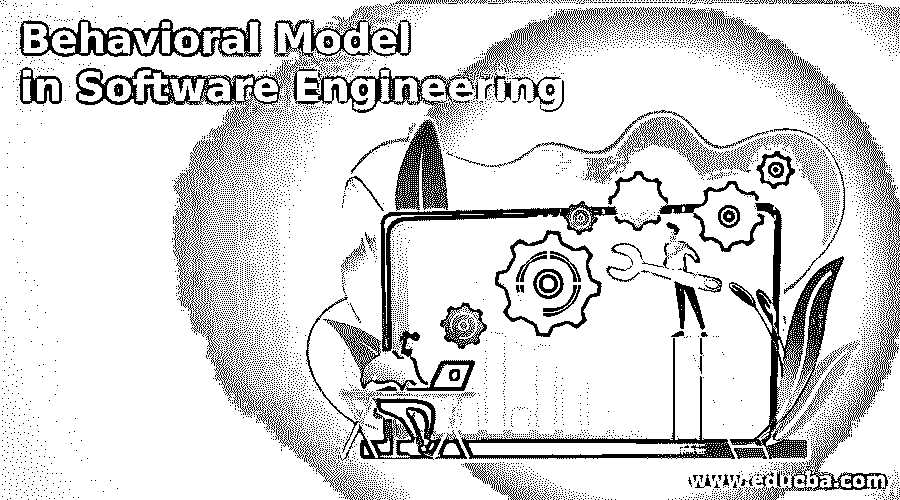

## 软件工程中的行为模型导论

在软件工程中，行为模型描述系统的整体行为。用于描述系统行为的行为模型有两种，一种是数据处理模型，另一种是状态机模型。数据处理模型也称为 DFD(数据流图)，用于显示数据在系统中移动时是如何处理的。状态机模型也称为状态图，用于显示系统如何对外部事件做出反应。

### 数据流图

*   数据流图用于建模系统的数据处理。
*   它也可以称为功能模型，因为它是定义范围内企业功能的图形表示。数据流图显示了端到端的数据处理。
*   它可以很容易地转换成软件，因为它们只是表示数据对象的流程。DFD 图使软件工程师能够同时开发信息领域和功能领域的模型。
*   它提供了系统的逻辑模型，并显示了所涉及的数据流和逻辑流。

### 数据流图的特征

*   它显示了将传入数据流转换为传出数据流的过程。
*   执行这种转换的进程通常会创建和使用数据。
*   外部实体发送和接收来自系统的数据流。
*   它也被称为气泡图。
*   数据流图支持自顶向下分析方法。

### 数据流图表指南

*   0 级 DFD 应该将软件系统描述为单个气泡。
*   主要输入和输出被仔细记录。
*   细化应该从隔离候选流程、数据对象、要在下一级表示的数据存储开始。
*   所有的箭头和气泡都应该标上全名。
*   信息流动的连续性必须逐级保持。这意味着在一个层次上流入任何转换系统的数据对象必须是相同的。在更精细的层次上流入转换的数据对象。
*   一个泡沫一个泡沫的去提炼。

### 数据流图符号

数据流图由一系列用线连接在一起的符号组成。数据对象由圆圈表示，也称为气泡图。数据流图以分层顺序表示。第一级数据流模型也称为 DFD 0 级或上下文图，它代表系统的整体。二级数据流模型细化了上下文图，并提供了一级 DFD 的更多细节。以类似的方式，第三级 DFD 提炼第二级 DFD，等等。数据流分析模型是由两个组织开发的——Yourdon 公司和 Gane and Sarson 公司。

<small>网页开发、编程语言、软件测试&其他</small>

符号如下:

*   **数据流:**表示数据流从特定的起点到目的地的移动。
*   **进程:**代表使用数据的用户、过程或设备。
*   **实体:**表示数据源或目的数据外部数据源或目的数据，可以是用户、程序、组织或其他与系统交互但在其边界之外的实体。
*   **数据存储:**可以有单个 DFD 图，也可以分解成各种级别，如 1 级、2 级、3 级等。

| **符号名称** | **Yourdon 公司** | **甘恩和萨尔森** |
| 数据流 | 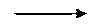

 | 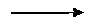

 |
| 过程 | 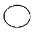

 | 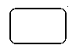

 |
| 实体 | 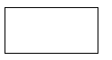

 | 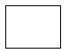

 |
| 数据存储 | 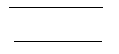

 | 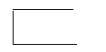

 |

### 状态图

状态图是一个动态模型，它表示对象在生命周期中响应事件所经历的状态变化。它用于帮助开发人员更好地理解系统特定领域的复杂功能。

状态图中使用的符号:

#### 1.初态

它代表图表的起点。它也被称为伪状态，其中状态没有变量也没有活动。

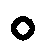

#### 2.末态

它表示图表的终点。它也是伪状态，因为它没有任何变量或活动。状态图可以有零个或多个最终状态。

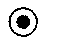

#### 3.状态

它代表了物体在某一瞬间的状态。状态是一种可识别的情况，存在于一段时间内。

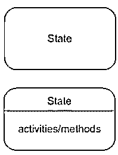

#### 4.过渡

它代表从一种状态到另一种状态的变化。这用箭头表示。引起转变的事件或动作写在箭头旁边，用斜线分开。当状态完成一个活动时，发生无触发转换。

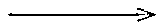

#### 5.事件和动作

导致转换发生并改变状态的触发器称为事件或动作。

#### 6.历史状态

流可能要求对象进入等待状态，并在某个事件发生时，返回到它所处的状态，在这种情况下使用这种表示法。

#### 7.信号

当 even 导致触发器被发送到导致转换的状态时，则该事件发送的消息称为信号。

#### 8.自我转变

具有返回到自身的转变的状态称为自转变。

### 结论——软件工程中的行为模型

在本文中，我们已经详细了解了行为模型及其两种类型。我们还看到了数据流图和状态图。

### 推荐文章

这是软件工程中行为建模的指南。这里我们讨论介绍、数据流图、指南、符号和状态图。您也可以看看以下文章，了解更多信息–

1.  [需求工程](https://www.educba.com/requirement-engineering/)
2.  [c#中的设计模式是什么？](https://www.educba.com/what-is-design-pattern-in-c-sharp/)
3.  [软件工程中的凝聚力](https://www.educba.com/cohesion-in-software-engineering/)
4.  [质量软件](https://www.educba.com/quality-software/)

