# 流程图符号

> 原文：<https://www.educba.com/flowchart-symbols/>

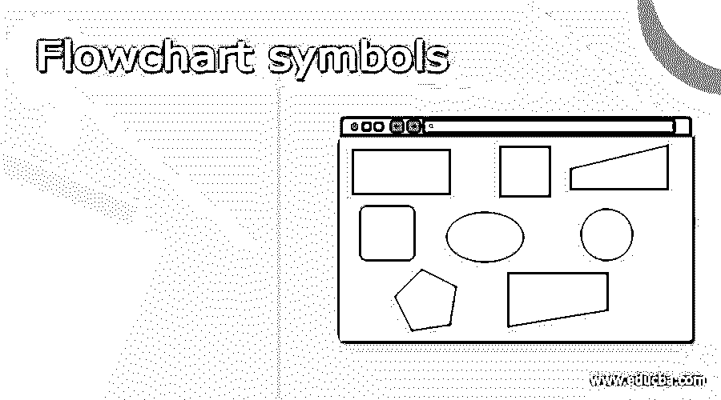

## 流程图符号介绍

流程图是不同动作和步骤的图形表示。它通常用于呈现算法、工作流或过程的流程，因为它以线性顺序显示步骤。流程图通常将步骤显示为不同类型的方框，并用箭头按正确的顺序将它们链接起来。各种流程图设计用于创建各种流程图。每个流程图符号都有其独特的含义和使用环境。无论你是想阅读流程图还是试图自己制作流程图，了解基本符号及其含义都会使事情变得更简单。一系列动作或步骤以及它们之间的关系用线和箭头表示。这些被称为流程图符号。

### 流程图符号列表

以下是下面提到的流程图符号列表

<small>网页开发、编程语言、软件测试&其他</small>

#### 1.流程符号的分支和控制

**终结者**

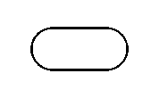

椭圆形/丸形代表系统的起点或终点。它包含“开始”或“结束”两个字。

**过程或动作**

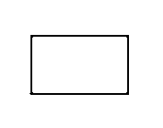

用于描述较大流程中的单个操作或步骤或整个子操作的方框。

**决定**

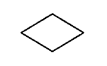

菱形表示分支或决策点。从菱形上的不同点，出现了说明不同决策的线条。

**连接线**

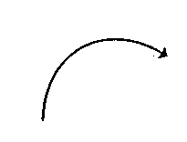

箭头形状使用此符号将各种元素链接在一起，以演示形状之间的相互关系。

**是/否决定点**

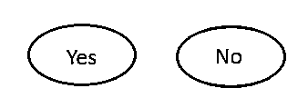

它表示过程中的一个序列，在该序列中，最终用户选择一个答案，例如“是-否”或“是非”，然后分支到流程图的各个部分。

**页面引用**

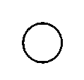

它用于表示连接同一页面上的独立流程。

**离页参考**

里面会有一封信。它表示流程从另一页开始，具有包含相同字母的匹配符号。

**合并符号**

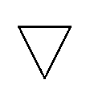

它表示多个系统或路径合并成一个系统或路径。

**提取符号**

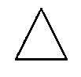

它表示多个系统或路径合并成一个系统或路径。

**或符号**

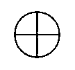

它表示流程流在两个以上的分支中继续。

**求和点**

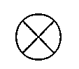

它代表流程图中几个分支合并成一个流程的点。

**控制权转移**

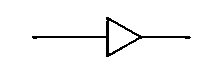

当满足某些条件时，一个步骤进行到不同于下一个步骤的步骤。

**注释符号**

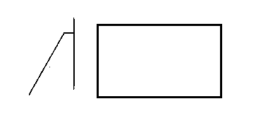

它表示流程中某个步骤的附加信息。

#### 2.过程/操作符号

**子流程符号**

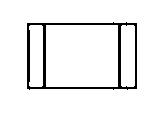

执行特定任务的更大更复杂的过程、例程或模块中的一系列活动。

**预定义流程**

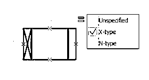

它演示了一系列步骤，这些步骤构成了在绘图的其他地方描述的复杂过程，通常在不同的页面上。

**延迟**

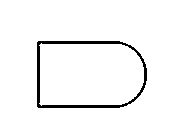

它表示过程中的延迟。

**准备**

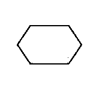

表示同一流程中另一步骤的设置。

**手动操作**

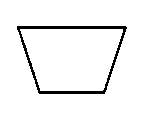

这表示应该手动而不是自动执行的流程步骤。

**并行模式**

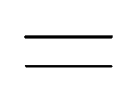

它也被称为“并发操作”指示了两个或多个并行的过程或程序阶段。

#### 3.输入和输出符号

**数据(输入/输出)**

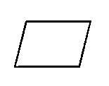

平行四边形表示数据是从外部进入还是退出流程。

**文件**

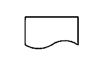

此形状代表打印输出，如报告或文档。

**多文档**

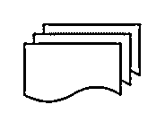

它说明了系统中的多个文档。

**显示**

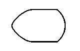

它表示信息在流程中的显示位置。

**手动输入**

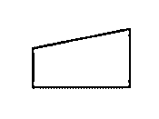

这是要求操作员或用户手动输入数据的过程步骤。

**卡**

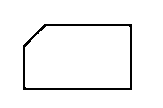

**纸带**

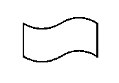

它指定数据存储在页面磁带上。这个符号也不再经常使用。

#### 循环极限符号

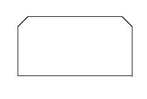

它表示循环应该停止的进程。

**子程序**

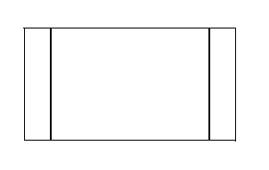

在更广泛的机制中执行特定任务的一组操作由该符号表示。

#### 4.数据和信息存储符号

**存储的数据**

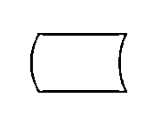

它也被称为数据存储符号。这指定了数据或信息的存储位置。

**数据库**

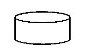

它表示可以搜索和排序的具有一致结构的信息或数据的列表。

**内部存储**

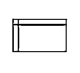

此符号表示在程序执行期间信息或数据存储在内存中。

**顺序数据**

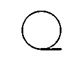

表示可以按顺序访问的数据。这个形状看起来像一卷胶带。

#### 5.数据处理符号

**整理**

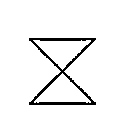

指定将信息或数据组织成标准格式的过程步骤。

**排序**

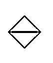

它表示文档、数据或材料按特定顺序的排列。

### 结论

本文中的大多数流程图符号都有非常特殊的用途，如计算机编程的数据流图。简单的流程图符号用于高级专家，图表由具有相似知识的小组创建。我希望你会发现这篇文章创建流程图。

### 推荐文章

这是流程图符号的指南。在这里，我们讨论简单的流程图符号，这是用于先进的专业知识。您也可以看看以下文章，了解更多信息–

1.  [质量软件](https://www.educba.com/quality-software/)
2.  [软件测试方法论](https://www.educba.com/software-testing-methodologies/)
3.  [软件开发模型](https://www.educba.com/software-development-models/)
4.  [软件事件管理](https://www.educba.com/software-incident-management/)

