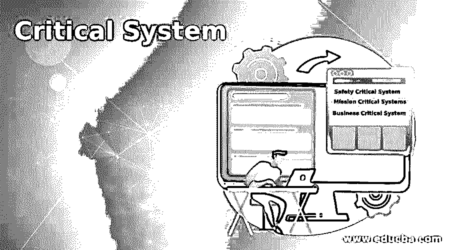

# 关键系统

> 原文：<https://www.educba.com/critical-system/>

## 关键系统介绍

关键系统是指这样的系统，该系统是高效的，并且当它们改变时保持这种效率，而不会产生过高的成本。在当今竞争激烈的全球市场中，关键系统被认为是企业或组织赖以生存和繁荣的基础。关键系统的集成高度依赖于高质量、可靠、低成本的软件。关键系统的成功构建、操作和维护依赖于定义明确、管理完善的软件开发和能力卓越的专业人员。

### 关键系统的类型

有三种类型的关键系统

<small>网页开发、编程语言、软件测试&其他</small>

*   **安全关键系统:**这些系统中的任何故障都会导致伤害、死亡或对环境的破坏。例如，化工厂系统。
*   **关键任务系统:**这些系统中的任何故障都会导致某些预期目标的失败。例如，航天器导航系统。
*   **业务关键系统:**这些系统的任何故障都会导致巨大的经济损失。比如银行会计系统。

### 系统可靠性

系统可信性是指系统的可信度，即用户对该系统的信任程度。它显示了用户对系统的信任程度，即系统将按预期运行，并且在正常使用中不会失败。有用和可信是不同的。一个系统不需要被信任才是有用的。可信性的常见维度是可用性、可靠性、安全性和安全性。可用性是系统在需要时提供服务的能力。它是一个系统在任何给定时间点运行并能够提供所需服务的概率。可靠性是指系统在正常使用中不出现任何故障的情况下提供用户指定和期望的服务的能力。安全性是指电子设备保护自己免受意外入侵或恶意攻击的能力。安全是系统运行而不发生灾难性故障的能力。

**可靠性的重要性**

*   不可靠的系统意味着不值得信任、不可靠、不安全或不可靠的系统会被用户拒绝。
*   不可靠的系统可能会丢失有价值的信息，从而导致高昂的恢复成本。

### 可靠性的影响

*   **硬件可靠性:**硬件组件的故障概率是多少，修复该组件需要多长时间
*   **软件可靠性:**软件组件产生错误输出的频率如何？
*   操作员可靠性:系统操作员出错的可能性有多大？
*   **可修复性:**是系统在发生故障时可修复的程度。
*   **可维护性:**是一个系统能够适应新需求的程度。
*   **可生存性:**是在意外攻击的情况下，系统能够交付服务的程度。
*   **容错:**是可以避免和容忍用户输入错误的程度。
    安全中使用的简单安全关键系统术语如下
*   **事故:**导致人员伤亡、财产损失或环境破坏的意外事件。例如，计算机控制的机器伤害了它的操作者。
*   **危险:**是导致或促成事故的情况。例如，检测机器前方障碍物的传感器故障。
*   **损害:**是对事故造成的损失的衡量。例如，许多人因事故而死亡，受轻伤或财产损失。
*   **危险严重性:**这是对特定危险可能导致的最严重损害的评估。例如，许多人仅仅因为轻微的损伤而死亡。
*   **危险概率:**造成危险的事件发生的概率。概率值的范围从可能到难以置信。
*   **风险:**系统发生事故的概率。通过考虑危险概率和危险严重性来评估风险。

### 安全成就

系统中的安全性可以通过使用各种方法来实现:

*   **危险避免:**系统的设计使得某些类别的危险不会发生。
*   **危险检测和消除:**系统的设计目的是在系统遇到任何意外故障或损坏之前识别并消除危险。
*   **损害控制:**该系统包含保护功能，可最大限度地减少危险可能造成的损害。

有两种类型的安全关键系统

*   主要安全关键系统:这些是嵌入式软件系统，其故障会导致相关硬件故障，并直接威胁到用户。
*   次要安全关键系统:这些系统的故障会导致其他系统的故障，从而威胁到系统的用户。

### 推荐文章

这是一个关键系统的指南。在这里，我们还将讨论关键系统的介绍和类型，以及系统可靠性及其重要性。您也可以看看以下文章，了解更多信息–

1.  [嵌入式系统安全](https://www.educba.com/embedded-systems-security/)
2.  [控制系统面试问题](https://www.educba.com/control-system-interview-questions/)
3.  [什么是 IDS？](https://www.educba.com/what-is-ids/)
4.  [GIS 使用](https://www.educba.com/gis-uses/)

