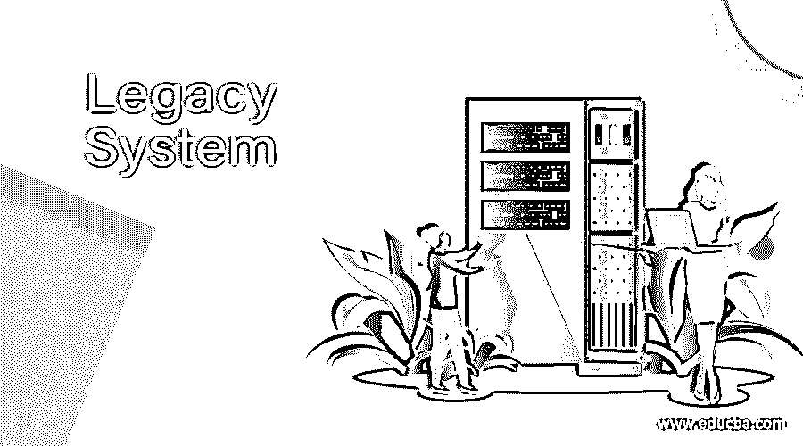

# 遗留系统

> 原文：<https://www.educba.com/legacy-system/>

## 遗留系统介绍

遗留软件系统是一种旧的计算机系统或应用程序，即使有了新的技术，它仍然在使用，只是因为它为社区执行了有用的工作。遗留软件系统是社区仍然在很好地使用的程序，或者是几年前使用早期版本的 FORTRAN 或其他语言开发的具有潜在内在价值的程序。例如，大型机运行 64 位 Linux 和 java 以及 20 世纪 60 年代的老式代码(这是 20 世纪 60 年代开发的遗留软件)。

### 遗留系统的质量

遗留软件已经由数百名程序员维护和开发了许多年，虽然对软件进行了许多更改，但是支持文档和编程可能不是当前的风格。这些因素导致维护遗留软件的成本高得令人难以置信，然而，这些系统支持核心业务功能，对业务来说是必不可少的。因此。有必要找到一些方法，使这些程序更易于维护，同时又不妨碍它们当前的使用，并保护它们所包含的信息。解决方法是完全丢弃软件，用一个新系统重新开始。但这可能会导致不可避免的损失，例如:

<small>网页开发、编程语言、软件测试&其他</small>

I .软件实际上可能工作得很好，它的行为可能很好理解。一个新的替换系统可能表现得更差，至少在替换的早期。因此，恢复遗留系统的一些好的特性可能是值得的。

二。软件包含了多年积累的信息，这些信息在其他地方没有表现出来，所以丢弃软件也会丢弃这些知识。

三。典型的大型遗留软件系统有许多用户。要求用户在没有明显好处的情况下进行大量重写可能还不够好。因此，维护遗留代码的接口和确切功能可能很重要。

用户可能更喜欢渐进的而不是革命性的方法来更新他们的软件，因为生成新软件通常会引入新的错误，这将降低用户对软件结果的信任。

因此，避免上述损失的唯一方法是不时地增强遗留软件，以使其满足新计算环境的要求。它实现了新业务的需求。它可以与更现代的系统和数据库互操作。它在网络环境中工作。

### 为什么使用遗留系统？

公司继续使用遗留系统的原因是多种多样的。其中一些如下。投资:虽然维护遗留系统费用昂贵，但升级到新技术系统需要更多的投资。

一、恐惧:增加一个突然的变化是很难的，转向新的技术或系统会激发一些关键的阻力。

**二。困难:**遗留软件可能是用一种编程语言构建的，这使得很难找到具有迁移技能的人员。规划遗留系统的数据迁移并定义新系统的需求范围是一项艰巨的任务。

### 遗留系统的问题

遗留系统可能导致以下问题。

**1。维护成本高:**维护遗留系统的成本很高。维护使遗留系统的工作保持柔和，但与此同时，组织却在浪费金钱。

**2。数据被困在筒仓中:**数据筒仓是遗留系统的副产品。许多旧系统的设计方式使得它们不能相互集成，并且许多遗留系统软件解决方案建立在不能与其他或新系统集成的框架上。换句话说，我们可以说每个遗留系统都有自己的数据仓库。

**3。合规要困难得多:**合规监管要求公司知道他们拥有哪些用户数据，这些数据在哪里，以及谁在访问这些数据。一个拥有良好用户数据的组织需要维护管理良好的数据记录，这是很难自动化的。

**4。安全性日益降低:**它不仅会使组织落后于旧技术，还会使数据面临被破坏的风险，从而损害组织的声誉。在某些时候，供应商不支持遗留系统或提供急需的更新，从而使遗留系统面临安全风险。即使更新是可用的，它的安装过程可能是有风险的，并且由于害怕破坏系统而被推迟。随着技术的进步，法律系统的风险也在增加。

### 结论

在本文中，我们已经看到了什么是遗留系统以及为什么使用它。我希望这篇文章对你有所帮助。

### 推荐文章

这是一个遗留系统指南。这里我们讨论一下引言，为什么使用遗留系统？质量和问题。您也可以看看以下文章，了解更多信息–

1.  [嵌入式控制系统](https://www.educba.com/embedded-control-systems/)
2.  [数字系统](https://www.educba.com/number-systems/)
3.  [永续盘存制](https://www.educba.com/perpetual-inventory-system/)
4.  [什么是嵌入式系统？](https://www.educba.com/what-is-embedded-systems/)

