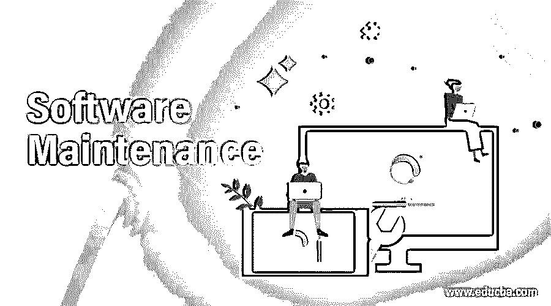

# 软件维护

> 原文：<https://www.educba.com/software-maintenance/>

## 软件维护简介

软件维护是软件工程生命周期的一个阶段，涉及修复报告的问题和新的增强以优化性能。这是一个重要的持续阶段，在开发、测试和部署或交付阶段完成后开始。大多数打包软件遵循常规维护或补丁发布周期。而组织特定的软件需要维护阶段的计划和过程管理。随着对软件操作技术的需求和变化的增长，维护阶段对于每一个使用软件进行高效业务流程的组织来说都是至关重要的。

### 软件维护需求

在这一节中，我们将通过一些真实的用例来讨论维护的需要。有几个实例和业务场景会引发维护阶段。一些业务场景如下

<small>网页开发、编程语言、软件测试&其他</small>

*   组织结构变化
*   市场需求
*   监管变化
*   客户定制需求
*   软件升级
*   设计改进
*   与其他应用程序接口。
*   修复 bug
*   提高可扩展性
*   增加部署选项。
*   基于业务流程负载提高效率

软件维护需求的一个例子是管理特定位置供应链的零售仓库软件。业务增长并与另一家零售连锁供应商合并。需要定制现有的仓库管理软件，以便将现有的容量与新的零售连锁业务软件集成和升级，从而有效地工作。这是零售仓库管理软件的软件可维护阶段。

### 软件维护过程

基于生命周期行业标准的相关流程如下

*   需求识别:需求识别和追踪是软件维护的初始过程，包括与相关资源和外部实体的多次交互。
*   **分析活动:**根据业务需求对维护活动进行功能和技术分析。
*   **设计阶段:**这个阶段包括架构和设计技术组件，以实现维护目标。
*   **实施阶段:**这是开发和配置阶段。这一阶段涉及到大多数开发人员资源。团队协作，使用现有的应用程序代码，参考软件的现有功能进行开发。
*   **测试阶段**:该阶段包括测试资源，以检查新的 manganese 功能或配置。此外，该阶段确保基于维护范围的新变更。它确保新的变更不会影响不在该阶段范围内的任何其他功能。
*   **交付阶段:**这个阶段处理维护部署和启用维护特性以及对软件的修复。重要的方面是部署活动的工作窗口，因为这可能需要业务停机时间来完成活动。它还管理对用户的培训和变更说明文档。
*   **维护管理阶段**:该阶段涉及与实现的软件相关的软件工件的配置和版本控制。这是补丁发布和迭代阶段的相关过程。

类似地，基于业务需求，有几种维护类别与软件维护过程相关联。

这些类型如下

*   **适应性维护:**这种维护涉及软件交付后的更新和修改，以适应最新的技术变化和行业需求。
*   **纠正性维护:**这种类型是交付后对软件的反应性修改，以纠正用户或一段时间内收集的错误报告所发现的问题。
*   **预防性维护:**这种类型的活动与软件交付后的修改和应用更新有关，以防止将来可能出现的故障。这些包括修复目前不重要的小问题，但是，这些问题在以后可能会成为有效的故障。
*   **完美维护:**这种类型与对交付软件的增强和修改有关，以提高性能、可用性、可靠性和可维护性

### 优势

维护对于提高业务流程效率非常有用。已实施软件的维护阶段给企业带来了一些直接和间接的好处。一些主要优势如下

*   降低运营成本。
*   提高生产率
*   通过提高现有软件的自动化能力，加快交付给客户的时间。
*   增加与其他业务部门或合作伙伴软件系统集成的兼容性。
*   降低任何依赖软件(如操作系统或驱动程序软件)的风险。
*   利用实施的软件堆栈扩展业务。
*   软件供应商的定期支持和服务。
*   有资格轻松升级到软件的最新版本。
*   软件供应商提供的定期维护警报选项，可实现更好的安全性和行业合规性政策。

### 不足之处

尽管有几个优点，这个阶段也有一些缺点。我们将在本节中讨论这些内容。

*   软件维护阶段与不同的当事人和时间约束相关联。
*   在应用和配置变更的过程中，业务生产可能会暂时停止。
*   现有的员工和外部用户，比如客户、合作伙伴和其他业务堆栈持有者，需要及时地接受关于软件任何变更的指导和培训。由于用户已经熟悉了现有的过程并习惯了软件的使用，所以用简单的描述来表示变化是很重要的。
*   集成应用程序的附加变更管理计划，以适应这些变更。

### 结论

与其他 SDLC 阶段(如开发和测试)相比，软件维护阶段是最不受关注的领域。但是，管理已经投入生产使用的软件的变更请求和定期更新需要花费更多的时间和精力。因此，维护对于正常运行至关重要。

### 推荐文章

这是软件维护指南。在这里，我们还讨论了软件维护的介绍和需求以及优点和缺点。您也可以看看以下文章，了解更多信息–

1.  [软件维护类型](https://www.educba.com/software-maintenance-types/)
2.  [软件质量控制](https://www.educba.com/software-quality-control/)
3.  [软件指标](https://www.educba.com/software-metrics/)
4.  [软件可靠性](https://www.educba.com/software-reliability/)

