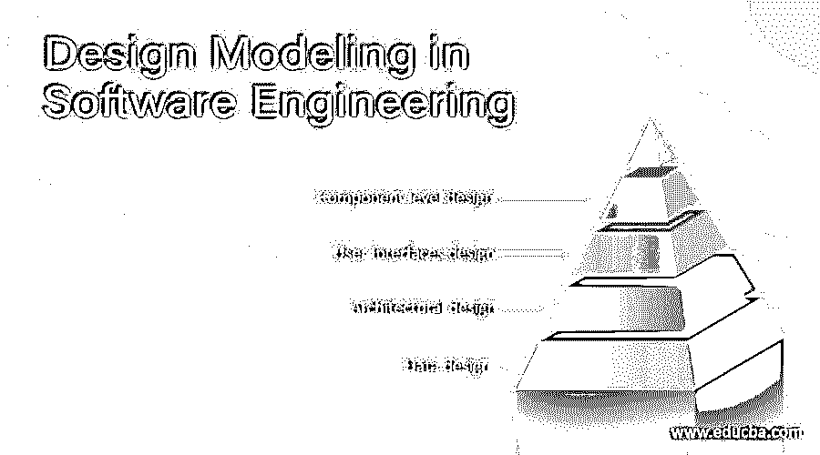

# 软件工程中的设计建模

> 原文：<https://www.educba.com/design-modeling-in-software-engineering/>

## 软件工程中的设计建模导论

软件工程中的设计建模代表了有助于工程师有效开发软件的特征、架构、用户界面和组件级细节。设计建模提供了各种不同的系统视图，如住宅或建筑物的建筑平面图。不同的方法，如数据驱动、模式驱动或面向对象的方法，用于构建设计模型。所有这些方法都使用一套设计原则来设计模型。

### 软件工程中的设计建模工作

设计一个模型是一个重要的阶段，是一个表示数据结构、程序结构、接口特征和过程细节的多过程。它主要分为四类——数据设计、架构设计、接口设计和组件级设计。

<small>网页开发、编程语言、软件测试&其他</small>

*   **数据设计:**以实体关系图的形式表现数据对象及其相互关系。实体关系由每个实体或数据对象所需的信息组成，它显示了这些对象之间的关系。它以表格的形式显示数据的结构。它显示了三种类型的关系-一对一、一对多和多对多。在一对一关系中，一个实体连接到另一个实体。在一对多关系中，一个实体连接到多个实体。在多对多关系中，一个实体连接到多个实体，并且其他实体也使用多个实体连接到第一个实体。
*   **架构设计:**定义软件主要结构元素之间的关系。它是将系统分解成相互作用的组件。它以框图的形式表示，概述了系统的结构、组件的功能以及这些组件如何相互通信以共享数据。它定义了系统中涉及的组件的结构和属性，以及这些组件之间的相互关系。
*   **用户界面设计:**它代表了软件如何与用户交流，即系统的行为。它是指用户与产品的控件或显示器进行交互的产品。例如，军事、车辆、飞机、音频设备、计算机外设都是用户界面设计的应用领域。只有在执行可用性测试之后，UI 设计才变得有效。这样做是为了测试哪些工作正常，哪些工作不正常。只有在进行修复后，该产品才被称为具有优化的界面。
*   **组件级设计:**它将软件架构的结构元素转化为软件组件的过程化描述。这是共享大量数据的完美方式。组件不需要关心如何在集中级别管理数据，即组件不需要担心数据的备份和安全性等问题。

### 设计模型的原则

*   **设计必须可追溯到分析模型:**

分析模型表示系统的信息、功能和行为。设计模型将所有这些东西转化为架构——一组实现主要功能的子系统和一组组件 kevel 设计，它们是分析类的实现。这意味着设计模型必须能够追踪到分析模型。

*   **始终考虑要构建的系统的架构:**

软件架构是要构建的系统的骨架。它影响接口、数据结构、行为、程序控制流、测试进行的方式、最终系统的可维护性等等。

*   **关注数据的设计:**

数据设计包括在设计中实现数据对象的方式。它有助于简化程序流程，使软件组件的设计和实现更容易，并使整体处理更有效。

*   **用户界面应该首先考虑用户:**

用户界面是任何软件的主要部分。不管它的内部功能有多好，或者它的体系结构设计得有多好，但是如果用户界面很差，最终用户不放心使用该软件，那么它会导致人们认为该软件是坏的。

*   **组件应该松散耦合:**

将不同的组件耦合成一个组件可以通过多种方式完成，比如通过组件接口、通过消息传递或通过全局数据。随着耦合程度的增加，错误传播也会增加，软件的整体可维护性会降低。因此，元件耦合应尽可能低。

*   **必须设计用户和内部界面:**

组件之间的数据流决定了处理效率、错误流和设计的简单性。一个设计良好的接口使得集成更加容易，测试人员可以更加容易地验证组件功能。

*   **组件级设计应展现功能独立性:**

这意味着由组件交付的功能应该是内聚的，即它应该只关注一个功能或子功能。

### 结论

在本文中，我们已经讨论了软件工程中设计建模的基础及其原则。我们还讨论了它的工作和其他一些领域。

### 推荐文章

这是软件工程中设计建模的指南。这里我们讨论设计模型的介绍、原理。您也可以浏览我们推荐的其他文章，了解更多信息——

1.  [什么是数据建模？](https://www.educba.com/what-is-data-modeling/)
2.  [软件配置管理](https://www.educba.com/software-configuration-management/)
3.  [软件设计原理](https://www.educba.com/software-design-principles/)

