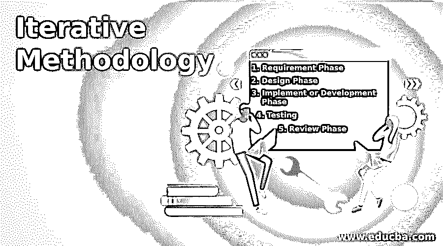

# 迭代方法

> 原文：<https://www.educba.com/iterative-methodology/>

## 迭代方法简介

将在生产中部署的软件可以通过采用不同类型的过程或模型来开发。迭代方法就是软件开发中的一个这样的模型。这也赢得了大量用户的欢迎。基于软件需求的目标，选择一种类型的模型，有时在软件开发生命周期中也可以实现多个模型。选择的模型也会影响我们的测试和缺陷跟踪。一些最流行的模型包括迭代、敏捷、[增量模型](https://www.educba.com/incremental-model/)、瀑布、RAD 等。

### 什么是迭代方法论？

*   迭代模型是软件开发生命周期 SDLC 中可以采用的流行模型之一。
*   这种模型特别关注小块的开发，并将它们增强或发展成最终的软件。
*   所以基本上，它从软件目标的更小需求集的更简单的实现开始，迭代地发展版本，直到完整的系统被实现和部署。
*   迭代不会开始考虑完整的需求和规范，但是开发过程会开始，但是理解需求的一部分并实现软件的一部分。
*   然后由产品负责人审查，然后决定下一步的开发。这将是一次迭代。
*   该过程将继续迭代运行，以在每次迭代结束时添加新版本的需求，并且在最终迭代结束时，来自软件的完整需求或规范期望已经准备好，

### 迭代方法阶段

迭代模型要求以下阶段成为其迭代一部分，以生成一个版本。每个阶段都被彻底实现，并确保特定迭代的需求得到满足。

<small>网页开发、编程语言、软件测试&其他</small>

#### 1.需求阶段

软件开发是一个重要的阶段，在迭代开发中，这个阶段被迭代地重复，因为软件的完整规范被分成更小的需求块并被开发。收集并仔细研究这个迭代需求，以便在特定的迭代中进一步工作。这个需求可以是一个新的需求，也可以是已经构建好的需求的扩展

#### 2.设计阶段

收集迭代需求后，我们需要实现设计阶段。有效的设计是从众多备选方案中决定实现需求的。这是一个关键阶段，因为适当的设计可以提供最佳的产出，降低客户的资金压力。这种设计可以是一种新的设计，也可以是对已有构建需求的扩展。

#### 3.实施或开发阶段

已经确定的设计将由开发人员使用确定的编码和度量标准来实现。开发人员在开发代码时，需要在开发的每个阶段实现单元测试。

#### 4.测试

一旦代码已经被实现，那么这个测试阶段就被实现来识别代码中存在的任何缺陷，如果存在，那么它们需要被报告给开发人员。测试人员可以编写新的测试用例，或者使用他们在以前的构建中编写的现有测试用例，但是全面测试是优先考虑的，因为任何失误都会影响软件的规格。

#### 5.审查阶段

在这个阶段，按照当前决定的需求，评审开发的需求以满足所有标准。基于这个进一步的计划需求，计划被起草并作为下一个迭代周期的一部分被实现。

为了有效的开发，迭代中的需求需要经历这些阶段。

### 迭代模型有什么用？

*   在迭代模型中，在每一次迭代中，将决定进一步进行下一次迭代或拒绝现有迭代，以便以更好的方式实现。
*   这在技术上被称为增量原型。
*   通过这样做，我们可以确保我们不会在软件需求上妥协，并以良好的精度小心地开发它。
*   一旦所有的迭代都完成了，那么包含所有需求的完整软件就可以交付给客户或者部署到产品中了。

### 迭代模型的重要性

迭代模型已经在许多情况下发现了它的重要性，并且根据软件需求，我们可以决定使用的模型以及迭代模型是否合适。

*   当我们清楚地理解软件的需求或规格时，最好使用这个模型。
*   此外，当使用新技术来实现迭代需求时，我们可以选择迭代模型，因为该模型提供了足够的时间，并且经过了许多审查和测试来识别缺陷并进行纠正。
*   此外，如果计划用一些高风险的特性和需求来进一步增强软件，迭代模型是最好的选择。
*   当要开发的软件非常大时，迭代模型也发现了它的重要性。

### 迭代方法的优势

当与其竞争对手一起考虑时，迭代方法有许多优点。

*   由于在每个阶段都要进行多次测试和评审，我们要确保我们开发的软件规范没有缺陷，并且高度可靠。
*   此外，测试和调试较小的迭代使任务变得容易，并且与在进行中测试完整的需求相比更有效。
*   使用迭代方法，还可以计划并行开发，这将节省时间。
*   每个阶段都可以轻松实现所要求的更改。一旦整个软件开发完成，就很难做到这一点。
*   在所有的审查中，所有的编码、业务和度量标准都被审查，所有的风险都可以很容易地被识别和纠正。
*   由于每个阶段都有专门的设计阶段，产品将会更加优化。
*   由于我们在每个阶段都进行了测试，团队可以很容易地在软件开发的开始阶段识别功能和设计相关的缺陷，这些缺陷可以很容易地被纠正。

### 结论

一个软件可以采用不同的方法开发，迭代模型是组织推荐和遵循的流行模型之一。该模型可以与其他模型(如增量模型、敏捷方法等)结合使用。由于这种模式提供了充分的优势，这是首选。

### 推荐文章

这是迭代方法的指南。在这里，我们讨论迭代方法的介绍以及阶段、重要性、用途和优点。您也可以看看以下文章，了解更多信息–

1.  [迭代模型](https://www.educba.com/iterative-model/)
2.  [迭代深化深度优先搜索](https://www.educba.com/iterative-deepening-depth-first-search/)
3.  [吉拉 Scrum 板](https://www.educba.com/jira-scrum-board/)
4.  [什么是方法论？](https://www.educba.com/what-is-methodology/)

