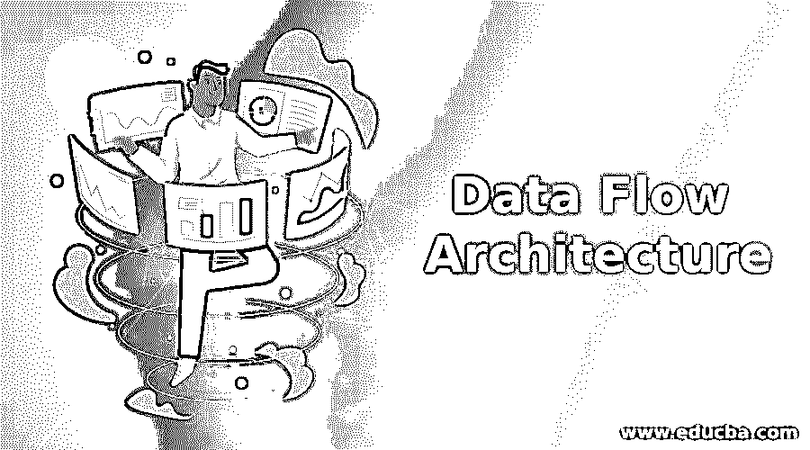

# 数据流架构

> 原文：<https://www.educba.com/data-flow-architecture/>

## 数据流体系结构介绍

当信息经过一系列的转换时，一个软件系统就产生了。数据流经不同的模块，这些模块之间的转换将原始输入转换为所需的解决方案。原始数据通过独立的操作和方法进行转换，直到我们得到最终的输出。数据流架构描述了创建软件系统所遵循的工作流程。工作流由对输入信息的一系列转换组成，其中信息和转换方法相互独立。在数据流体系结构中，信息被拉入系统，然后流经几个模块并经过转换，直到到达目的地(输出或数据存储)。在数据流体系结构中，可以重用和修改转换。

### 数据流架构的模块和组件

数据流体系结构有几种可用的方法。我们将讨论其中的 3 个，第一个是非常基础的，第二个是中级的，第三个提供了广泛的可能性。这些方法执行不同模块之间的序列。

<small>网页开发、编程语言、软件测试&其他</small>

*   批量顺序
*   管道和过滤器
*   过程控制

#### 1.批量顺序

顾名思义，这个任务被分成几个批处理及其子任务。这些批处理执行它们的子任务，并将结果提供给下一个批处理。在批处理中遵循一个非常基本的处理模型，即只有在前一批完成时才开始下一批。

可以在银行交易中观察到这种数据流架构的基本示例，其中一旦提供了交易所需的所有细节，则仅处理下一页，然后可以进行支付。

#### 2.管道和过滤器

管道和过滤器强调数据的增量转换以完成任务，这也提供了提供独立于其他数据并发处理数据的能力的可能性，并且以后可以被组合以得出有用的输出/信息。

顾名思义，管道和过滤器架构提供了将整个系统分解为管道、过滤器和数据接收器的灵活性。这些管道是相互连接的，可以像 FIFO(先进先出等)一样跟随数据流。)来处理信息。在这里，我们可以灵活地使用顺序流和并行流。如果所有的管道都是串联的，没有任何并联，它就完成了顺序转换的工作。请注意，这种顺序不同于批处理顺序，在批处理顺序中，下一个批处理直到当前作业完成后才开始。

**管道:**管道是过滤器的连接器，没有状态，管道的工作是将数据流从一个过滤器传递到另一个过滤器。从一个过滤器可以有几个管道连接到不同的过滤器，这进一步取决于问题的需要，不同的架构可以提出不同的连接。管道连接是相互独立的。

**过滤器:**过滤器是这个数据流结构中的一个转换单元，独立于数据流。在这里，数据以增量模式进行转换，这意味着数据从相邻的连接管道一进入，数据转换就开始。

过滤器有两种类型:

*   主动过滤:推拉转换后的信息
*   被动过滤:通过读写机制推拉信息。

#### 3.过程控制架构

这里，数据不是通过批处理或任何管道进行处理，而是根据传递给它的变量进行处理。通过将整个系统组合成几个模块来处理数据流，并将其连接起来进行进一步处理。

过程控制单元有两个主要单元，一个是处理单元，另一个是控制器单元。处理单元完成改变变量的工作，控制单元考虑已经进行的改变。

以下是控制器单元的元件。

*   受控变量:它提供由传感器测量的值。
*   输入变量:它包含控制器单元要处理的输入信息。
*   操纵变量:它是一个调节变量，可以由控制器改变
*   过程定义:它定义了处理不同变量的过程。
*   传感器:记录变量的值，也用于反馈以触发操纵变量重新计算变量。
*   设定点:受控变量的期望值。
*   控制算法:算法为操作过程变量提供了一个决定性的方法。

### 数据流架构的优点和缺点

每种数据流结构都有其优点和缺点，我们将分别讨论它们。

#### 批量顺序

**优点:**子系统划分简单，这些子系统独立于其他批次。每个批次转换输入数据并产生独立于相邻批次的输出。

**缺点:**延迟高，因为必须完成每一批才能到达第二批。它没有利用批次之间交互的灵活性。

#### 管道和过滤器

**优点:**管道和过滤器对并发有规定，吞吐量也快。这使得它可以灵活地支持顺序和并行执行。数据不断流动，这使得它可以重复使用，维护也很少。很容易修改过滤器之间的连接，它通过在过滤器之间提供简单的管道连接来实现。

**缺点:**它不支持动态交互，并且在过滤器之间总是存在数据转换开销的可能性。这种架构的维护并不简单。

#### 过程控制架构

**优点:**即使在控制算法发生变化的时候，过程的运行时控制也很容易。这些体系结构可以处理动态系统，并且可以处理连续的数据流。

**缺点:**指定时间特性是这类架构的一个难点。无法处理受干扰的响应。

### 结论

数据流架构描述了创建软件系统所遵循的工作流程。工作流由对输入信息的一系列转换组成，其中信息和操作相互独立。在本文中，我们讨论了三种数据流架构，即批处理序列、管道和过滤器以及过程控制架构。我们还讨论了每种方法的优缺点。有时一种架构可能适合这个问题，而其他时候一些其他的架构可能适合。

### 推荐文章

这是一个数据流架构的指南。这里我们讨论数据流架构、模块、组件、优点和缺点的介绍。您也可以浏览我们的其他相关文章，了解更多信息——

1.  [数据建模工具](https://www.educba.com/data-modelling-tools/)
2.  [运行数据存储器](https://www.educba.com/operational-data-stores/)
3.  [大数据编程语言](https://www.educba.com/big-data-programming-languages/)
4.  [数据链路层 OSI 模型](https://www.educba.com/data-link-layer-osi-model/)

