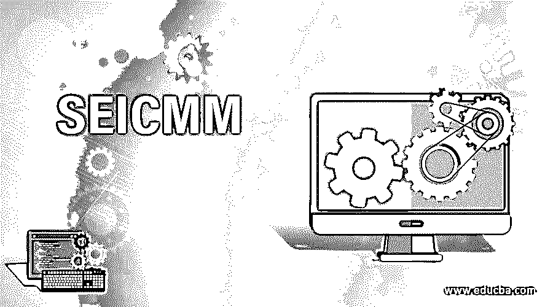

# seicom

> 原文：<https://www.educba.com/seicmm/>

## SEICMM 简介

SEICMM 被扩展为“软件工程研究所能力成熟度模型”，它是由 SEI(软件工程研究所)于 1987 年在卡内基梅隆大学提出的。能力成熟度模型或 CMM 可以被定义为一种标准/框架，基于该标准/框架，软件开发组织被划分为不同的能力级别。该过程是基于对组织所遵循的过程流执行的分析来执行的。CMM 有五个不同的级别，即 CMM1、CMM2、CMM3、CMM4 和 CMM5，用于展示软件开发公司所使用的开发技术的进展。

### SEICMM 方法

对软件开发组织所遵循的过程和方法的检查是基于两种不同的 SEICMM 方法进行的。他们是，

<small>网页开发、编程语言、软件测试&其他</small>

*   能力评估
*   软件过程评估

#### 1.能力评估

能力评估是用于评估和分析组织各方面能力的方法之一，包括供应商的诚信水平、员工的技能和流程模式等级、承包商的工作常规和遵循的技术等。由此产生的分析结果被视为一个因素，用于根据整个软件行业的标准来评估组织在性能和标准方面的整体能力。

#### 2.软件过程评估

软件过程评估是基于软件开发过程的一组度量，与模型的范围有关，由组织设置为项目的原型，以组织的名义执行所有活动。这种评估有助于提高目前使用的工艺和技术的水平。最终的结果，以报告或演示的形式，预计将在内部共享，并为更好的程序开发进行改进。

### SEICMM 过程

SEICMM 过程可以分为五个不同的阶段和它们各自的 CMM 等级。过程阶段越低，CMM 水平就越低。在这个分类过程中，还有一个重要因素需要考虑，那就是“关键过程区域”或 KPA。

KPA 仅仅是为任何软件开发组织设定的最低要求，并且期望它被满足以达到更好的 CMM 水平。KPA 包括过程控制、管理方法、技术标准、职业道德、文档、数据管理、员工素质以及为其职业发展、产品质量、无差错流程等设置的路标等领域。

以下是五个阶段及其各自的 CMM 等级，

| **阶段** | **组织的特征** | **CMM 等级** |
| 英语字母表中第九个字母 | 最初的 | One |
| 二 | 可重复的 | Two |
| 罗马数字 3 | 清晰的 | Three |
| 注入静脉的 | 管理良好 | Four |
| 英语字母表中第二十二个字母 | 最佳化的 | Five |

#### 第一阶段:初始–CMM 1

处于初始阶段的组织通常没有任何 KPA，员工素质较低，管理程序没有明确定义，对开发过程的控制设计薄弱，产品质量在客户便利性和技术进步方面都不尽如人意。因此，这些组织属于 SEI CMM 中 CMM1 的最低级别。

#### 第二阶段:可重复–CMM 2

第二阶段用于描述具有可重复过程流的组织。在这种类型中，组织在管理成本估算(一种众所周知的项目管理方法)方面更具决定性，并且所涵盖的软件开发阶段通常是规划阶段、软件配置阶段和软件维护阶段。当一个或两个项目成功时，具有类似行为约束的即将到来的项目将遵循相同的模式。因此，这种类型的组织被归类为 SEI CMM 的 CMM2 级别。

#### 第三阶段:定义明确–CMM 3

超越 CMM2 组织一步的软件开发组织被认为是第三阶段。这种类型的组织的普遍观察到的特征是，他们为开发过程使用明确的流程，在开发流程的每个步骤中创建文档，公司中的每个人都很清楚他们自己的角色和职责，组织将能够交付更高质量的软件产品，员工作为一个团队工作，并且有一个明显结构化的管理过程被观察到。这些是 CMM3 级软件组织的品质。

#### 第四阶段:管理良好 CMM4

对于任何一个组织来说，要想在自己的行业中取得成功，延续下来的管理风格和方法是一个关键的方面。当管理被清晰地定义和执行时，组织可以在交付高质量产品和财务扩张方面达到一个更好的水平。第四阶段的组织是那些有合格的管理人员的组织，他们只关注可交付产品的质量。这种类型的组织会有各种各样的自我评估方法，包括产品点和过程点。这些类型的组织被置于 CMM 级别 4，即 SEI CMM 级别的 CMM4。

#### 第五阶段:优化–CMM 5

通过 CMM4 的组织在产品质量上超越了 CMM 4，遵循明确定义的管理过程模式，经常评估组织中使用的过程和产品方法，通过经常提供与行业技术发展相关的培训来帮助员工保持他们的技能，等等。这种工作中的持续进展使他们保持在 CMM5 中，这是 SEI CMM 过程等级中的最高级别。

### SEICMM 的优势

以下是在组织中应用 SEI CMM 的优势，

*   质量交付成果
*   更高的客户满意度
*   更简单的管理
*   成本效率
*   带来更多的生意

### 结论

几乎所有的软件开发组织都采用了由软件工程协会(SEI)创建和实现的 CMM 级别，因为它帮助组织在行业中确立自己的位置。这反过来有助于吸引高质量的客户和熟练的员工，从而给组织带来良好的生产力。

### 推荐文章

这是一个 SEICMM 的指南。在这里，我们还讨论了 SEICMM 的介绍和方法，以及过程和优势。您也可以看看以下文章，了解更多信息–

1.  [程序员 vs 软件工程](https://www.educba.com/programmers-vs-software-engineering/)
2.  [数据科学 vs 软件工程](https://www.educba.com/data-science-vs-software-engineering/)
3.  [逆向工程](https://www.educba.com/reverse-engineering/)
4.  [统计分析软件](https://www.educba.com/statistical-analysis-softwares/)

