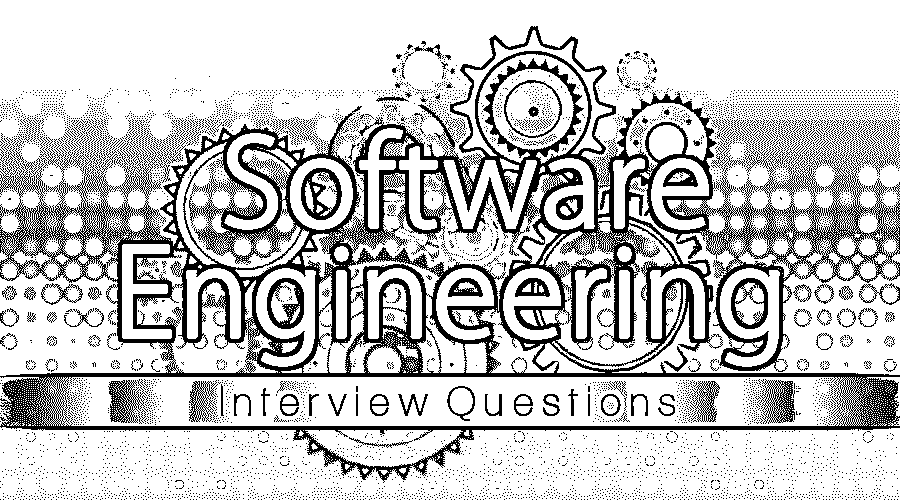

# 软件工程面试问题

> 原文：<https://www.educba.com/software-engineering-interview-questions/>

## 软件工程概论面试问答

所以你终于在软件工程领域找到了你的梦想工作，但是你想知道如何破解 2022 年的软件工程面试，以及可能的软件工程面试问题。每次面试都不一样，工作范围也不一样。牢记这一点，我们设计了最常见的软件工程面试问题和答案，以帮助您在面试中取得成功。

以下是 2022 年软件工程面试问答列表，可以在面试时提问，以求新鲜和体验。这些顶级面试问题分为两部分:

<small>网页开发、编程语言、软件测试&其他</small>

*   [第 1 部分-软件工程面试问题(基础)](#1)
*   [第二部分-软件工程面试问题(高级)](#2)

### 第 1 部分-软件工程面试问题(基础)

第一部分包括基本的面试问题和答案

#### 1.什么是软件工程？

**答案:**
软件工程是以明确定义的系统方法开发软件产品的过程。换句话说，通过使用科学的原理、方法和程序来开发软件。

#### 2.学习软件工程概念的必要性是什么？

**答案:**
想象一个人，他擅长砌墙，不一定擅长盖房子。类似地，一个会写程序的人也不具备用定义明确的系统方法开发和实现软件的知识。因此，程序员需要坚持软件工程概念，如需求收集、计划、开发、测试和文档。

#### 3.什么是 SDLC 或软件开发生命周期？

**答:**
[SDLC 定义了一套开发软件产品的](https://www.educba.com/what-is-sdlc/)准则。SDLC 有不同的阶段，即:收集需求、分析、计划、开发、测试、实现、维护和文档。SDLC 中提到的各个阶段的顺序可能会根据选择实现的模型而有所不同。

让我们进入下一个面试问题。

#### 4.SDLC 中有哪些不同类型的模型？

**答案:**
许多模型被提出，以高效地进行软件实现。其中包括瀑布模型、敏捷模型、螺旋模型、[迭代模型、](https://www.educba.com/iterative-model/)、V 模型等。

#### 5.解释软件项目经理的角色？

**答案:**
这是面试中常见的面试问题。项目经理负责用系统化的方法驱动软件项目。软件项目经理的一些关键角色&职责包括项目规划、跟踪项目进度、风险管理、资源管理、开发活动的执行、在成本、时间和质量约束下交付项目。

#### 6.什么是软件项目范围？

**答:**
范围是用来概括为设计、开发和交付软件产品而执行的活动。换句话说，范围包含了项目打算交付什么和不打算交付什么的信息。范围还概述了所开发的软件产品包含什么和不包含什么的信息。

#### 7.什么是软件项目估算？

**回答:**
项目评估是一个用来计算开发成本的过程，比如交付项目所需的努力、时间和资源。[项目评估](https://www.educba.com/project-estimation-techniques/)是通过过去的项目经验或在咨询专家的帮助下或在标准预定义业务公式的帮助下得出的。

让我们转到下一个软件工程面试问题。

#### 8.解释功能点？

**答案:**
功能点是用来衡量软件产品大小的。在某些业务中，场景在跟踪和评估项目交付中起着关键作用。

#### 9.什么是基线？

**答:**
基线是由项目经理提出来跟踪整个项目交付的。基线通常用于跟踪一个阶段或阶段下列出的全部任务。基线有助于项目经理跟踪和监控项目的整体执行情况。

#### 10.什么是软件配置管理？

**答:**
[软件配置管理帮助](https://www.educba.com/software-configuration-management/)用户跟踪软件产品交付中的整体变更。从开发和需求收集的角度来跟踪软件的更新或变更。

让我们转到下一个软件工程面试问题。

#### 11.什么是变更控制？

**答:**
变更控制跟踪软件中所做的变更，以确保一致性，并根据企业标准合并更新。

#### 12.提几个项目管理工具？

**答:**
根据企业标准使用了许多项目管理工具，其中包括:甘特图、PERT 图、里程碑检查表、直方图、MS project、状态报告等。

#### 13.什么是软件需求？

**答:**
需求在提供正在开发的软件产品的详细描述中起着关键的作用。软件需求有助于开发人员和其他与项目交付相关的支持团队理解提议的目标系统及其期望。

### 第 2 部分-软件工程面试问题(高级)

现在让我们来看看高级软件工程面试问题。

#### 14.解释可行性研究？

**答:**
进行可行性研究是为了评估软件开发的有益和实用属性。组织在可行性研究的帮助下进行彻底的分析，以了解软件项目交付中涉及的经济、运营和技术方面。

*   **经济:**经济研究包括与资源管理相关的成本、培训成本、使用的工具以及项目评估成本
*   **技术:**技术研究帮助企业分析软件交付中涉及的技术方面，如机器、操作系统、知识、资源分配的技能、使用的工具和培训。
*   **运营:**运营研究帮助企业根据项目需求研究变更管理和相关问题。

#### 15.什么是功能性和非功能性需求？

**答:**
功能需求是根据业务需求来指定功能特性。例如，添加从网站购买内容的支付选项。而非功能性需求提供了对安全性、性能、用户界面、互操作性成本等的洞察。

#### 16.什么是软件度量？

**答:**
度量被用来按照业务标准指导软件产品交付。度量也可以用来测量软件产品交付的一些特性。度量分为需求度量、产品度量、性能度量和过程度量。

让我们转到下一个软件工程面试问题。

#### 17.什么是模块化？

**答案:**
模块化将软件系统任务划分为多个模块。这些模块独立于其他模块，并且每个模块中调用的任务独立执行。

#### 18.解释并发性以及在软件产品交付过程中是如何实现的？

**答案:**
这是高级软件工程面试中问的问题。并发是同时执行多个事件或任务的过程。借助于与软件项目交付相关的模块、事件和任务，可以实现并发性。

#### 19.什么是凝聚力？

**答:**
内聚性是用来度量模块中定义的各种属性之间的内部相关性。

#### 20.什么是耦合？

**答:**
耦合是用来衡量一个模块中定义的各种元素的相互依赖程度。

#### 21.提到几个软件分析和设计工具？

**答:**
一些关键的软件分析&设计工具有数据流图(DFD)、结构化图表、数据字典、UML(统一建模语言)图、er(实体关系)图等。

让我们转到下一个软件工程面试问题。

#### 22.什么是 DFD 0 级？

**答:**
DFD(数据流图)0 级描述了软件信息系统中的整个数据流以及所有抽象细节。这种类型的 DFD 也被称为上下文级 DFD。

#### 23.什么是数据字典？

**答案:**
数据字典又称元数据。数据字典被用来捕获与软件项目中使用的对象和文件的命名约定相关的信息。

#### 24.什么是黑盒测试和白盒测试？

**答案:**

*   **黑盒测试:** [黑盒测试](https://www.educba.com/black-box-testing/)用于验证输出以及给定的有效输入。但是，它不测试程序的实现部分。
*   **白盒测试:** [白盒测试](https://www.educba.com/white-box-testing/)用于验证其执行中涉及的输入、输出和程序实现。

让我们转到下一个软件工程面试问题。

#### 25.软件维护的各种类型有哪些？

**答案:**
维修类型有矫正型、适应型、完善型、预防型。

*   **纠正:**此类维护用于消除业务用户发现的错误。
*   **适应性:**执行该维护活动是为了检查硬件和软件环境中所做的更改。
*   **完善:**这种类型的维护用于实现现有或新用户需求的变更
*   **预防性:**执行此维护活动是为了避免未来实施中出现任何问题。

#### 26.解释案例工具？

**答:**
CASE(计算机辅助软件工程工具)用于实现、支持和加速软件项目中涉及的各种 SDLC 活动。

### 推荐文章

这是软件工程面试问题和答案列表的指南。这里我们列出了最有用的 26 组面试问题，这样求职者就能轻松应对面试。您也可以阅读以下文章，了解更多信息——

1.  [ETL 面试问题](https://www.educba.com/etl-interview-questions/)
2.  [数据建模面试问题](https://www.educba.com/data-modeling-interview-questions/)
3.  [软件测试面试问题](https://www.educba.com/software-testing-interview-questions/)
4.  [数据建模面试问题](https://www.educba.com/data-modeling-interview-questions/)

