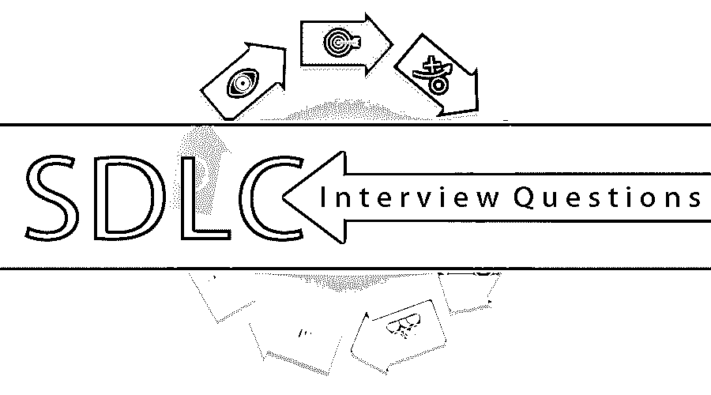

# SDLC 面试问题

> 原文：<https://www.educba.com/sdlc-interview-questions/>

## SDLC 面试问答简介

SDLC 是一个定义软件开发周期中不同步骤或过程的框架。软件开发生命周期(SDLC)也称为应用程序开发生命周期。软件开发生命周期中涉及的不同步骤是规划、分析、设计、实现和维护。软件开发生命周期过程可以应用于硬件或软件组件或配置，以定义其范围和生命周期过程。该软件开发生命周期将确保向最终客户交付高效和高质量的软件或硬件产品，以确保硬件或软件组织中的高质量产品或服务开发。这将确保业务的顺利进行。

**以下是 SDLC 上最重要和最常见的 10 个面试问题:**

<small>网页开发、编程语言、软件测试&其他</small>

现在，如果你正在寻找一份与 SDLC 相关的工作，那么你需要准备 2022 年 SDLC 面试问题。的确，每个面试都因不同的职位而不同。在这里，我们准备了重要的 SDLC 面试问题和答案，将帮助您在面试中取得成功。这些顶级面试问题分为以下两部分:

### 第 1 部分–SDLC 面试问题(基础)

第一部分包括基本的 SDLC 面试问题和答案。

#### Q1。SDLC 是什么，是用来做什么的？

**答:**
SDLC(软件开发生命周期)是信息技术或硬件组织中的软件或系统项目所遵循的要交付给客户的产品或服务的设计和开发过程。SDLC 框架有助于交付产品或客户，确保高质量和高效率。

#### Q2。有哪些不同类型的 SDLC 方法？

**答案:**
这是 SDLC 面试中问的基本问题。SDLC 的不同模式是

*   瀑布模型
*   敏捷模型
*   迭代或增量模型
*   螺旋模型
*   [RAD–快速应用开发模型](https://www.educba.com/rad-model/)
*   v 形模型
*   进化原型模型

#### Q3。瀑布模型的不同阶段是什么？

**答:**
瀑布模型中涉及的不同阶段或步骤是需求、设计、执行、测试、发布。这个模型是连续的，向下移动，没有任何偏差。只有在前一个阶段完成后，每个阶段才会开始。这个过程被沿用了很长时间，是一种传统的方法，也是最近采用敏捷以来最好的方法。这种类型的模型不涉及任何频繁的需求变更，并且从头到尾都遵循清晰的文档。这些阶段和活动都计划得很好。

#### Q4。什么是 CMM 成熟度等级，它的重要性是什么？

**答:**
CMM(Capability Maturity Model，能力成熟度模型)是一种标准或基准，用于组织中开发模型的过程，以研究或了解组织中所遵循的过程的成熟度。CMMI 级别用于确定组织中软件开发过程的质量或成熟度，即软件或硬件。它将用于在五个不同级别的范围内评估组织以及组织中遵循的流程。这五个不同的级别是初始、可重复、已定义、有能力(管理)和高效(优化)。

#### Q5。瀑布模型有哪些弊端？

**回答:**
瀑布模型的缺点是——当需求没有清晰地文档化和不明确时，它对于较大和复杂的项目来说不是理想的。回到软件开发过程中的任何阶段是不容易的，也是不可能的。直到软件开发生命周期的最后阶段，才交付软件产品或服务，这是一种风险。测试过程也可以仅在开发阶段完成之后完成，并且也不能并行执行。

### 第 2 部分–SDLC 面试问题(高级)

现在让我们来看看高级面试问题。

#### Q6。瀑布模型不同阶段涉及的不同团队成员是谁？

**答:**
瀑布模型开发过程中涉及的不同团队成员或关键成员是设计阶段的技术经理、开发人员、高级开发人员、业务分析师、技术负责人或系统架构师或解决方案架构师或技术架构师以及编码阶段的开发人员、高级开发人员。测试阶段的测试人员或分析师。项目经理、项目经理和维护团队将处于软件开发生命周期过程的维护阶段。参与不同项目阶段的团队成员还取决于组织的结构以及特定组织所遵循或维护的角色和职责。

#### Q7。SDLC 中的 lld 或 HLD 是什么？

**答:**
LLD(低层次设计)和 HLD(高层次设计)用于根据人员的技术或业务知识，从高层次和低层次的概述，向不同类型的团队成员和客户分析和理解项目。低层次设计是一个详细的设计实现，它将在开发过程中对开发人员有所帮助，而高层次设计将由架构师给出，以开始开发过程。这将更容易知道或看一眼就能很容易地了解项目。

#### Q8。敏捷模型中有哪些不同的阶段？

**答:**
敏捷模型中涉及的不同阶段有计划、需求、分析、设计、编码、单元测试、系统集成测试、[非功能测试](https://www.educba.com/non-functional-testing/)，验收测试。敏捷模型将使用任何敏捷板来遵循，例如 [Scrum 或看板](https://www.educba.com/scrum-vs-kanban/)。接下来将会有一些 Sprints，所有的交付物都将以故事点的形式完成。

#### Q9。敏捷模型的优势是什么？

**答:**
在软件开发生命周期过程中遵循敏捷模型的不同优势如下:

*   它易于理解、使用和实现。
*   它有简单和更容易的可交付成果，这些可交付成果经常基于 Sprints 进行计划，这确保了频繁和高质量的可交付成果。
*   这对于更小、更大或者更复杂的项目来说是非常好的，并且最终可以交付高质量的项目。

#### Q10。SDLC 中的 V 型模型是什么？

**答:**
V 型模型是一种延伸模型，测试会提前计划。不同的步骤如下所示:

*   规划
*   要求
*   体系结构
*   设计
*   履行
*   单元测试
*   集成测试
*   系统和验收测试
*   维护

### 推荐文章

这是 SDLC 面试问题和答案列表的指南，以便候选人可以轻松解决这些 SDLC 面试问题。在本帖中，我们研究了在面试中经常被问到的顶级 SDLC 面试问题。您也可以阅读以下文章，了解更多信息——

1.  [软件工程面试问题](https://www.educba.com/software-engineering-interview-questions/)
2.  [SOA 面试问题](https://www.educba.com/soa-interview-questions/)
3.  [软件测试面试问题](https://www.educba.com/software-testing-interview-questions/)
4.  [项目管理面试问题](https://www.educba.com/project-management-job-interview-questions/)

