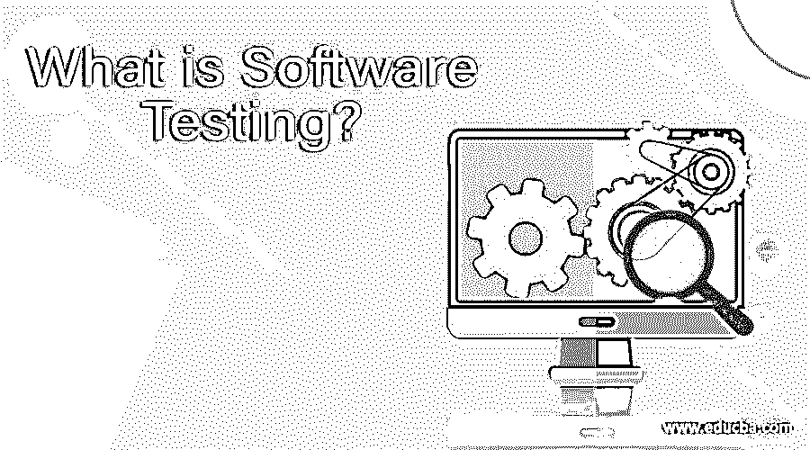
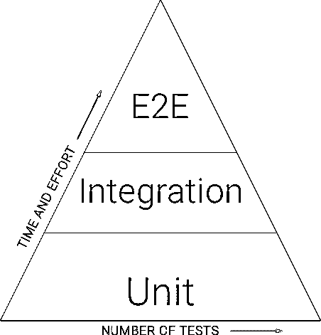
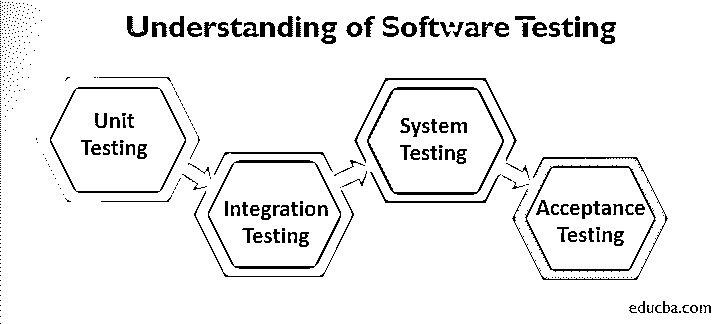

# 什么是软件测试？

> 原文：<https://www.educba.com/what-is-software-testing/>

## 软件测试介绍

软件测试是软件开发生命周期中必不可少的一步，执行软件测试是为了维护和确保软件质量，以及验证是否符合客户对应用程序功能的要求。软件测试类型在开发阶段的不同阶段可能会有所不同，如开发人员对源代码进行单元测试，对每个模块进行集成测试以确认其整体功能，进行系统测试以验证系统的整体性能、速度和功能行为，以及由客户端进行验收测试以测试用户验收标准。

### 理解软件测试

当我们谈论测试软件时，我们需要谈论各种各样的测试和它们的性能易用性。单元测试更容易编写和执行；因此，我们应该在测试过程中进行更多的单元测试。第二，集成测试相对来说比[单元测试](https://www.educba.com/unit-testing/)更昂贵；因此，我们应该减少集成测试。最后，端到端测试是最复杂的；所以，这些我们应该很少。

<small>网页开发、编程语言、软件测试&其他</small>

让我们更详细地了解一下测试级别。

#### 1.单元测试

软件开发人员进行单元测试，以检查他们开发的源代码的各个模块是否正常工作。他们分别测试应用程序的每个单元的稳定性。这是一种廉价且耗时最少的测试。

#### 2.集成测试

[集成测试是对两个或多个单元测试模块一起进行测试的过程，以检查它们之间的连通性和数据传输。这一级别的测试可以由 QA 测试人员进行黑盒测试，也可以由开发人员进行软件模块的复杂集成。](https://www.educba.com/integration-testing/)

#### 3.系统测试(端到端测试)

单元测试和集成测试测试系统的各个部分，[系统测试](https://www.educba.com/system-testing/)测试完全集成的应用程序。它将系统作为一个整体，以确保软件在所有预期的目标系统中都能工作。这个测试由 QA 测试人员执行，并且是从用户的角度来完成的。这是最复杂和耗时的测试。

#### 4.验收测试

验收测试是检查系统可接受性的地方。该测试评估软件与我们的需求的兼容性，并评估它是否适合交付。简而言之，这样做是为了获得客户的认可，这样软件就可以交付并收到付款。

软件测试中的测试方法。

两种最基本的测试方法是[白盒测试](https://www.educba.com/white-box-testing/)和[黑盒测试](https://www.educba.com/black-box-testing/)。

1.  **白盒测试:**在这个测试中，我们检查源代码，检查它是否按照需求工作。在白盒测试中，系统的内部视图和编程知识被用来设计测试用例。这种测试通常在单元级完成。
2.  **黑盒测试:**在这个测试中，我们不能访问源代码，我们只使用自动化工具测试代码产生的外部接口。在这里，测试人员在不查看内部代码结构的情况下评估被测软件的功能。

### 为什么软件测试很重要？

软件测试很重要，因为软件错误可能很昂贵，甚至很危险。它们可能会造成金钱和人员损失。例如，由于安全气囊传感器检测器的软件故障，日产汽车不得不从市场上召回超过 100 万辆汽车。由于这一软件故障，已经报告了两起事故。

下面列出了一些为什么测试是必要的原因:

*   软件测试有助于在软件发挥作用之前识别和修复错误，因此失败的风险可以大大降低。
*   软件测试确保应用程序能够正常工作，并且其性能不会因为集成而受到影响。
*   软件测试是在牢记最终用户可能面对的场景的情况下完成的。
*   软件的可靠性可以通过它与任何技术标准或认证的一致性来衡量。这有助于建立信心和健康的业务关系。

当测试在正确的时间完成时，它会非常有用，因为它通过记住最终用户来提高产品的效率。

### 我们为什么要使用软件测试，它的需求是什么？

作为一名软件测试人员，会进行许多自动化和手动测试，以确保开发人员创建的软件是合适的，这反过来会在软件部署到日常用户之前消除软件中的任何错误或问题。

软件开发人员识别业务需求，并将它们与已开发的软件相匹配。他们监控应用程序和软件系统。他们编写和执行测试脚本，运行手动和自动测试。他们在不同的环境中测试以确保功能。所有这些都是为了提供软件的质量保证和降低风险。如前所述，软件错误可能是有害的。

### 需要哪些技能？

不管你如何为软件测试职业做准备，以下是你应该拥有或计划发展的技能:

*   创建并记录自动化和手动测试计划和程序，执行测试，分析结果，并报告测试问题和错误。
*   在设计-开发-测试-发布-维护软件生命周期的所有阶段进行软件测试。
*   了解各种开发方法，[比如敏捷和 Scrum](https://www.educba.com/agile-vs-scrum/)
*   掌握多种测试工具的全面知识。
*   熟练使用 UNIX、Linux 和/或 Windows，以及脚本和命令行工具。
*   成为优秀的沟通者(书面和口头)。

有些职位需要编程技能和对数据库的理解。作为一名测试人员，你不一定需要多年的编程经验，但是从基础做起不会有什么坏处。

### 这些测试技能对职业发展有什么帮助？

你可以从一个入门级的职位开始你的软件测试员生涯。你成长的速度将取决于你对不同技术的接触，你的经验，以及你对测试方法的认识。专业培训和技术专长将有助于加快你的成长。你可以选择专攻某个特定的行业，例如媒体行业或金融服务，或者你也可以决定拓展业务，积累多个行业的知识。此外，由于软件测试人员本质上与业务团队一起工作，您也可以进入业务前沿角色。软件开发角色的提升是另一种可能性。

测试人员可能会发现有助于更好的职业发展的一些趋势测试技术是:

*   大数据测试
*   移动测试
*   使用 TDD 和 BDD 进行测试
*   DevOps
*   持续集成的自动化
*   视觉验证测试
*   物联网和硬件测试

既然你对软件测试有了更好的理解，它的好处和你可以采取的过程，决定就在你的手里。当然，你总是可以从软件测试的基础开始，或者了解广泛的测试技术，或者深入某一特定的技术。正如他们在软件测试世界中所说的，你不能总是避免犯错误，但是有办法在错误出现之前发现它。

### 推荐文章

这是什么是软件测试的指南？这里我们讨论软件测试的理解、职业发展、技能和优势。您也可以浏览我们推荐的其他文章，了解更多信息——

1.  [软件测试面试问题](https://www.educba.com/software-testing-interview-questions/)
2.  [软件工程面试问题](https://www.educba.com/software-engineering-interview-questions/)
3.  [软件测试职业](https://www.educba.com/careers-in-software-testing/)
4.  [什么是软件开发？](https://www.educba.com/what-is-software-development/)

