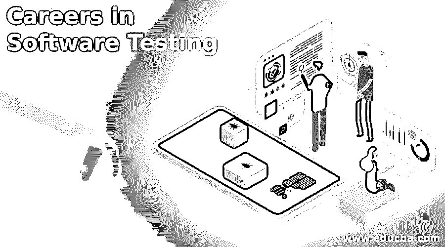

# 软件测试职业

> 原文：<https://www.educba.com/careers-in-software-testing/>

## 软件测试职业介绍

[软件测试](https://www.educba.com/what-is-software-testing/)职业可以定义为通过一系列的验证和确认过程，使产品无缺陷、符合给定的功能需求、确保逻辑效率覆盖的努力。对于一个以此为职业道路的人来说，拥有一些特定的技能是必不可少的，如良好的分析能力、测试概念的基本知识、沟通和任务管理能力，以及至少拥有计算机科学专业的学士学位。一个软件测试员的职业生涯从助理测试员开始，经过测试执行分析师、高级测试员、技术测试主管、测试经理，尽管不同的组织有不同的头衔。

**让我们更详细地研究一下软件测试职业:**

<small>网页开发、编程语言、软件测试&其他</small>

在软件测试中，有两个术语被使用:QA(质量保证)和测试。质量保证基本上是一个活动过程，旨在确保系统满足其目标&创建高质量的软件。QA 流程更多的是对流程进行持续的监控和持续的改进和维护。QA 是用来建立防止程序错误出现的过程，测试活动基本上被称为“质量控制”,用来衡量产品的质量。测试是在转移到实际用户之前识别或发现错误。

### 建立软件测试职业所需的教育

要想获得[软件测试员职位](https://www.educba.com/software-tester-work/)，你至少需要拥有计算机科学、信息系统、数学或同等专业的学士学位。一些雇主也要求硕士学位。对数据库有所了解后，在一家公司找到一份初级工作应该相对容易。一些雇主可能会接受没有这些领域的正式教育的申请人，而不是大量的技术经验和知识。然而，你的学历和经验越多，你对雇主就越有吸引力。

**推荐课程**

*   [JSON 上的程序](https://www.educba.com/data-science/courses/predictive-modeling-course/)
*   Axure 认证课程
*   OmniGraffle Pro 培训

### 软件测试的职业道路

以下是不同的职业道路:

#### 1.非技术技能

 **分析技能软件测试人员要有良好的[分析技能](https://www.educba.com/great-analytical-skills/)，这将有助于理解一个复杂的系统，分解成更小的系统[编写测试用例](https://www.educba.com/how-to-write-test-case/)。**

 ****口头和书面沟通技巧要成为一名优秀的软件测试人员，他/她必须具备良好的口头和书面沟通技巧。测试人员需要编写测试条件、测试用例、测试策略/计划、错误报告，这些应该易于阅读，并且任何人都应该理解。在缺陷或其他后续测试中，测试人员需要与开发人员合作，这需要良好的沟通。**

 ****&时间管理**
组织技巧一个测试人员应该擅长[时间管理](https://www.educba.com/time-management-activities/)，因为它直接关系到代码的发布。他/她应该运用组织技巧以有效的方式工作。

 **态度软件测试人员必须对‘测试到崩溃’系统有一个很好的态度，能够自我学习，提高技术技能和其他技能。有时，测试人员需要在没有任何监督的情况下自主完成任务。**

 **激情
一个软件测试人员必须对测试领域有热情，这样他/她才能参与其中。

#### 2.技术

**·数据库/SQL 基础知识**
软件应用在后台有大量的数据，存储在 Oracle、My SQL 等不同类型的数据库上。这个数据需要验证，在这种情况下， [SQL 查询](https://www.educba.com/mysql-queries/)。

 **Linux 命令的基本知识大部分软件系统都部署在 Linux 机器上，因此测试人员掌握[Linux](https://www.educba.com/top-commands-in-linux/)的知识至关重要。**

 ****自动化工具的知识和经验软件测试人员可以开发任何自动化工具的知识和实践经验，如 UFT、硒、TOSCA 等。**

 **测试管理工具的知识和经验
测试管理是软件测试的一个重要方面。有了合适的[测试管理工具，](https://www.educba.com/test-management-tools/)测试就无法进行。因此，拥有关于任何测试管理工具的知识和实践经验是很好的。

 **缺陷跟踪工具的知识和经验在测试生命周期中缺陷跟踪和缺陷生命周期起着重要的作用，因此应该由软件测试人员借助[缺陷跟踪工具](https://www.educba.com/defect-tracking-tools/)进行适当的管理和跟踪。由于包括测试人员、开发人员和管理人员在内的整个团队都参与到缺陷跟踪中，因此它变得很有必要。质量控制，TFS，JIRA 等是缺陷跟踪的工具。**

 **当然，在我们之前提到的所有可能的路径之后，还有几十条。一个人可以专注于敏捷世界，在测试和工具的类型上有所不同，成为商业领域的专家，在测试领域进行研究，或者通过在会议上发言、参加会议和通过博客传播知识来激励其他人成为测试人员(就像这个！)、[社交媒体](https://www.educba.com/career-in-social-media/)，或者教学课程、工作坊。以下是软件测试人员不同的职业轨迹

 **[手动测试人员](https://www.educba.com/manual-testing/)结合测试条件和场景，手动验证软件应用。**

 ****[自动化测试自动化测试人员是](https://www.educba.com/what-is-automation-testing/)负责用自动化工具自动化手动测试用例的执行，以减少执行时间。**

 ****性能测试使用 LoadRunner、WEBLoad 等工具检查软件应用程序的响应性。**

 ****[商业分析师](https://www.educba.com/data-scientist-vs-business-analyst/)分析和评估公司的商业模式和工作流程。**

 **### 工作职位或应用领域

从测试工程师到高级测试工程师，从测试主管到测试经理；否则可以成为质量保证主管，质量保证经理。测试工具方面的可用选项非常多。作为软件测试职业，任何人都可以考虑以下工作角色:

*   质量保证分析师/见习测试员(新人)
*   **质量保证分析师/软件测试员(1-3 年经验)**
*   质量保证分析员 (3-5 年经验)
*   **软件测试工程师** (3-5 年经验)
*   质量保证团队协调员 (5-6 年经验)
*   测试经理 (8-11 年经验)
*   **高级测试经理** (14 年以上经验)

**薪资(美国数据)**

| **工作简介** | **平均工资【每年】** |
| **软件测试仪** | $45,993 |
| **质量保证测试仪** | $69,843 |
| **软件测试工程师** | $93,675 |
| **质量保证工程师** | $79,150 |
| **测试工程师** | $81,982 |
| **软件工程师** | $98,567 |
| **质量保证分析师** | $67,035 |

[Reference: https://www.indeed.com/salaries/Software-Tester-Salaries]

### 结论或职业前景

在过去的十年中，软件测试人员的形象经历了巨大的变化。软件测试职业已经成为一些应用程序/产品实现的绊脚石，企业已经意识到在发布之前对应用程序进行结构化测试的重要性。测试创造了几个级别和类型，这些不同类型测试的专业化增加了软件测试职业的内在价值。从一个单调的测试用例执行者，几个职业选择已经在测试社区面前发展起来。应用程序领域的良好知识为测试专业人员增加了价值。有像 BFSI，电信，医疗保健，制造，嵌入式等生活领域。这些领域都有许多认证，测试人员可以在这些领域获得认证。

### 推荐文章

这是软件测试职业的指南。在这里，我们讨论了软件测试中的入门、教育、职业道路以及软件测试中的工资和应用领域。您也可以阅读以下文章，了解更多信息——

1.  软件开发人员的职业
2.  [SharePoint 中的职业](https://www.educba.com/careers-in-sharepoint/)
3.  [软件工程师职业](https://www.educba.com/careers-as-a-software-engineer/)
4.  [软件测试的级别](https://www.educba.com/levels-of-software-testing/)

********************