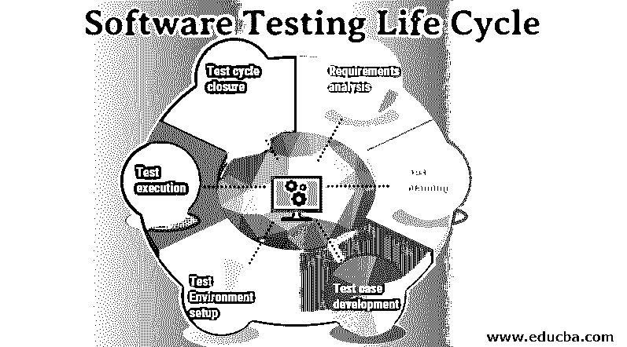

# 软件测试生命周期

> 原文：<https://www.educba.com/software-testing-life-cycle/>

## 软件测试生命周期简介

软件测试生命周期，通常被称为 STLC，是在软件应用系统上按顺序执行的测试过程的流程，以便对照业务提供的需求来验证和确认应用的正确性。它由六个不同的阶段组成，类似于软件开发生命周期。这些阶段可以与开发过程并行，也可以作为软件开发生命周期过程的最后一步完成，这取决于用于开发应用软件的方法。

### 软件测试生命周期

软件测试生命周期的不同阶段如下:

<small>网页开发、编程语言、软件测试&其他</small>

1.需求分析
2。测试计划
3。测试用例开发
4。测试环境设置
5。测试执行
6。测试周期结束

为了更好的理解，让我们详细讨论一下上面提到的软件测试阶段。

#### 1.需求分析

这是软件测试生命周期的第一阶段。之后，需求分析是最重要的阶段，因为它是所有软件开发的基础阶段；如果我们在需求分析中犯了一个错误，错误的软件可能会被交付给客户。

在这个阶段，质量保证团队首先了解软件的需求，以确定需要测试的部分。然后，为了更好地理解需求，QA(即质量保证团队)可能会遇到不同的组织，如业务组织、利益相关者、开发团队、技术团队、设计团队等。一旦确定了软件的需求，QA 团队就识别出要测试的软件或系统的组件或部分。

#### 2.测试计划

这是软件测试生命周期的第二阶段。这个阶段被称为[测试策略](https://www.educba.com/test-strategy/)，因为测试策略是在这个阶段计划的。测试经理执行这个活动，他负责所有与测试相关的事情，比如测试需要多少工作量，测试整个项目需要多少成本，以及需要对哪个组件进行哪些类型的测试。除此之外，它还涉及以下任务

1.分析软件
2。定义测试的目标
3。设计测试策略
4。为测试
5 规划资源。规划测试标准
6。设计测试用例
7。调度和执行测试
8。规划执行测试环境
9。分析测试交付

#### 3.测试用例开发

这是软件测试生命周期的第三阶段。一旦测试计划完成，测试用例的工作就开始了。在这个阶段，测试团队详细设计测试执行的测试用例。它还准备信息，即测试用例的数据。在测试用例被设计之后，它们被交付给同级团队或者质量控制，例如 QA 团队，用于检查。如果测试用例能够快速识别错误并在测试中立即解决它们，那么它就是好的。

1.一个好的测试用例的特征是
2。测试用例是透明和简单的。
3。每次对相同的测试产生相同的结果。
4。测试用例 id 包含名称。
5。涵盖 100%的软件需求。

#### 4.测试环境设置

这是软件测试生命周期的第四个阶段。这个阶段是 STLC 的重要组成部分。测试环境设置是为测试团队设置所有的资源，如软件和硬件，以执行所有的测试用例。客户或组织不做测试团队的测试环境设置。相反，测试团队为执行测试环境设置准备冒烟测试。

#### 5.测试执行

这是软件测试生命周期的第五个阶段。它用代码执行测试，并与预期结果进行比较，然后分析报告。测试团队根据测试计划和策略执行测试。在执行测试的时候，测试分析员标记测试报告。

1.如果测试用例被成功执行，它被标记为通过。
2。如果测试用例失败，它被标记为失败，相应的缺陷被报告给[软件开发者](https://www.educba.com/career-as-a-software-developers/)团队
3。如果测试用例因为一个错误而被阻塞，那么它被标记为阻塞。一旦缺陷被解决，被标记为阻塞或失败的测试用例被再次测试，以确保它们被修复。

#### 6.测试周期结束

这是软件测试生命周期的最后阶段。在这个阶段，软件测试人员会根据软件的需求、测试用例、成本、时间和质量保证来评估测试覆盖率。对测试用例以及 bug 报告的分析是为了找到缺陷的类型分布。一旦测试周期完成，就要准备测试周期结束报告。最后，测试领导者准备测试周期结束。
试验循环结束的标准格式如下

测试总结报告
标识符
测试总结
差异
全面性评估
结果总结
评估
活动总结
批准

### 结论

在本文中，我们已经看到了软件测试生命周期的各个阶段。我希望这篇文章对你有所帮助。

### 推荐文章

这是软件测试生命周期指南。这里我们讨论软件测试生命周期不同阶段的基本概念。您也可以浏览我们推荐的其他文章，了解更多信息——

1.  [性能测试工具](https://www.educba.com/performance-testing-tools/)
2.  [状态转换测试](https://www.educba.com/state-transition-testing/)
3.  [功能测试工具](https://www.educba.com/functional-testing-tools/)
4.  什么是可用性测试？

