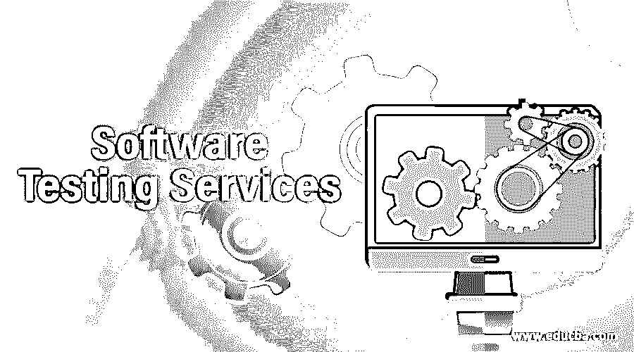

# 软件测试服务

> 原文：<https://www.educba.com/software-testing-services/>

## 软件测试服务介绍

顾名思义，软件测试服务可以被解释为各种相互合作的条款，以确保软件系统的质量符合客户的期望。该过程涉及一系列用于检查多个软件属性的活动，如功能性、一致性、安全性、可靠性、稳定性、完整性、可访问性、响应性、用户友好界面、数据处理能力、连接性等。任何提供软件测试服务的组织也可以提供副产品，一些这样的附加服务是质量控制咨询、质量分析、测试处理管理等。

### 8 大软件测试服务

软件测试服务包括许多软件验证过程，这些过程可以归入功能和非功能领域，下面是其中的一些，

<small>网页开发、编程语言、软件测试&其他</small>

#### 1.功能服务

功能测试可以定义为确认实现与客户提供的功能需求相匹配的过程。这是通过运行软件并获取一组结果来实现的，然后该结果将与作为需求的一部分提供的功能规范相匹配。如果实际结果等于预期结果，那么可以说软件在功能上是合格的。功能通常由界面、菜单列表、连接的 API、数据库后端、功能集成等功能区域组成。

#### 2.可用性服务

可用性测试可以定义为这样一种活动，当在软件范围内执行大量操作时，测试人员可以仔细检查软件应用程序，以完成不同的操作。当组织或项目需要彻底的评估或调查时，使用这种类型的软件测试服务，以便发现可能的功能问题、问题、错误，或者有时甚至是故障软件应用程序性能。这些问题还可能意味着用户访问应用程序不安全，交付处理可能会成为一个巨大的麻烦。

#### 3.性能服务

另一种常用的软件测试服务类型是性能测试，它通过改变应用程序的事务限制、负载量、发送和响应时间记录、改变软件的稳定性等来执行。当这些参数根据需要调整时，它可以成倍地提高软件应用程序的性能。由各种组织提供的软件测试服务是由最有经验的测试人员执行的，最好是自动化专业人员，因为它需要 ETL 流程以及软件的性能。这通常在一系列环境设置中完成，以确保团队实施的即兴创作在需要时得到体现。性能测试有两种类型，它们是负载测试和压力测试。

#### 4.安全服务

安全测试可以定义为一系列的验证和确认过程，以发现可能的安全异常，因为薄弱的软件安全设计会危及其他系统与主系统的连接/集成。这种测试用于捕获漏洞，这些漏洞会让入侵者进入应用程序，并访问组织的机密信息。一个经过严格安全测试的管理良好的应用程序可以承受任何类型的黑客攻击和干扰，或者至少可以以数字足迹的形式捕获黑客的详细信息，这可以追溯到骗子本人。

#### 5.兼容性服务

兼容性测试是一种著名的软件测试服务，因为它用于严格调查当软件应用程序与其他应用程序一起工作时，由于缺乏兼容性而可能发生的潜在问题。该测试通常在一系列组合中横向执行，其中在不同的浏览器应用程序、不同类型的数据库系统、各种硬件组合上访问应用程序，以验证应用程序的速度和性能、服务器通信设置、界面和外观、显示质量改变的分辨率，以及在不同类型的设备(如台式机、笔记本电脑、移动电话、平板电脑等)上。

#### 6.移动应用服务

现在几乎所有的软件应用程序都有移动应用程序版本，这意味着软件测试服务也以移动应用程序测试的形式广泛提供。在移动应用程序测试过程中，验证的重点是应用程序的可伸缩性、可靠性、稳定性、一致性和安全性。这些形式的应用程序有望在多种移动系统平台上访问，例如 Android 系统、iOS 系统、Symbion 系统等。服务组织可以提供一个完整的测试过程，从用户界面，通过跨浏览器验证，通过功能区，直到后端服务器连接验证测试。一旦功能被修复，测试人员可以选择手动或者通过自动化测试流程来执行测试。

#### 7.Web 应用服务

随着趋势向基于互联网和基于云的应用倾斜，当前市场上几乎所有的服务公司都提供最常用的 Web 应用测试服务之一。这种类型的测试包括应用硬件要求和软件配置方面的多种组合，例如在具有不同连接性和不同带宽范围的系统上的各种浏览器上执行的验证。它与移动应用程序测试服务非常相似，因此测试团队需要相似的知识来执行这种类型的测试。

#### 8.数据仓库服务

数据仓库测试服务，顾名思义，是在软件的数据仓库系统上执行的，依次确认软件和链接的数据仓库之间的不间断服务连接。该测试服务包括其他活动，即 ETL 测试、BI 测试、DWH 性能测试、DWH 安全测试等。这些过程都是例行的，包括测试计划的创建，测试场景的设计，测试用例的编写，以及测试的执行。

### 结论

软件测试服务由许多基于服务的组织提供，这些组织自然也会为软件的正常运行提供其他服务。客户公司使用测试服务，目的是确保应用程序运行完美，最终用户在访问软件时不会发现任何障碍。

### 推荐文章

这是软件测试服务指南。在这里，我们讨论了软件测试服务的介绍，并详细解释了 8 大服务。您也可以浏览我们的其他相关文章，了解更多信息——

1.  [等价类测试](https://www.educba.com/equivalence-class-testing/)
2.  什么是可用性测试？
3.  [玻璃箱测试](https://www.educba.com/glass-box-testing/)
4.  [非功能测试](https://www.educba.com/non-functional-testing/)

