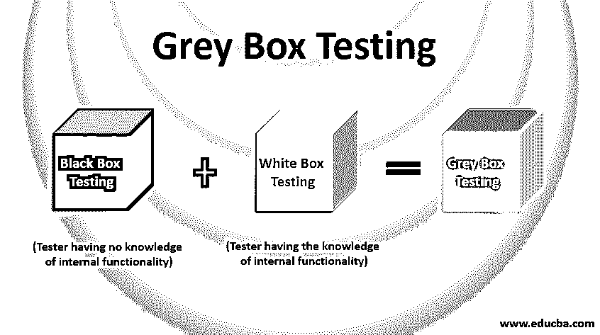

# 灰箱测试

> 原文：<https://www.educba.com/grey-box-testing/>

## 什么是灰盒测试？

正如人们对灰盒测试这个名字的理解，[它是白盒测试](https://www.educba.com/white-box-testing/)(测试人员了解应用程序的内部功能/代码)和黑盒测试(测试人员不了解内部功能)的结合。它是利用内部功能的部分/有限信息在软件产品上执行的。测试人员通常可以访问数据库、详细的设计文档和关于产品需求的信息。测试人员了解[代码的基本工作原理和使用的算法](https://www.educba.com/types-of-algorithms/)，这有助于设计测试用例，但不知道确切的代码，所以从测试人员的角度来看，测试是正常进行的。

### 为什么我们需要灰盒测试？

在当今的软件应用中，对于一个测试人员来说，对源代码有一个基本的了解是非常重要的，这样测试才能深入，测试的范围才能扩大。证明测试人员需要灰箱测试的一些重要原因如下:

<small>网页开发、编程语言、软件测试&其他</small>

*   灰盒测试最重要的原因之一是它减少了测试人员在应用程序中发现的每个小问题对开发人员的依赖。因为对应用程序代码有基本了解的测试人员可以找出原因并在需要时自行修复。
*   它结合了黑盒测试和白盒测试的优点。
*   通过从开发者和测试者的角度更好地理解应用程序，它有助于扩大测试的范围，从而提高软件的质量。
*   它给开发人员足够的自由时间来修复测试团队提出的错误/问题。

### 它是如何工作的？

执行应用程序的灰箱测试的基本步骤是:

**第一步:**白盒测试，了解[软件应用](https://www.educba.com/what-is-application-software-its-types/)整个程序的代码和流程。

**第二步:**利用上述代码的知识设计详细的测试用例，使其具有最大的代码覆盖率。

**第三步:**黑盒测试为了用测试者的观点而不是一个应用的开发者的观点来测试上面的测试用例。

### 四大灰箱测试技术

基本上有 4 种技术用于测试任何软件应用程序:

#### 1.模式测试

在模式测试中，执行对缺陷的先前记录的分析，并且调查代码中的问题，由于该问题而产生缺陷。模式测试是针对以前在相同模式下开发的软件应用程序执行的，因为有可能再次出现相同的缺陷，所以以前遇到的问题可以在下一个软件中正确测试，以避免风险。

#### 2.OAT 或正交阵列测试

OAT 测试是针对复杂应用程序进行的，目的是通过对数组中表示的测试数据进行排列和组合，用代表列的变量和代表行中测试用例的变量，用最少数量的测试用例覆盖最多的代码和最少数量的 GUI 功能。

#### 3.回归测试

执行回归测试是为了测试任何变化或新添加的功能是否没有影响相关的或先前工作的软件。在回归测试中，测试主要集中在可能由于变更而受到影响的区域，对已修复的 bug 进行重新测试，通过选择基线测试对可能妨碍应用程序的风险区域进行回归。

#### 4.矩阵测试

在这种类型的测试中，定义了程序中使用的所有变量，以便测试与开发人员定义的变量相关联的业务和技术风险。变量在任何软件应用程序的整个流程中起着重要的作用，当所有关于变量的信息都汇总在一个表中时，围绕它的测试会变得更加容易和流畅。

### 优点和缺点

以下是优点和缺点:

#### 优势

下面给出了一些优点:

*   它是公正的，有助于从开发人员和测试人员的角度找出更多需要测试的场景。
*   灰色框也有助于在测试阶段再次验证需求，因为所有的软件需求文档、架构图都是与测试人员共享的。
*   它减少了从功能和非功能角度分别测试软件应用程序的任务，因为两者都可以在灰盒测试中覆盖。
*   即使测试人员有代码知识，但是灰盒测试是从用户的角度而不是从开发人员的角度来完成的。
*   这对应用程序的集成测试和渗透测试非常有益。
*   在应用程序出现小问题的情况下(比如超链接在网站上不起作用，图像无法加载等)，不必要的时间不会浪费在提交 bug 和提交给开发人员进行修复上。由于测试人员对代码有一个基本的了解，可以在没有开发人员的干扰下访问和修复它。

#### 不足之处

下面列出了一些缺点:

*   与单独的黑盒测试和白盒测试相比，灰盒测试的测试覆盖率相对较小。
*   实际上，由于安全原因，并不是所有的组织都允许测试人员访问代码，所以它不能被完全执行。
*   对于大型应用程序，覆盖每个输入路径需要花费大量时间，这反过来增加了项目预算，并可能妨碍项目的截止日期。
*   对于一个测试人员来说，理解每一个用来设计测试用例的需求和算法是非常具有挑战性的。
*   在分布式环境中，应用程序的某些相关功能的失败会在执行时造成阻碍，并且灰箱测试中的错误关联是困难的。

### 结论

上面的描述清楚地解释了它是什么，为什么它在软件测试领域很重要？这是非常有益的，也是现代 It 界的趋势，因为它结合了黑盒和白盒测试的优点。它特别有助于基于 web 的应用程序的广泛测试和应用程序的功能测试。

### 推荐文章

这是一个灰盒测试指南。在这里，我们讨论了基本概念和 4 大灰箱测试技术以及优缺点。您也可以浏览我们推荐的其他文章，了解更多信息——

1.  [软件测试的级别](https://www.educba.com/levels-of-software-testing/)
2.  [安全测试的类型](https://www.educba.com/security-testing/)
3.  [白盒测试 vs 黑盒测试](https://www.educba.com/white-box-testing-vs-black-box-testing/)
4.  [域测试](https://www.educba.com/domain-testing/)

