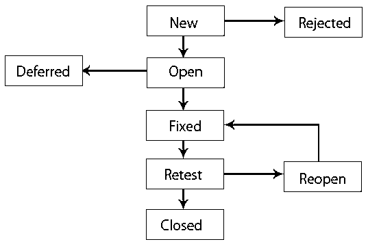

# 什么是软件测试中的 Bug？

> 原文：<https://www.educba.com/what-is-a-bug-in-software-testing/>

## 软件测试中的 Bug 介绍

软件测试中的 Bug 是一个组件或系统或软件中的缺陷或缺省，它会导致组件或系统无法执行其所需的功能，换句话说，我们可以说，如果在测试执行过程中遇到 bug 或缺陷，它可能会导致组件的失败，即无法像组件预期的那样工作。例如，不正确的数据定义、语句、输入数据、设计等

### 软件测试中 Bug 的生命周期

Bug 生命周期也被称为[缺陷生命周期](https://www.educba.com/defect-life-cycle/)。它是缺陷的一个阶段，在其生命周期中占据不同的状态。它在测试设备发现新的缺陷时开始，在测试设备移除该缺陷并确保该缺陷不被复制时结束。现在是时候通过如下所示的基本图表来理解缺陷生命周期的真正工作流程了。

<small>网页开发、编程语言、软件测试&其他</small>

下面是 Bug 生命周期的示意图:

### 错误的状态

让我们看看 bug 生命周期的每个组成部分。

#### 1.打开

程序员从这里开始错误分析过程，尽可能地修复它。如果程序员认为缺陷不充分，那么取决于特定原因的错误可能被传递到以下四种状态，拒绝或不拒绝，即重复。

#### 2.新的

这是 bug 生命周期中 bug 分类的第一个状态。在 bug 生命周期的后期[阶段](https://www.educba.com/jira-bug-life-cycle/)，如果发现新的缺陷，就对这些 bug 进行验证和测试。

#### 3.分配

开发团队被分配一个新创建的故障，用于在这个级别上操作故障。这将由项目负责人或团队老板委托给设计师。

#### 4.等待复试

在修复缺陷后，设计者将向测试者提供该故障以重新测试该故障，并且该缺陷的状态保持在“等待重新测试”中，直到测试者重新测试该故障。

#### 5.固定的

如果开发人员通过进行必要的变更完成了修复缺陷的任务，那么缺陷状态就可以被称为“已修复”

#### 6.已证实的

如果在设计者已经将缺陷分配给测试设备并且认为缺陷已经被正确修复之后，测试者对缺陷没有问题，则缺陷状态被分配为“已确认”。

#### 7.重新开放

如果缺陷仍然有问题，程序员将被指示再次检查，缺陷状态将被重新打开。

#### 8.关闭的

如果缺陷不存在，测试人员将缺陷状态更改为‘已关闭’。

#### 9.重新检测

然后，测试人员开始重新测试缺陷的任务，以检查开发人员是否按照需求的要求正确地修复了缺陷。

#### 10.复制

如果开发人员认为该缺陷与任何其他缺陷相似，或者如果该缺陷定义与任何其他缺陷混合，那么开发人员会将该缺陷状态更改为“重复”。

### 软件测试中的缺陷参数

*   发布日期、批准、作者和状态。
*   严重性和事件优先级。
*   测试用例显示了问题。
*   具有再生步骤的事件定义。

### 缺陷生命周期实施指南

*   在开始研究缺陷生命周期之前，整个团队必须清楚地了解一个缺陷的不同情况。
*   为了防止将来的混乱，缺陷生命周期应该被适当地记录。
*   确保与默认生命周期相关的任何任务的每个人都非常清楚地了解他/她对更好结果的责任。
*   每一个改变缺陷状态的人都应该正确地知道状态，这应该提供足够的关于缺陷状态和原因的信息，这样每一个处理缺陷的人都可以容易地看到缺陷的原因。
*   缺陷跟踪工具应该在缺陷生命周期的工作流程中小心处理，以确保缺陷之间的一致性。

### 结论

我希望你对缺陷的生命周期有所了解。如果你将来处理软件缺陷，这篇文章也会很方便地帮助你。

### 推荐文章

这是关于什么是软件测试中的错误的指南。这里我们讨论一个 bug 的生命周期、状态、参数和指导。您也可以浏览我们的其他相关文章，了解更多信息——

1.  [软件测试生命周期](https://www.educba.com/software-testing-life-cycle/)
2.  [什么是软件测试？](https://www.educba.com/what-is-software-testing/)
3.  [软件测试的类型](https://www.educba.com/types-of-software-testing/)
4.  [缺陷生命周期](https://www.educba.com/defect-life-cycle/)

