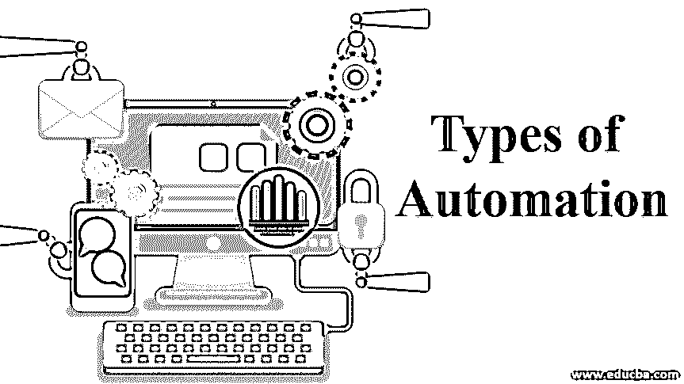

# 自动化的类型

> 原文：<https://www.educba.com/types-of-automation/>

## 自动化类型介绍

在自动化脚本的帮助下，自动化测试对于测试没有新的功能更新的重复功能流是有用的。可以根据给定模块所需的测试类型以及要实现自动化测试的软件开发阶段来选择自动化测试类型。自动化测试的类型有功能测试、单元测试、集成测试、冒烟测试、关键字驱动测试、数据驱动测试和回归测试。

### 自动化的 7 大类型

适合自动化的软件测试可以分为以下类型:

<small>网页开发、编程语言、软件测试&其他</small>

#### 1.烟雾测试

它也被称为构建验证测试(BVT)或构建验收测试(BAT)。冒烟测试确保应用程序最重要和最关键的功能能够顺利运行。这是用于找出有可能拒绝软件发布的错误的主要测试方法。[冒烟测试涵盖重要的](https://www.educba.com/smoke-testing/)特性和功能，用于评估软件运行是否正常。这些初步测试用于评估是否需要进一步的测试，以及产品在发布给测试团队之前的测试价值。这是最具成本效益的方法，当运行测试套件时，它运行迅速并给出快速的反馈。烟雾测试可以由人工测试人员或通过自动化工具来完成。

#### 2.单元测试

这是一种软件自动化测试，其中应用程序/软件的单个过程或组件被单独测试。这种类型的测试检查和验证应用程序的每个单元是否按照其设计执行。软件应用程序的最小可测试部分称为一个单元。自动化单元测试检查源代码的单个单元，它分离程序的每个部分，并单独检查它是否按预期工作。这被认为是 web 应用程序测试的第一步。单元测试通常是自动化的。

#### 3.功能测试

这是一种[类型的软件测试](https://www.educba.com/types-of-software-testing/)，在这种测试中，所有的功能需求和规范都是通过向系统输入数据来测试的，并检查输出数据来检查应用程序是否满足所有的需求。[功能测试包括](https://www.educba.com/what-is-functional-testing/)测试，用于检查 UI、API、客户端/服务器应用程序、安全特性、数据库以及软件应用程序的整体特性和功能，以确定它们是否按照所有重要规范正常工作。功能测试可以通过使用自动化工具来自动化；它传统上是由人工测试人员实现的。然而，自动化工具现在也用于功能测试，它可以加速整个测试过程。

#### 4.集成测试

这是软件测试的一种形式，其中[软件应用程序](https://www.educba.com/what-is-application-software-its-types/)的单个组件被组合成一组并进行测试。集成测试的功能是根据作为一个集成单元的各个单元的相互作用，暴露错误并检查应用程序的性能。这种测试形式的目的是确定当集成到一个单元中时，应用程序的各个单元如何一起执行。这种类型的测试有助于提高测试覆盖率和完成测试差距。集成测试发现系统级的错误，比如 catch 集成错误、数据库模式错误等。也可以自动化。

#### 5.回归测试

这是一种软件测试，用于确定程序更改的最新代码是否对应用程序的任何现有功能产生了负面影响。在这种情况下，部分或完全成功执行的测试用例然后被再次重新执行，以检查软件的现有功能中的错误。这种类型的测试用于确保一旦完成任何新的更改，最近的代码更改不会对应用程序产生负面影响。这种类型的测试确保代码可以根据需求的变化进行修改，可以对软件进行新的添加和功能，并且可以轻松地修复错误和性能问题。回归测试也可以使用自动化测试工具来完成。

#### 6.关键词驱动测试

它也被称为动作词驱动测试。这是一种软件测试，也可以使用自动化工具来实现自动化。它是一种脚本方法，使用包含与被测试软件应用程序相关的关键字的数据文件。然后，这些关键字用于描述一组执行特定流程的操作。关键字驱动测试包含高级和低级关键字。然后识别关键字列表，然后将它们与和这些关键字相关的特定功能相关联。在这种形式的测试中，诸如鼠标点击、打开浏览器、击键等动作。由诸如点击、打开浏览器、键入文本等关键字来分配。

#### 7.数据驱动测试

它是一种也可以自动化的测试执行和设计策略，其中测试脚本从不同的源读取测试数据(数据库或文件),例如 ODBC 源、ADO 对象、CSV 文件等。，而不是使用硬编码的值。在数据驱动测试中，测试脚本被创建，它们与相应的数据集一起在一个框架中运行。这个框架使用可重用的测试逻辑来提高测试覆盖率和减少维护。在自动化环境中，测试数据是使用定制的自动化工具从已经运行的系统中获取的。自动化测试使用一组记录的或编程的用户动作序列，覆盖被测试应用程序的某些部分。

### 结论

可以得出结论，自动化是测试的一个重要方面，它有可能减少与手动测试相关的缺点，同时降低成本并提高效率。自动化工具的正确类型必须根据测试的类型来选择。

### 推荐文章

这是自动化类型的指南。在这里，我们讨论自动化的基本概念和类型，分别包括 smoke、单元和功能测试。您也可以阅读以下文章，了解更多信息——

1.  什么是测试自动化框架？
2.  [硒测试](https://www.educba.com/selenium-testing/)
3.  [视觉测试](https://www.educba.com/visual-testing/)
4.  [手工测试 vs 自动化测试](https://www.educba.com/manual-testing-vs-automation-testing/)

