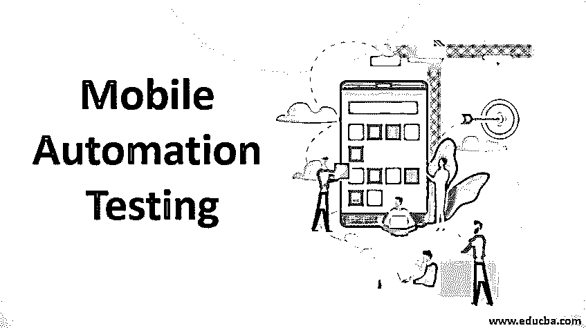
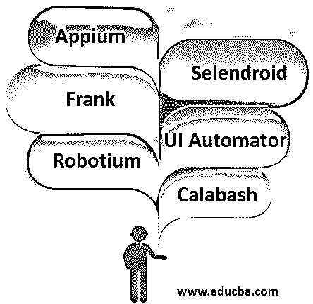

# 移动自动化测试

> 原文：<https://www.educba.com/mobile-automation-testing/>

## 移动自动化测试简介

移动自动化通常在移动应用测试中完成，以提高我们测试过程的效率。[移动应用程序测试](https://www.educba.com/testing-of-mobile-application/)在我们当前的场景中是绝对必要的，因为在我们说话的时候，许多应用程序正在开发，以减轻我们的痛苦，例如，我们依赖 Swiggy、优步、Instagram、WhatsApp 等应用程序。为了生存。为了维护应用程序的品牌、收入和质量，我们需要有一个适当的测试策略，以便应用程序在进入市场之前处于良好的状态。

### 什么是移动自动化测试？

手动测试 web 应用程序或移动应用程序需要大量的精力和时间，随着技术的进步，我们没有太多的时间来手动测试这些应用程序，因此我们采用自动化测试，从而减少手动工作，我们可以借助市场上可用的工具来完成这项工作。

<small>网页开发、编程语言、软件测试&其他</small>

移动自动化测试有助于解决移动测试领域面临的一些关键挑战，例如:

*   大量设备(笔记本电脑、手机、平板电脑等。).
*   应对各种软件(应对不同版本的 IOS 和 android)和硬件(涉及不同的内存、CPU 和 OS 优化)。
*   频繁的移动应用更新。
*   部署手动测试工程师来执行任务的成本。

### 移动自动化测试是如何完成的？

移动自动化测试通常是在市场上可用的各种工具的帮助下进行的，其中很少是付费工具，也很少是开源工具。

让我们看看移动自动化测试领域中一些最常用的工具:

#### 1.Appium

这是一个开源工具，市场上有售，可用于测试混合应用程序、原生程序等。还支持 Firefox、Mac、windows、android 等几乎所有平台。由于 Appium 可以在所有模拟器上运行应用程序，这使得该工具可以进行跨平台的自动化测试。Appium 的主要原则是代码库应该总是可以在各种平台中重用。因此，该工具在 ios 和 android 应用程序的自动化测试中非常有用，对于可以通过移动浏览器访问的应用程序也非常有用。

#### 2.弗兰克（男子名）

这个工具有助于以结构化的方式编写验收测试，它还有一个名为 symbiote 的应用程序检查器。

#### 3.机器人工厂

这个自动化测试框架主要面向 android 用户，它类似于 selenium 工具，但是它只关注 android 应用程序。有了这个工具，集成变得更加容易，脚本可以在仿真器和设备中执行。该工具的主要缺点是可扩展性，即一次只能在一个设备上执行测试。

#### 4.硒机器人

这个自动化框架工具有助于克服我们在 Robotium 工具中面临的缺点。它不仅扩展性好，我们还可以进行并行测试。测试在 Selenium 2 客户端 API 中编写和执行。这也是主要为 Android 开发的，所以测试可以在模拟器和真实设备上运行。

#### 5.UI 自动机

它通过创建各种功能测试用例来帮助测试用户界面，这些测试用例将在多个设备上的 AUT(被测应用程序)上运行。

#### 6.葫芦

这是一个行为驱动的开发[自动化框架](https://www.educba.com/test-automation-framework/)，其中为 android 和 IOS 编写并执行验收测试。也可以在设备上执行。

### 自动化测试工作

既然我们已经了解了移动自动化测试中涉及的各种工具，让我们来理解自动化测试是如何工作的。要进行自动化测试，首先要根据测试标准创建一个框架(一些常见的框架是数据驱动和关键字驱动的)。在数据驱动的自动化框架的情况下，软件开发人员将创建脚本，这些脚本将在多个数据集上工作，并且用最少的脚本覆盖各种各样的测试用例。

在关键字驱动框架的情况下，测试的自动化不需要知道任何特定的语言，脚本将完全基于关键字并以表格格式创建以供执行。为了进行自动化测试，我们可以在市场上找到各种工具，最流行的是硒，UFT 等。对于这些工具，需要了解的语言有 C#、Java、Python 和 VB 脚本。

### 利益

下面是提到的好处:

*   **提供更快的反馈:**当我们处理一个软件项目中的不同阶段时，自动化测试使测试生活变得更加容易，也提供了更高的效率。
*   **更快的结果:**当我们从[手动测试转移到自动化](https://www.educba.com/manual-testing-vs-automation-testing/)时，我们确实节省了很多时间，并且[自动化测试也帮助](https://www.educba.com/automation-testing-life-cycle/)在各种应用上执行严格的回归。
*   **费用:**当然省了不少钱；我们不再花费大量的人力资源，而是花更少的钱来获得各种工具的许可证。
*   测试覆盖率:通过编写测试脚本，我们将能够实现更高的覆盖率，这反过来有助于测试应用程序中的更多功能。
*   测试用例的可重用性和缺陷的早期发现。
*   更快上市。
*   整体测试效率提高。

### 结论

从上面的文章中，我们看到了移动自动化测试对于移动应用的重要性以及它的各种应用和优势。我们还看到，市场上有各种各样的工具可用于移动应用程序的自动化测试。在开始测试之前，我们必须权衡每个工具的利弊，然后明智地选择。自动化测试无疑使我们的生活更加简单和容易。

### 推荐文章

这是一个移动自动化测试指南。在这里，我们讨论什么是移动自动化测试，以及它的工作和它的好处。您也可以浏览我们推荐的其他文章，了解更多信息——

1.  什么是自动化测试？
2.  [测试自动化框架](https://www.educba.com/test-automation-framework/)
3.  [自动化测试工具](https://www.educba.com/automation-testing-tools/)
4.  [手机测试面试问题](https://www.educba.com/mobile-testing-interview-questions/)

