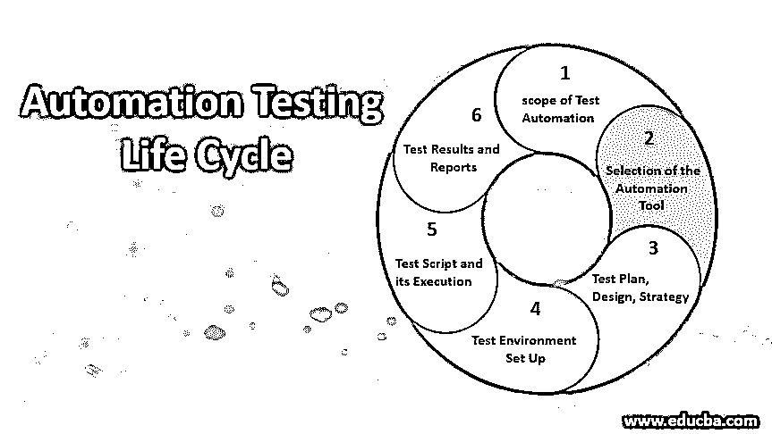

# 自动化测试生命周期

> 原文：<https://www.educba.com/automation-testing-life-cycle/>

## 自动化测试生命周期简介

测试自动化应用于测试过程的结构序列，它可以包含测试生命周期的所有阶段，以及包括测试准备和自动化实现过程的附加阶段。这整个过程被称为自动化测试生命周期。ATLC 的各个阶段是“定义测试自动化的范围”，“根据功能类型的自动化测试工具选择过程”，“设计测试计划”，“定义测试策略”，“设置测试环境”，“设计测试用例并编写脚本”，“执行测试脚本”，“验证测试结果”，最后是“生成测试报告”。

### 自动化测试生命周期的阶段(ATLM)

下面是自动化测试生命周期的各个阶段:

<small>网页开发、编程语言、软件测试&其他</small>

#### 1.确定测试自动化的范围

这个阶段指的是为自动化测试过程的可行性研究所做的决定。应提出一份建议书，其中包含以下评估:

需要将可以自动化的应用程序模块与不能自动化的模块区分开来。需要识别和考虑一些重要的因素，例如自动化工具的成本、测试团队的规模以及与自动化过程相关的专业知识。可行性检查应该在开始自动化测试之前进行，这些包括测试用例自动化可行性和 AUT 自动化可行性检查。

#### 2.为测试自动化选择合适的自动化工具

这是 ATLM 进程的第二阶段。识别正确的自动化测试工具对于自动化测试生命周期至关重要，因为自动化测试高度依赖于所使用的工具。开发人员需要考虑预算限制、团队对所用自动化工具的熟悉程度，以及团队可用的资源。自动化工具的选择也依赖于团队使用该工具的灵活性和直观性。测试工程师应该定义和评估自动化工具的试点测试的标准。然后，测试人员应该根据测试工程师规定的不同标准对其进行评估。

#### 3.开发测试计划、测试设计和测试策略

这是自动化测试生命周期的下一个阶段，它包括建立一个测试自动化框架。测试团队确定测试标准和准则，以及支持测试环境的软件、硬件和网络系统。它还确定了初步的测试时间表、测试和错误跟踪系统的数据要求、相关的跟踪工具以及控制测试的配置和试运行环境的方法。

**测试管理策略:**

*   所有的手动测试用例应该从测试管理工具中收集，并识别需要自动化的测试用例。
*   测试工具的优点和缺点应该和测试框架一起被识别。
*   在测试计划中应该提到相关的风险、背景信息以及复制和工具之间的依赖关系
*   自动化测试用例的测试套件应该构建在测试管理工具中。
*   必须寻求利益相关者或客户对测试策略的批准。

#### 4.应该建立测试环境

测试团队需要跟踪和安排测试环境，设置和安装测试环境软件，以及链接网络资源和硬件。

**测试环境设置的重要区域**

*   生产数据需要与测试环境的数据相同，否则当在生产环境中进行代码更改时，就会出现问题。
*   测试需要制作所有模型、系统和应用程序的清单。
*   需要有一个前端运行环境来执行负载测试，以分析产品处理 web 流量的能力。
*   测试应该在众多的客户端操作系统上进行
*   测试应该在所有浏览器及其版本中进行。
*   设置一个临时环境，例如在独立的数据库服务器中。
*   所有配置/安装指南最终用户手册必须存储在中央数据库中。

**测试环境设置必须执行以下任务:**

*   工具的许可证。
*   几乎
*   自动化框架的实现。
*   应该设置高级文本编辑器和比较工具。
*   软件测试的分级环境。

最好的方法是将生产数据复制到测试环境中，这样测试工程师就可以在不破坏产品数据的情况下发现问题。

#### 5.开发自动化测试脚本及其执行

为了执行脚本，自动化测试团队必须确保所有的脚本都正常运行，他们需要注意以下过程，

*   测试脚本应该基于实际需求来创建。
*   必须创建一个通用函数方法，在整个测试过程中使用。
*   必须创建结构化的可重用脚本，以便其他团队成员可以轻松理解。
*   应该审查代码的测试脚本，以保证适当的质量。

**成功开发测试脚本后，必须遵循以下流程:**

*   它应该包含测试用例的所有功能方面
*   测试脚本应该在多个环境和多个平台上完成。
*   测试脚本必须成批执行，以节省时间和资源。
*   应该为失败的情况写一份错误报告。
*   测试团队必须遵守严格的时间表，并且所有的评估测试的结果都应该被评估和执行。
*   所有文档也应在此阶段准备好。

为了对系统进行整体测试，设计了系统、单元、用户验收和集成测试计划，并进行了运行。代码概要分析可以发现算法和资源利用不当的情况，必须在单元测试时进行。

#### 6.测试分析以及测试结果和报告的生成

在完成所有测试后，团队分析并确定在测试报告中遇到几个问题的特定功能和组件。分析表明任何额外测试或程序的要求。对测试结果的分析可以确认所执行的测试脚本或过程是否有错误。这是自动化测试生命周期的最后阶段，在这个阶段，所有的测试报告都必须与客户或者利益相关者共享。

### 结论

自动化测试是测试应用程序的一种有用的方法，可以在规定的时间内满足特定的测试目标。自动化测试周期必须逐步实现，以获得最佳结果。如果没有足够的计划、调度和一系列操作，就会创建大型脚本，这些脚本通常会失败，需要大量的人工干预，给现有的人力资源带来压力，并增加制作预算和时间表。

### 推荐文章

这是自动化测试生命周期指南。这里我们讨论自动化测试生命周期的介绍以及六个阶段。您也可以浏览我们推荐的其他文章，了解更多信息——

1.  [测试自动化框架](https://www.educba.com/test-automation-framework/)
2.  [自动化测试工具](https://www.educba.com/automation-testing-tools/)
3.  [手机测试面试问题](https://www.educba.com/mobile-testing-interview-questions/)
4.  [测试策略](https://www.educba.com/test-strategy/)

