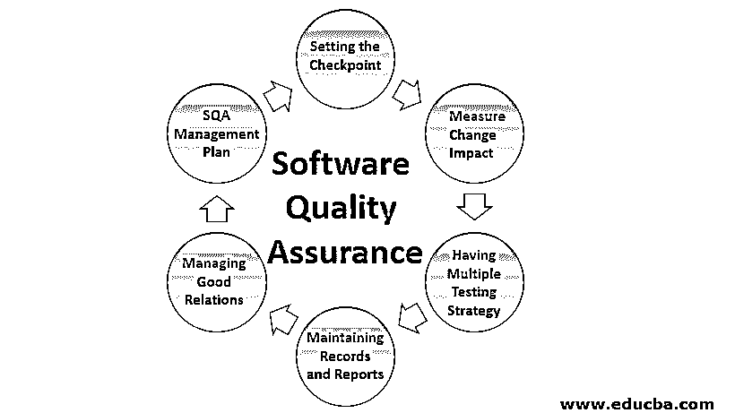

# 软件质量保证

> 原文：<https://www.educba.com/software-quality-assurance/>

## 什么是软件质量保证？

顾名思义，软件质量保证是软件工程师的一个过程或角色，以确保软件应用程序中不会出现与客户提供的需求相关的让步或失误。软件质量保证的四个阶段是计划、执行、检查和行动，其中计划是计划保持高质量的应用标准所必需的措施，执行是涉及构建和测试过程的开发过程，检查是观察和检查实现路线，行动是对保持应用质量所需的活动采取行动。

### 软件质量保证活动

下面给出了软件质量保证的一些活动。

<small>网页开发、编程语言、软件测试&其他</small>

#### 1.设置检查点

SQA 团队在特定的时间间隔后设置检查点，以检查软件的进度、质量和性能，以及软件质量工作是否按照时间表和文档按时完成。

#### 2.衡量变革影响

对于由 QA 报告并由开发人员修复的缺陷，重新测试[缺陷](https://www.educba.com/what-is-defect/)修复并验证修复的缺陷是否没有在工作软件中引入新的缺陷是非常重要的。为此，测试度量由经理和开发人员维护和观察，以通过引入新功能或修复任何缺陷来检查新产生的缺陷。

#### 3.拥有多种测试策略

人们不应该依赖单一的测试方法和策略来测试软件。在软件中应该实施多种测试策略，以便从不同的角度测试软件，并覆盖所有的领域。对于一个电子商务网站来说，安全测试、性能测试、负载测试、数据库测试都应该进行，以确保软件的质量。

#### 4.维护记录和报告

保留质量保证的所有记录和文件并不时地与利益相关者分享是很重要的。执行的测试用例、测试周期、记录的缺陷、修复的缺陷、创建的测试用例、客户对特定测试用例的需求变更，所有这些都应该被适当地记录下来，以备将来参考。

#### 5.管理良好关系

管理好测试人员和开发人员之间的关系在项目中起着重要的作用。因为开发人员和测试人员的角色是相互矛盾的，但是这不应该是针对个人的。这两个团队的主要目标应该是以最小的失败风险交付高质量的项目。

#### 6.SQA 管理计划

这包括寻找 SQA 在新项目中最有效的工作方式。想想 SQA 战略，可以按照项目需求实现的软件工程过程，以及团队成员的个人技能。

### SQA 系统的组件

SQA 成分可分为 6 类:

#### 1.项目前组成部分

这保证了项目的承诺已被明确定义，包括时间估计、客户需求的澄清、项目的总预算、开发风险的评估、特定项目所需的全部人员。它还确保开发和质量计划已被明确定义。

#### 2.软件项目生命周期组件

这个组件包括评审、专家意见、软件测试、软件维护组件。在项目开发生命周期中，它包括评审、专家意见和发现软件设计和编程中的缺陷等组件，而在软件维护生命周期中，它包括专门的维护组件和用于增强维护任务的开发生命周期组件。

#### 3.用于错误预防和改进的基础设施组件

这一组成部分包括工作人员培训、认证、配置管理、预防和纠正措施，以便根据本组织积累的 SQA 经验降低软件出错率。

#### 4.管理 SQA 组件

该课程包括软件质量度量、软件质量成本，包括维护和开发活动的控制，以及引入管理参与以降低项目中的质量、进度和预算风险。

#### 5.标准化、认证和 SQA 系统评估的组成部分

本课程的主要目标是利用专业的国际知识，这有助于在专业水平上协调不同组织的质量体系。

#### 6.组织 SQA 人的组成部分

这个基础包括经理、测试人员和其他对 SQA 感兴趣的 SQA 实践者。主要目标是支持和发起 SQA 活动，发现其中的差距/偏差，并提出改进建议。

### 软件质量保证标准

一些组织、国家和国际机构参与了 SQA 标准的制定。以下是参与其中的主要组织和机构:

1.  电气电子工程师学会
2.  点
3.  国际标准化组织
4.  美国国家标准学会
5.  美国电子工业联合会(Electronic Industries Association)
6.  国际电工技术委员会（International Electrotechnical Commission）

SQA 标准基本上分为两类:

1.软件质量保证标准，即所谓的[质量管理标准](https://www.educba.com/quality-management-system/)。

**举例:** ISO 9000-3，CMM(能力成熟度模型)。

他们关注组织的基础设施、SQA 系统、需求，将工具和测试方法的选择留给组织。他们的标准目标是“实现什么”。它确保组织获得可接受的软件质量。

2.被称为项目过程标准的软件项目开发过程标准。

例如:ISO/IEC 12207 IEEE STD 1012-1998。

他们关注软件开发和维护中必须实现的方法。它侧重于“如何”执行。它包括设计文档要求、要采取的步骤、要执行的软件测试以及设计评审和评审问题。

### SQA 技术

有几种 SQA 技术。其中一些提到如下:

#### 1.回顾

在评审中，内部和外部的利益相关者召开会议来评审整个项目，他们分析整个软件，如果发现问题，区分它是测试、开发、需求还是设计。主要目标是测量软件的质量，并确保它是否满足客户的期望。

#### 2.审计

在审计中，整个工作产品和所有数据都由涉众检查，以检查它是否遵循标准过程。

#### 3.功能测试

在功能测试中，测试整个软件的功能，无论它是否按预期运行。它在不知道“系统如何工作”的情况下检查“系统是如何工作的”。这就像应用程序的黑盒测试一样，用户知道预期的输出，但不知道它是如何产生的。

#### 4.标准化

它确保软件中的所有东西都应该是标准化的，也就是说，它遵循所有的标准，无论是文档、开发还是质量控制的标准。它减少了不确定性，从而提高了软件的质量。

#### 5.代码检查

代码检查是最正式的检查之一，其主要目标是发现代码中的缺陷，并强调代码检查中的任何问题，这是由受过训练的主持人而不是代码的作者领导的。会议有适当的进入和退出标准。用户必须在会议前做好充分的准备，以便在提出他们的观点之前完全了解文件和所有内容。

#### 6.演练

软件漫游是一种非正式的过程，通常由作者阅读文档或代码发起，同行成员在其中写下他们的建议或错误并提交。它不像检查那样被正式记录，会议不需要主持人。它的主要目标是了解到目前为止已完成的代码的状态，并收集来自同行的建议以提高软件质量。

#### 7.压力测试

压力测试是为了检查系统在高负载下的工作情况。这种测试在软件质量中起着重要的作用，因为在电子商务应用程序中，压力和负载测试是为了测试软件的容量(一次最多有多少用户可以访问一个应用程序)而正确进行的。

#### 8.设计检查

设计检查是使用检查表来检查软件的各个方面，如功能和界面设计、约定、一般需求和设计、需求可追溯性、逻辑、耦合和内聚。

### SQA 的优势

让我们讨论一下 SQA 的优势。

#### 1.增加客户的信心

在不同级别的软件中进行适当的质量检查，如审查、检查、审计等，并有内部和外部利益相关者的参与，这增加了客户对提交缺陷和需求度量的每周报告的信心，也有助于向客户保证工作按时完成。

#### 2.SQA 省钱

在需求收集、编码、测试的早期阶段发现的缺陷很容易且成本效益高。在几个级别进行适当的 SQA 有助于降低这些风险，因为最大的缺陷已在早期阶段被发现和解决，因此节省了在提交给客户后修复故障软件的资金，这可能会损害公司的声誉、用户和客户。

#### 3.提高客户满意度

软件开发和测试中[客户的及时参与提高了客户对正在开发的高质量软件的满意度，并且根据需求和考虑之间的建议提高了客户满意度。](https://www.educba.com/what-is-software-development/)

#### 4.提高生产力和效率

当开发和测试并行进行时，在单个模块开发完成后早期发现的缺陷，以及开发人员及时修复的缺陷，使得每个人都可以平静地工作，并以更有成效的方式工作，而不是在整个软件完成后立即承受多个错误的负担。

#### 5.防止不可预见的紧急情况

开发公司软件时，风险也很高。由于软件处理大量客户的敏感数据，它需要像预期的那样工作，没有任何中断、损坏或通信故障。软件应该经过非常严格的测试，这样它才能按预期工作。

#### 6.减少结束时间客户端冲突

有许多案例发现，客户和组织后来对开始时确定的要求、时间和预算的变更意见不一致，导致项目取消、金钱损失和公司在市场上的坏印象(失去客户，因为这会造成坏名声)。在 SQA，在项目开始时一切都是固定的，并且没有任何歧义地被适当地记录，因此不会出现冲突

### SQA 的缺点

让我们讨论一下 SQA 的缺点。

#### 1.有时难以实现

由于 SQA 以非常详细的方式定义了在软件开发的每一步应该采取的所有活动和行动，有时在开发中实现每一个活动和过程变得很困难。因此，这个人知道这将是有益的，但在大型团队中工作时，关注每一步的细节会变得困难。

#### 2.耗费时间的

在 SQA 实施每一项行动都非常耗时，有时会将更多的时间浪费在文档和会议上，而不是在软件的实际开发和测试上。

#### 3.高成本

通过实施 SQA，虽然在后期修复错误的成本可以通过发现它们并在开始时仅针对低预算的小项目进行修复来降低，但是随着项目中资源数量的增加以及项目预算的增加，实施 SQA 非常困难。对于小项目，雇佣整个 QA 团队并实施 SQA 会导致项目成本的急剧增加。

### 结论

SQA 是一个总括性的活动，涵盖了从需求收集到项目维护的整个软件生命周期。它涵盖了软件开发不同阶段的所有活动和过程，以确保交付的软件具有高质量和最小风险，从而在市场上取得成功并满足客户和客户的期望。

### 推荐文章

这是软件质量保证指南。在这里，我们详细讨论了 SQA 的基本概念、活动、组件、优点和缺点。您也可以浏览我们推荐的其他文章，了解更多信息——

1.  [软件测试原则](https://www.educba.com/software-testing-principles/)
2.  [软件测试生命周期](https://www.educba.com/software-testing-life-cycle/)
3.  [敏捷软件](https://www.educba.com/agile-software/)
4.  [质量保证与质量控制](https://www.educba.com/quality-assurance-vs-quality-control/)

