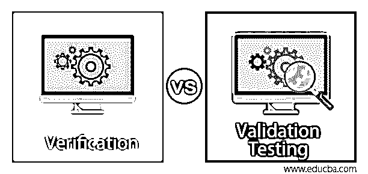
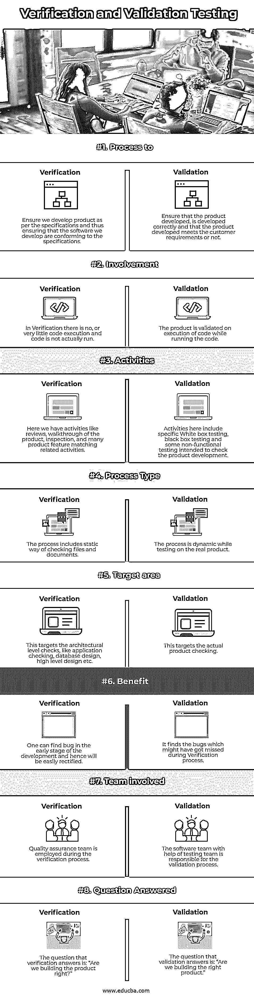

# 验证和确认测试

> 原文：<https://www.educba.com/verification-and-validation-testing/>

## 验证和确认测试的区别

确认和验证测试是软件行业中的重要组成部分，并且经常被组合在一起形成一个术语，但是你知道吗，这两个术语在它们执行什么任务和每个过程的目标上有微妙的区别。为了指出每个过程所拥有的目标，验证的目标是确保产品符合设计的要求和规范，验证的目标是确保产品是否满足用户要求。

### 验证与确认测试之间的直接比较(信息图)

<small>网页开发、编程语言、软件测试&其他</small>

### 验证和确认测试的主要区别

让我们来讨论验证和确认测试的以下区别。

*   在我们开始指出验证和确认测试的区别之前，让我们先了解一下确认和验证的定义，然后我们会以适当的形式指出它们的区别。
*   验证被定义为在开发阶段对与工作相关的产品(不一定是最终产品)进行评估的过程，以便确定在该阶段是否满足要求。
*   验证被定义为评估软件以确定软件是否满足用户需求的过程。
*   换句话说，验证旨在满足用户在预期环境下的预期愿望，而验证旨在检查阶段的要求是否得到满足。
*   现在让我们一个接一个地来看它们的区别:验证遵循一个过程，以确保我们在那个阶段的开发过程中按照提到的规范来构建产品，而另一方面，验证确保我们正在开发的产品满足客户需求和产品开发的意图。
*   在验证测试中，不需要运行代码的实际部分，而在验证中，团队需要运行代码的部分，以确保我们正在构建的产品是否符合客户需求。
*   接下来，需要执行活动，如审查、走查和检查，以执行验证中的指定任务，而在验证中，有特定的测试，如白盒、黑盒、冒烟、回归、功能，以确保过程的意图。
*   这两个流程都指定了 ISO/IEC 标准，以保持整个行业的统一流程。列举几个标准化平台下的验证活动，代码验证必须伴随代码审查，文档验证涉及用户手册和其他相关文档的验证等等。
*   在标准化平台中列出一些验证活动，包括边界值、压力和功能测试，准备测试手册、文档和特定测试案例以满足要求，这是标准化的一部分。
*   验证过程本质上是静态的，而确认过程本质上是动态的。此外，由于验证在开发阶段很早就开始了，所以在这个早期阶段可以很容易地定位错误，并确保我们在开发的后期阶段减少错误。在系统的早期发现并纠正错误将有助于我们最大限度地减少在开发过程中的成本，如果在开发的后期发现的话，还要再次测试。
*   对于验证，我们有专门的质量保证团队来负责整个过程，而在验证过程中，软件团队在测试团队的帮助下负责整个过程，并确保一切都非常清楚正确。
*   最后，看一下差异，我们可以期望理解验证和确认测试之间的微妙差异，这在软件行业中经常互换使用，有一个微妙的差异陈述，验证是关于“我们是否构建了正确的产品”，而确认是关于“我们是否构建了正确的产品”。对陈述中这两个细微差别的回答将回答你在这两个术语中的微妙之处。

### 验证与确认测试对照表

以下是主要的比较:

| **意向** | **验证** | **验证** |
| 处理至 | 确保我们根据规范开发产品，从而确保我们开发的软件符合规范。 | 确保所开发的产品是正确开发的，以及所开发的产品是否满足客户的要求 |
| 牵连 | 在验证中，没有或很少执行代码，并且实际上没有运行代码。 | 在运行代码时，产品在代码执行时得到验证。 |
| 活动 | 在这里，我们有像审查、产品的预演、检查和许多产品特性匹配相关的活动。 | 这里的活动包括特定的白盒测试、黑盒测试和一些旨在检查产品开发的非功能性测试。 |
| 流程类型 | 该过程包括静态方式检查文件和文档。 | 在真实产品上测试时，该过程是动态的。 |
| 靶面积 | 这针对架构级别的检查，如应用程序检查、数据库设计、高级设计等。 | 这针对的是实际的产品检测。 |
| 利益 | 人们可以在开发的早期阶段发现 bug，因此很容易纠正。 | 它可以发现在验证过程中可能遗漏的错误。 |
| 参与团队 | 质量保证团队在验证过程中被雇佣。 | 软件团队在测试团队的帮助下负责验证过程。 |
| 问题已回答 | 验证回答的问题是:“我们构建的产品是正确的吗？” | 验证回答的问题是:“我们正在构建正确的产品吗？” |

### 结论

通过所有的差异，我们能够很好地理解验证和确认测试之间的差异。两者一起，V&V 确保开发的产品适合使用，并符合要求。现在总结一下，验证过程确保对静态测试技术的活动进行审查，并且验证是在动态环境中执行的实际测试。还有一点需要记住的是，验证可能不直接涉及产品，而验证必然需要对产品进行检验。最后，需要记住 V&V 是一个需要软件团队集体努力的过程，包括开发人员、测试人员和产品所有者，而不仅仅是特定的团队。

### 推荐文章

这是一个验证和确认测试的指南。在这里，我们讨论验证和确认测试的介绍，主要差异和比较表。您也可以浏览我们的其他相关文章，了解更多信息——

1.  [黑盒测试技术](https://www.educba.com/black-box-testing-techniques/)
2.  [动态测试](https://www.educba.com/dynamic-testing/)
3.  什么是功能测试？
4.  [软件测试职业](https://www.educba.com/careers-in-software-testing/)

