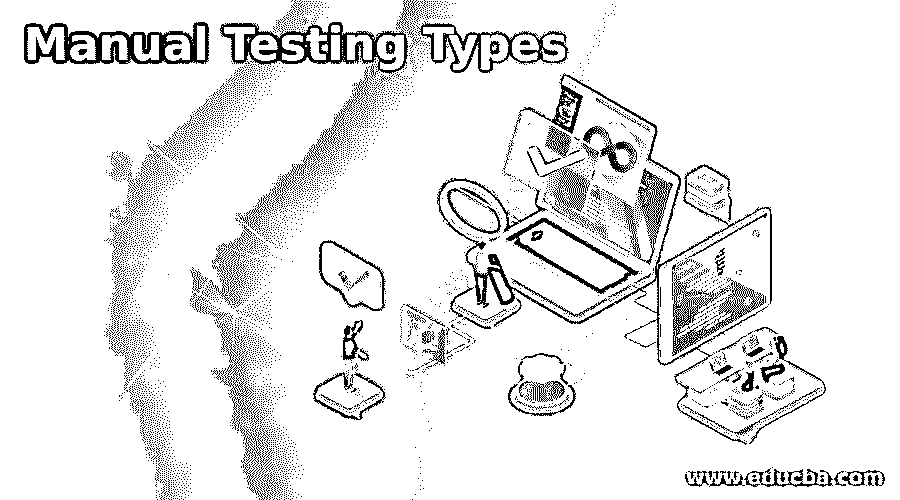

# 手动测试类型

> 原文：<https://www.educba.com/manual-testing-types/>

## 手动测试类型介绍

手动测试是手动测试软件缺陷的过程。它要求测试人员扮演最终用户的角色，从而使用大多数应用程序特性来确保正确的行为。测试人员经常遵循书面的测试计划；他们带领他们通过一系列重要的测试用例，并保证软件的完整性。在手动测试中，操作成本更低，因为没有使用测试工具。大多数错误都是通过手工测试发现的。各种类型的手动测试是黑盒测试、白盒测试、单元测试、系统测试、集成测试和验收测试。

### 手动测试类型列表

下面是我们可以进行手动测试的测试列表:

<small>网页开发、编程语言、软件测试&其他</small>

#### 1.黑箱测试

黑盒测试是一种手动测试，它检查软件的功能，而不检查其内部结构和编码。这种类型的主要来源是用户指定的需求。第一个测试人员通过考虑有效和无效的输入来验证软件是否正常工作，从而创建积极的测试场景和消极的测试场景。之后，测试人员创建各种测试用例，如决策表、因果图、误差估计等。然后，测试人员执行所有测试用例，并将结果与预期结果进行比较。根据结果，测试人员决定是否发布软件或者需要返工。

#### 2.白盒测试

另一种手动测试类型是[白盒测试](https://www.educba.com/white-box-testing/)，也称为玻璃盒测试。它用于测试软件的内部编码和基础结构。它侧重于根据期望的输出检查预定义的输入。为了执行这种类型的测试，测试人员需要了解编程，因为它关注于编码结构。其主要目标是通过软件集中输入和输出，加强软件的安全性。每一行代码都经过测试。在测试白盒技术之后，开发人员将软件发送给测试团队来执行黑盒测试，并根据指定的需求验证软件。

#### 3.单元测试

在这种手动测试类型中，软件的组件被测试。该测试的主要目标是确定软件的每个组件是否正常工作。开发人员在应用程序的开发过程中执行它。它有助于在开发生命周期的早期发现 bug，以便可以在早期修复它们，并节省时间和成本。它帮助开发人员理解代码库，并允许他们快速做出更改。单元测试的手动方法包括一步一步的指导文档。采用[单元测试](https://www.educba.com/unit-testing/)的一个好处是，我们可以测试项目的各个部分，而不必等待其他部分完成。

#### 4.集成测试

在集成测试中，软件的每个组件被组合在一起，作为一个组进行测试。该测试的主要目标是确定每个组件是否如预期的那样相互交互。为了执行测试，它使用测试驱动程序和测试存根。[集成测试](https://www.educba.com/integration-testing/)在单元测试之后，系统测试之前进行。开发人员或单独的测试人员执行它。它使用四种方法:大爆炸法、自上而下法、自下而上法和混合法。

#### 5.系统试验

系统测试是将系统作为一个整体进行测试。它的主要目标是评估端到端的系统规范。单元测试用于使用完全集成的系统来检查每个组件如何相互作用以及如何与系统相互作用。它涉及各种功能的测试，如负载测试、回归测试、可用性测试、功能测试、迁移测试、恢复测试、硬件测试、软件测试等。

#### 6.验收测试

执行验收测试是为了测试软件的可接受性。该测试的主要目标是评估系统与指定要求的符合性，并评估其是否可接受交付。验收测试在系统测试之后，系统投入生产实际使用之前进行。它分为两种类型——内部验收测试和外部验收测试。组织的内部成员执行内部验收测试，外部验收测试由不属于组织的外部人员执行。

### 结论

在本文中，我们已经看到了各种类型的手工测试。每种测试类型都很重要，因为每种类型都有自己的重要性，并且每种类型都用于在不同的级别测试软件的各个部分。

### 推荐文章

这是手动测试类型的指南。为了更好的理解，我们在这里讨论手动测试类型的介绍和列表。您也可以看看以下文章，了解更多信息–

1.  [软件测试服务](https://www.educba.com/software-testing-services/)
2.  [控制流测试](https://www.educba.com/control-flow-testing/)
3.  [无障碍测试](https://www.educba.com/accessibility-testing/)
4.  [猴子测试](https://www.educba.com/monkey-testing/)

