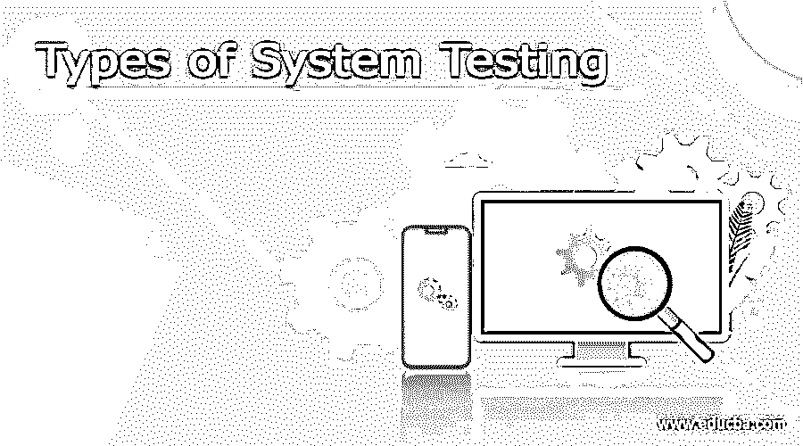

# 系统测试的类型

> 原文：<https://www.educba.com/types-of-system-testing/>

## 系统测试介绍

术语“系统测试”指的是对一个完全集成的软件系统进行测试的过程。在大多数情况下，计算机系统是由软件组合而成的(任何软件都只是计算机系统的单个元素)。软件是以模块形式创建的，然后这些模块与其他软件和硬件相结合，形成一个完整的计算机系统。换句话说，计算机系统由执行各种功能的软件集合组成；但是，单靠软件无法完成这项工作；它必须与适当的硬件接口。系统测试是几种测试类型的集合，旨在测试和评估集成软件计算机系统的整体功能，并与它的要求进行比较。系统测试是作为用户检查应用程序或软件的端到端流程的过程。我们遍历(检查)一个应用程序的所有必要模块，检查最终功能或最终业务功能是否正常，以及将产品作为一个整体系统进行测试。

这被称为端到端测试，因为测试环境与生产环境是相同的。

<small>网页开发、编程语言、软件测试&其他</small>

有两类软件测试

1.  黑箱测试
2.  白盒测试

被称为黑盒测试的软件测试类别包括系统测试。因此，系统测试是黑盒测试。

系统测试、验收测试、集成测试和单元测试是用于测试目的的四层软件测试。单元测试用于测试单个软件；集成测试用于测试一组软件单元；系统测试用于测试整个系统，验收测试用于确保业务需求是可接受的。

### 不同类型的系统测试

有 50 多种不同的系统测试。大型软件开发公司通常使用的系统测试类型如下所述。

#### 1.回归测试

回归测试是系统测试的一部分，用于检查和检测系统中是否存在由于对系统的另一个组件进行更改而导致的问题。它确保在整个开发过程中所做的任何修改都不会引入新的缺陷，并且随着时间的推移添加新的软件，以前的缺陷不会再次出现。

#### 2.负载测试

负载测试是系统测试的一部分，用来检查系统是否能承受实时负载。

#### 3.功能测试

系统的功能测试是为了查看系统中是否有任何缺失的功能。测试人员创建一个关键功能的列表，这些功能应该包含在系统中，并且可以在功能测试期间添加，以提高系统的质量。

#### 4.恢复测试

系统的恢复测试是作为系统测试的一部分来完成的，以确认系统的可靠性、可信性和责任性，所有这些都基于系统的恢复能力。它应该能够从所有可能的系统崩溃中成功恢复。

在测试过程中，我们将看到应用程序从故障或灾难中恢复的情况。

恢复测试的步骤如下:

*   当软件崩溃时，它不应该简单地消失；相反，它应该写一个崩溃日志消息或错误日志消息，指出崩溃的原因。考虑以下场景:QTP/克雷什. log 位于 C:/Program Files/QTP/克雷什. log 中
*   在它消失之前，它应该终止自己的过程。例如，在 Windows 中，任务管理器显示哪些进程当前是活动的。
*   我们会提出这个错误，让它使应用程序崩溃，这意味着有人会向我们展示应用程序将如何以及何时崩溃。或者在几个月的产品实践经验之后，我们可以预测应用程序将如何以及何时崩溃。
*   重新打开应用程序；必须使用与之前相同的设置重新启动。

#### 5.迁移测试

迁移测试确保如果需要在新的基础设施上修改系统，可以毫无困难地完成。

#### 6.可用性测试

这个测试的目标是确保用户对系统了如指掌，并且系统完成了它的目标。

#### 7.硬件和软件测试

该系统测试的目的是确保硬件和软件兼容。要顺利运行软件，硬件设置必须与之兼容。通过允许硬件和软件之间的交互，兼容性提供了灵活性。

### 系统测试的重要性是什么？

系统测试确保系统的性能完美无缺，因为它涵盖了整个系统的功能。它涉及系统软件架构和业务需求测试。即使在生产之后，它也有助于缓解现场问题和故障。

系统测试包括将相同的数据输入现有系统和新系统，然后比较新旧功能的功能差异，以便用户能够掌握系统新功能的好处。

### 测试人员应该使用哪些不同类型的系统测试？

*   测试人员为谁工作是他或她将要执行的系统测试类型的一个重要决定因素。大型组织采用的方法与中小型企业不同。
*   **可用于测试的时间:**最终可采用全部 50 种测试形式。我们经常受到时间的限制，只能使用对软件项目最重要的类型。
*   测试人员可用的资源:当然，一些测试人员可能缺乏必要的资源来执行某些类型的测试。例如，如果你是一家大型软件开发公司的测试人员，你可能会接触到昂贵的自动化测试工具，而这些工具并不容易获得。
*   软件测试人员的教育:每一种软件测试都有不同的学习曲线。为了使用它，测试人员必须学会如何利用一些相关的软件。
*   测试预算:金钱不仅是小企业和个人软件工程师的考虑因素，也是大公司的考虑因素。

### 推荐文章

这是一个系统测试类型的指南。在这里，我们还讨论了介绍和各种类型的系统测试以及解释。您也可以看看以下文章，了解更多信息–

1.  [单元测试 vs 系统测试](https://www.educba.com/unit-testing-vs-system-testing/)
2.  [Asana vs Todoist](https://www.educba.com/asana-vs-todoist/)
3.  [Java 测试私有方法](https://www.educba.com/java-testing-private-methods/)
4.  [系统测试](https://www.educba.com/system-testing/)

