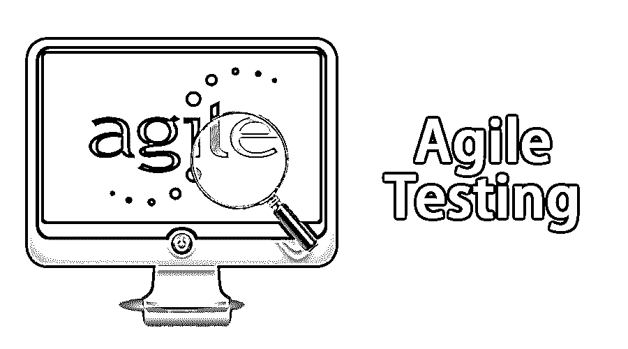

# 敏捷测试

> 原文：<https://www.educba.com/agile-testing/>

## 敏捷测试简介

敏捷测试是一个[软件测试过程](https://www.educba.com/what-is-software-testing/)。它遵循敏捷软件开发的原则。这是一种关联的开发方法，因为开发和测试活动在这里并行进行。这种发展与顾客不断变化的需求相一致。敏捷测试是一个持续的过程。这个项目的所有成员都参与其中。测试不是一个单独的阶段；相反，它是与编码一起完成的；因此，最终产品质量高，符合客户要求。测试在项目开始时就开始了，测试和开发之间有一个联盟。敏捷团队的主要目标是实现质量。敏捷测试的时间框架很短(1 到 4 周)并且被命名为迭代。测试与迭代模型的开发并行进行。

### 敏捷测试的原则

以下是提到的原则:

<small>项目进度与管理，项目管理软件&其他</small>

**1。持续:**它在持续的基础上提供反馈，因此产品满足业务需求。

**2。团队合作:**在其他软件中，测试团队负责测试，但是在敏捷测试中，除了测试团队，开发人员和[业务分析师同样](https://www.educba.com/what-is-business-analytics/)参与测试。

**3。反馈响应时间:**由于业务团队[参与敏捷测试](https://www.educba.com/what-is-agile-testing/)，反馈快速且持续，因此反馈响应时间很短。

**4。干净和简化的代码:**敏捷团队发现的缺陷在同一次迭代中得到纠正，因此代码保持干净和简化。

**5。承担测试:**在这里，测试是在实现的时候进行的，而在其他流程中，测试是在实现之后进行的。

**6。轻量级文档:**敏捷测试人员使用可重用的清单来决定要进行的测试。文档可以有多种用途，使用的工具也很轻便。

7 .**。测试驱动开发:**在这里，开发是由测试驱动的。测试用例是根据需求编写的，所以这种方法被称为测试驱动开发(TDD)。在[瀑布测试软件](https://www.educba.com/waterfall-model/)中，测试在最后阶段完成。

### 敏捷测试的价值

*   相对于严格的过程和工具，个人和交流是被选择的。敏捷测试中不能忽视过程和工具；相反，它建立在合理的、强大的流程和工具之上，并且这些工具也被利用。这里的规则是测试人员驱动工具，并且输出取决于测试人员，而不是相反。
*   敏捷测试中的选择是功能性的和可用的软件，而不是无用的和全面的文档。这里的主要目标是实际的测试，而不是精心制作的文档，后者的唯一目标是指向目标。如果一个成员决定离开，这些文件肯定是存在的。
*   顾客参与是这里的秘密。客户总是保持参与，并与项目的进展保持联系。这意味着客户需要在整个项目中定期开会，而不是在项目完成后直接交付。这当然是额外的工作，但肯定比在错误的方向上工作要好。

接受并实施任何必要的变更。虽然这个项目遵循一个计划，但当情况发生变化时，它会随时改变。因此，人们不必等到最后才发现变更的场景，也不必因为变更的需求而放弃项目。

### 敏捷测试方法

有各种各样的敏捷测试方法:

#### 1.行为驱动开发

行为驱动的开发改善了沟通，这样所有的成员在过程开始之前就理解了每个特性。开发人员、分析人员和测试人员在不断地交流。

#### 2.验收测试驱动的开发(ATDD)

这里的主要目标是让所有团队成员都参与进来，即客户、测试人员和开发人员，因为这三个人都有不同的视角。客户关注的是要解决的问题，开发人员关注的是如何解决问题，而测试人员的目标是看到可能出错的地方。这些被称为验收测试，这三者的观点被结合在一起，描述系统将如何运行。

#### 3.探索性测试

在这样的测试中，测试设计及其执行是齐头并进的。重点是工作软件而不是文档。个人和沟通比流程和工具更重要。探索性测试更能适应变化。测试计划是根据测试人员的发现来设计和执行的。

### 测试计划

在敏捷测试中，每次都要编写和更新测试计划。

它包括:

*   测试范围
*   正在测试的新功能
*   测试的级别或类型
*   性能和负载测试
*   考虑到基础设施
*   救济计划
*   规划资源
*   交付成果和里程碑

### 敏捷测试生命周期的阶段

敏捷测试生命周期有 5 个阶段:

1.  影响评估意味着从利益相关者和用户那里收集信息，这些信息将作为下一个开发周期的反馈。
2.  敏捷测试计划，所有的涉众聚集在一起计划测试过程、会议和可交付成果。
3.  发布就绪，这是决定已经开发的特性是否准备好上线的阶段。
4.  每日检查包括每天的晨会，以了解测试的状态并设定当天的目标。
5.  敏捷性审查，每周与利益相关者召开审查会议，检查进展情况。

### 敏捷测试的好处

敏捷测试有它自己的好处。这是一款既省时又省钱的软件，因为它减少了文档，并且非常灵活，能够适应业务的不断变化。从实际使用中接收定期反馈，以便当它到达最后阶段时，用户不知道该过程的可能性最小。

敏捷测试是早期发现缺陷的完美软件，并且随着问题的早期修复，修复的成本也降低了。最终产品以客户为中心，质量上乘。团队之间的持续交流使得敏捷测试取得成功。

### 推荐文章

这是敏捷测试的指南。这里我们讨论了敏捷测试的概念、阶段、好处、测试计划、方法、原则和价值。您也可以浏览我们推荐的其他文章，了解更多信息——

1.  [什么是 ETL 测试](https://www.educba.com/what-is-etl-testing/)
2.  [什么是敏捷编程](https://www.educba.com/what-is-agile-programming/)
3.  [什么是敏捷冲刺](https://www.educba.com/what-is-agile-sprint/)
4.  [敏捷蔻驰面试问题](https://www.educba.com/agile-coach-interview-questions/)

