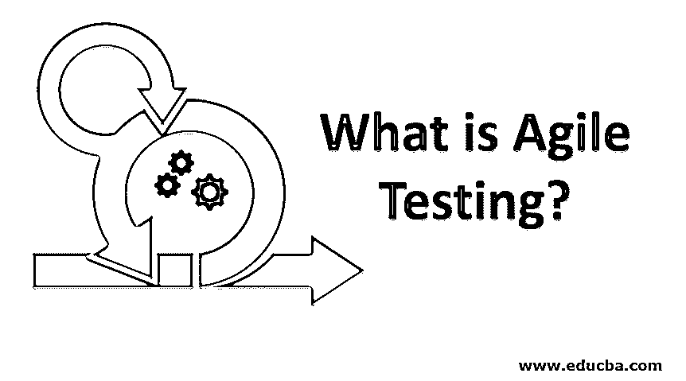
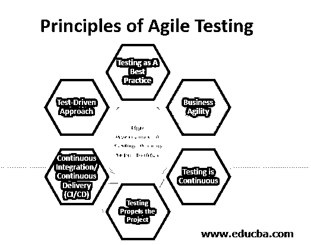

# 什么是敏捷测试？

> 原文：<https://www.educba.com/what-is-agile-testing/>

## 敏捷测试简介

敏捷测试是与开发并行执行的测试，从开发的开始阶段到每个冲刺/迭代，直到其他测试过程。该测试包括测试文档、测试数据准备、测试、再测试、缺陷跟踪等。这是与开发的每一步并行进行的。因此，敏捷测试方法是一个连续的交付驱动的过程，与给定的功能/非功能需求保持一致。敏捷测试是敏捷开发不可或缺的一部分，在敏捷开发中，软件解决方案是分阶段递增交付的，而不是在最后作为一个批次交付。

敏捷测试是[软件开发生命周期](https://www.educba.com/what-is-sdlc/) (SDLC)中至关重要的一步，它保证软件的所有功能和特性都按照其原始规范运行。由于缺乏测试而导致的软件缺陷会导致潜在的客户、收入和品牌价值的损失。

<small>网页开发、编程语言、软件测试&其他</small>

传统上，测试是 SDLC 中一个独特的阶段，测试团队过去常常孤立地工作，只有在开发完成后才会参与进来。这延误了整个过程，影响了软件交付的质量。敏捷测试解决了传统测试方法中的问题。

### 传统测试和敏捷测试的区别

传统测试和敏捷测试的区别在于，

| **传统测试(瀑布法)** | **敏捷测试** |
| 测试与开发是分离的，最终是分开进行的。 | 测试随着开发一起发生，使得在更短的周期内交付项目成为现实。 |
| 测试人员独立工作，他们从不与开发人员混在一起。 | 测试团队是敏捷核心团队的一部分，他们与开发团队紧密结合。 |
| 测试人员的经验没有在任何开发活动中被利用。 | 测试人员从需求捕获阶段就开始参与，他们的输入也是构建丰富的用户界面(UI)和功能的要素。 |
| 按照确定的测试计划进行。 | 测试计划是灵活的，以适应需求的变化。 |
| 测试的排他阶段消耗时间，因此导致交付延迟。 | 没有延迟，因为编码和测试一起进行。 |
| 测试的重要性和重点不明显。 | 吸收到开发过程中，并无情地实践。 |
| 交付的软件可能存在缺陷。 | 软件缺陷得到有效控制。 |

### 敏捷测试的方法论

测试场景和测试用例是从系统规范文档中预先准备的，并由开发团队验证，测试与开发一起开始。测试计划和测试用例是为每个增量软件发布(Sprints)开发的。编码和测试一起渐进地进行(在 sprints 中)。

重复这个过程，直到达到稳定性和所需的质量。随后，软件在试点环境中启动，然后在生产环境中启动。

### 敏捷测试策略

由于在任何时间开发周期中适应变化的灵活性，敏捷测试依赖于策略而不是确定的测试计划，它由 4 个阶段组成，

#### 1.项目启动

它涵盖初始设置活动，例如:

*   最终确定商业案例
*   决定项目的范围
*   用合适的技术人员组建团队
*   确定测试工具和[方法](https://www.educba.com/what-is-methodology/)
*   制定风险缓解计划

#### 2.Sprints 结构

*   测试团队和开发团队共同确定 a .在每个 sprint 中要完成的活动，b .每个 sprint 将花费的时间。
*   每个 sprint 中的可交付成果都是预先决定的。
*   当需求最终确定时，测试团队开发测试场景和测试用例。
*   随着目标的广泛接受，构建 sprints(增量软件解决方案)开始了，scrum master 也开始了。
*   scrum master 的角色是促进和监控开发和测试。
*   代码和测试的并行开发发生了，并且任何发现的缺陷都被立即纠正。
*   进行确认性测试，以确定所有功能是否按照要求工作。开发人员和关键用户执行这些测试，其中大部分是自动化的，回归测试贯穿整个生命周期。
*   调查性测试包括集成测试、负载测试和安全性测试。

#### 3.放

在完成用户验收测试之后，增量软件代码(Sprint)被转移到生产中。此阶段的活动包括最终用户培训、指导和支持、用户手册准备、营销和后端活动的操作。应该定期召开审查会议，评估绩效水平，并反复进行过程修正。

#### 4.生产

在完成所有增量软件发布和迭代改进后，项目进入生产阶段，后期生产支持由团队提供。

软件中的任何更改都通过一个更改控制委员会进行管理，这些更改会针对具体功能进行彻底测试，在实施之前会对整体功能进行回归测试。

### 敏捷测试的 7 大原则

下面是详细解释的敏捷测试原则列表:

#### 1.持续集成/持续交付(CI/CD)

CI/CD 是 DevOps 的重要支柱[，它](https://www.educba.com/what-is-devops/)坚持频繁的代码移动，而不是传统方法中的周期性代码移动。敏捷测试很好地吸收到开发中，促进了 CI/CD 的实现。

#### 2.测试推动了项目

持续测试提供的反馈消除了障碍，在修复了测试中观察到的缺陷之后，项目进入下一个阶段。客户会对最终的无缺陷产品感到满意。

#### 3.测试是连续的

测试从编码开始的那一天开始，测试人员和开发人员一起完成测试。

#### 4.业务敏捷性

随着开发人员/测试人员的敏捷团队对项目进展的频繁反馈，业务团队也变得敏捷起来。

#### 5.测试作为最佳实践

在敏捷环境中，测试被赋予了最大的重要性，并被作为改善用户体验和赢得新客户的最佳实践。

#### 6.利益相关者对测试有很高的认识

敏捷测试让开发链中的每个人都参与到测试过程中。除了开发人员和测试人员、业务用户、客户

#### 7.测试驱动方法

[测试场景和测试用例](https://www.educba.com/test-cases-vs-test-scenario/)使用系统规格开发，测试团队甚至在编码开始之前就准备好开始了。测试推动了敏捷环境中的开发。

### 敏捷测试的好处

*   无缺陷软件按计划按时交付，这让客户很高兴。
*   并行开发和测试避免了沟通的差距和误解，从而避免了精力、时间和金钱的浪费。
*   随着软件作为逻辑增量单元交付，客户利用服务的等待时间缩短了。

### 结论

除了商业利益之外，敏捷测试还帮助软件供应商在他们的软件开发过程中达到高质量的标准，并提高他们在行业中的评级。这也使他们能够在采用 DevOps 原则方面快速前进。

### 推荐文章

这是一个什么是敏捷测试的指南？在这里，我们讨论了传统测试和敏捷测试的区别，以及 7 大原则和它们的策略。你也可以看看下面的文章来了解更多-

1.  [敏捷 Scrum 认证](https://www.educba.com/agile-scrum-certification/)
2.  [敏捷站立](https://www.educba.com/agile-standup/)
3.  [敏捷工作](https://www.educba.com/agile-working/)
4.  [什么是测试用例？](https://www.educba.com/what-is-test-case/)

