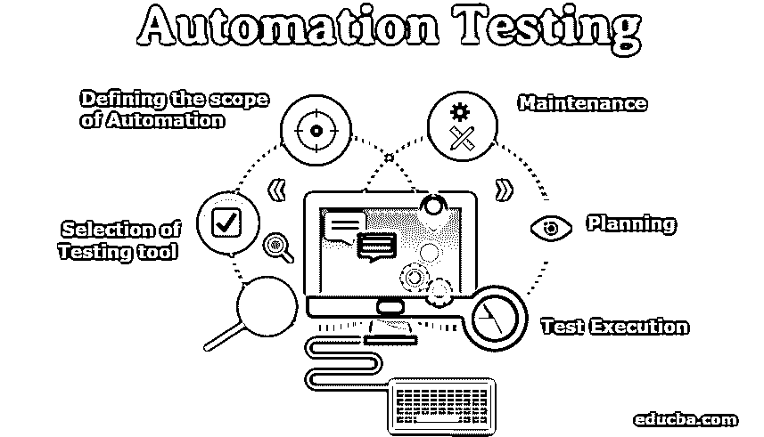

# 自动化测试

> 原文：<https://www.educba.com/automation-testing/>

## 什么是自动化测试？

[自动化测试](https://www.educba.com/what-is-automation-testing/)是一个自动化测试过程的过程，通常用于测试软件应用程序的功能和非功能行为。它适用于重复性的测试流程，不需要太多的人工参与和认知努力。自动化测试需要一个工具来完成测试过程，根据所用工具的类型，用通用编程语言为各个测试用例构建测试脚本。

### 为什么我们需要自动化测试？

*   在理解自动化测试的需求之前，让我们考虑一个场景。假设一个非常大的项目遵循[敏捷方法](https://www.educba.com/agile-methodology-in-project-management/)，即软件的开发在不同的生命周期中完成，并且每次在新闻发布中都会实现一些新功能。对于每个版本，整个应用程序都要再测试一次，也就是说，每次都要进行回归测试，以测试新实现的功能是否没有给现有功能带来任何问题。
*   一个大型的回归套件，我们需要至少 4 个人的人力，2-3 天才能完成，甚至可以有 100%准确率的风险。在这种情况下，自动化测试就出现了。至于已经存在的特性，不需要进行深入的或探索性的测试，因为它们已经在实现时进行了测试。
*   因此，通过提供所有的测试数据并每次为新版本运行，创建一个包含所有回归测试用例的自动化测试套件(最初可能需要时间)可以节省大量时间，可以提供 100%的准确性，并且可以通过减少运行该测试套件所需的资源来节省资金。
*   自动化测试并不像手动测试那样从整体上消除手动测试，而是有人工干预，并且使用了人脑，它尝试用不同的方式来执行相同的任务，并且可以处理多个测试数据，因此增加了发现更多关键错误的机会。
*   这样做是为了减少在执行相同的重复任务时浪费的额外时间，每次都以特定的方式执行，如果手动执行，可能会很无聊，因此容易出错。此外，几乎所有的 web 应用程序都支持多种浏览器，如 Chrome、IE11、Mozilla Firefox 等。，而且不可能在所有浏览器上同时测试所有内容。这种情况可以很容易地通过自动化测试来处理，因为我们可以同时运行测试用例，这在多个浏览器上非常容易。

### 自动化测试是如何进行的？

它需要适当的计划和策略来执行测试用例。自动化测试中要遵循的步骤如下:

<small>网页开发、编程语言、软件测试&其他</small>

#### 1.测试工具的选择

*   一旦你确定要从手工测试转移到项目的自动化，测试工具的选择是最重要的，因此也是自动化最重要的任务之一。
*   虽然市场上有很多测试工具，但是在根据项目的需求选择任何测试工具之前，都需要进行全面的分析。
*   在选择任何测试工具之前，有一些要点需要记住，比如该工具是否支持编写测试脚本的语言？该工具会提供增强的报告功能吗？该工具能在各种平台上工作吗，比如移动、网络、桌面(如果一个应用程序能在所有平台上工作)？

#### 2.定义自动化的范围

其次，在特定的项目中定义自动化的范围是很重要的。定义一个范围基本上意味着选择需要自动化的测试用例，以及应用程序可以支持测试用例自动化的范围。

通常，定义自动化范围的场景如下:

*   在每个版本中不需要任何改变的重复测试用例。
*   如果手动完成，测试用例会耗费大量时间。
*   非常复杂并且需要大量数据的测试用例。
*   对业务需求非常关键且技术上可行的功能。

#### 3.规划、设计和开发

*   在为自动化选择了测试工具和测试用例之后，测试脚本和测试套件就被创建了，并且计划是在考虑各种场景的情况下完成的，比如自动化脚本应该在什么时候运行以及测试的可交付性。
*   创建的测试脚本应该包括所有的测试场景，但应该是小型或大型的测试用例。拥有多个场景将被划分成更小的测试用例，因为这有助于更容易地找到错误并调试它们。包含所有测试的测试套件。
*   案例定义了运行测试的完整顺序。为了确保流程顺畅，没有人为干预，应该非常敏锐地创建案例。

#### 4.测试执行

*   这一步包括为上述测试用例创建的测试脚本的执行，这些脚本或者通过我们正在使用的测试工具直接执行，或者通过调用测试工具来执行具有所有测试用例的测试套件的测试管理工具来执行，
*   测试用例应该及时执行，以便检查是否有任何脚本由于应用程序中的一些更改而失败。在大型项目中，测试人员创建一个在特定时间运行的任务(通常是通宵运行，这样就不会妨碍任何正在进行的任务)，调用测试工具，从而运行测试用例。

#### 5.维护

*   在执行创建的测试脚本之后，测试工具的增强测试报告中提供了测试结果，指定了每个执行的测试用例的状态。对于每个版本，都会实现一个新功能，对现有功能进行一些更改，并删除一些功能。
*   为这些新特性添加一个新的测试脚本；在一个特定的版本中，根据项目的需求，一些测试脚本被更新和删除。因此，为了有效的结果，在每个版本中维护整个测试套件是非常重要的。

### 自动化测试工具

尽管市场上有很多自动化测试工具，但是根据项目需求选择合适的工具是非常重要的。在为项目选择任何自动化工具之前，需要记住以下几点:

1.  该工具应该满足项目中测试用例的所有需求。
2.  所选工具应在预算之内。
3.  测试脚本易于调试，并且支持不同的环境支持和浏览器支持等特性。
4.  如果项目需要，支持图像测试
5.  如果项目需要，支持数据库测试。

使用的一些工具如下:

#### 1.硒

*   开源测试自动化工具，支持多种语言，如 Java、Python、Ruby、C#等。
*   为测试提供记录和回放功能。
*   支持多种浏览器；我们只需要安装浏览器的驱动文件。
*   支持多种平台，如 Windows、Linux、Mac、
*   允许一次运行多个测试用例。

#### 2.加泰罗尼亚工作室

*   提供自动化 API、移动和 Web 应用程序测试的完整功能。
*   支持在 Windows、Linux、Mac 等多种平台上测试应用程序。
*   它提供了一个集成的环境，使得开发人员和测试人员更容易集成和部署不同的框架和库。
*   它支持许多内置特性来简化测试，并且允许 SOAP 和 RESTful API 测试。

#### 3.UFT

*   最有效和最商业化的测试工具之一是它为移动、Web 和桌面应用程序的测试提供支持。
*   为 API 测试提供支持。
*   为创建、执行和报告 API 测试提供了一个交互式界面。
*   图形表示用于表示测试活动和测试动作。

#### 4.WATIR

*   开源工具用于回归测试。
*   通过 Webdrivers 支持 Chrome、Firefox、IE 等多种浏览器。
*   支持在 Windows、Linux、Mac 等多种平台上测试应用程序。
*   支持对所有 web 应用程序的灵活支持，无论它是用哪种语言开发的。

#### 5.索普伊

*   专为执行 API 测试而设计的软件测试工具。
*   可以通过拖放选项轻松创建测试用例。
*   SoapUI 支持应用程序的异步测试。
*   支持使用已经存储在数据库和文件中的数据进行数据驱动测试。

### 优势

下面给出了一些解释的优点。

1.  它的最大优势之一是快速交付结果，节省了大量时间。尽管在创建测试脚本时投入了时间，但是只需要运行作业，这就调用了整个测试套件并在每个版本中节省了时间。
2.  它有助于更快地提供反馈。当测试人员开始创建测试脚本和开发特性时，测试套件会在每次发布后立即运行，并且测试结果会在更短的时间内生成，从而为开发人员、产品所有者和其他团队成员提供早期反馈。
3.  毫无疑问，通过提供高质量和可靠的结果，测试自动化有助于提高应用程序的效率。在手动测试应用程序时，可能会遗漏一些错误，但是自动化测试的情况就不一样了。
4.  与手工测试相比，它允许更高的测试覆盖率，这有助于覆盖所有的测试场景，从而减少遗漏任何 bug 的机会。
5.  因为这对于在每个版本中或一段时间后需要完成的重复性任务的回归非常有帮助。自动化测试有助于重用每次都需要执行的相同测试用例。唯一的一次性工作是创建测试脚本，测试人员可以在每个版本中重用它们。
6.  它在项目成本的整体降低中也起着重要的作用。对于执行手工测试，需要更多的资源，这需要更多的钱，因此增加了项目的总成本。在自动化测试中，虽然有一个独立的测试团队，但是可以进行自动化的资源更少，并且不需要额外的资源来执行那些测试套件和测试用例，并且有助于减少项目预算。

### 结论

上述文章清楚地解释了它在当今快速发展的 it 世界中的重要性。但是应该记住，不可能自动化所有的测试用例，因为一些测试用例需要人工干预，一些测试用例需要执行各种排列和组合的更变通的方法，并且不可能自动化编写每个测试场景的所有内容。因此，在任何项目中从手动测试转移到自动化测试之前，应该对特定项目中为什么需要自动化以及哪些测试用例需要自动化进行适当的分析。基本上，测试用例选择也是迈向自动化的一个非常重要的任务，因为它随着项目和项目的不同而不同，并且通常是重复的、耗时的(手动执行需要花费时间)，并且高风险的测试用例应该是自动化的。

### 推荐文章

这是自动化测试的指南。这里我们已经详细讨论了它的工作原理、一些自动化工具以及它的优点。您也可以浏览我们推荐的其他文章，了解更多信息——

1.  [硒自动化测试](https://www.educba.com/selenium-automation-testing/)
2.  [稳定性测试](https://www.educba.com/stability-testing/)
3.  [软件测试的类型](https://www.educba.com/types-of-software-testing/)
4.  [静态测试](https://www.educba.com/static-testing/)

