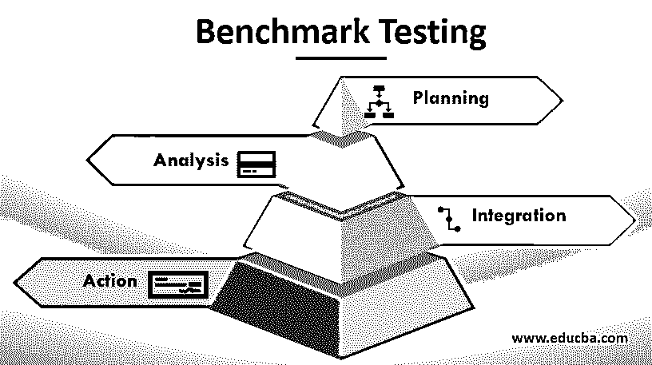
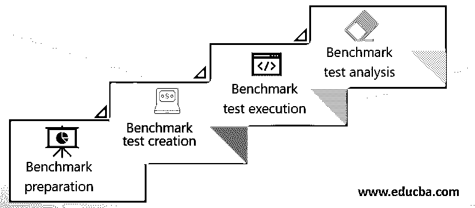

# 基准测试

> 原文：<https://www.educba.com/benchmark-testing/>

## 什么是基准测试？

基准测试用于根据开发团队或系统架构制定的规则验证系统软件应用程序或基于 web 的软件应用程序的产品价值，以维护或提高应用程序的声誉。该产品价值确定过程涉及各种测试流程，具体取决于为应用制定的法规。在大多数情况下，这是通过对应用程序进行一轮性能测试来实现的。

它必须是可重复的，以便可以捕获性能度量，并且需要记录变化，并且每次运行测试时，变化应该只有百分之几。这有助于对应用程序进行更改，以确定性能是提高还是降低。该测试也可以[与安全测试](https://www.educba.com/security-testing/)相结合。例如，我们可以考虑基准测试防火墙。这需要系统可以与不同的安全违规同时合并并执行，以便可以确定性能的基准。作为软件开发生命周期的一部分，它可以让开发人员和数据库管理员都参与进来，这有助于获得当前的性能，然后有助于提高性能。

<small>网页开发、编程语言、软件测试&其他</small>

### 它是如何执行的？

必须在与预期相同的环境和条件下进行，以便获得比较系数。它有助于建立一个基准并据此进行进一步的操作。这方面的先决条件包括:

*   应确保所有软件组件都能准确工作。
*   在测试开始之前，应该检查所有操作系统更新和配置是否都已完成。
*   测试用例应该被很好地定义，并根据它们不同的功能划分为元素。
*   当测试进行时，应该检查其一致性和控制措施，因为它们是执行基准测试的重要因素。
*   每次测试都应该在相同的环境和条件下进行。
*   软件和硬件组件必须始终符合生产环境的要求或规范，因为应该为生产设置基准。测试应该像在生产中一样进行。

在此之后，重要的是要找出您希望继续进行哪种基准测试。它可以是一个基础设施基准，有助于发现在某些特定条件下的吞吐量能力。

第二种类型是应用程序基准，它有助于在类似于生产的条件下找到数据库的吞吐量能力。

### 创建基准测试计划

当去做的时候，这是最重要的一步，需要正确处理。创建测试计划的步骤是:

*   检查和审查工作量。
*   为了获得准确的基准，拥有以前的基准是很重要的，因此需要手头有所有存储的度量的集合。
*   制定一个有时间表的计划，让用户知道所需的时间和测试过程的终点。
*   如果在测试计划期间出现任何故障，则必须创建一个备份计划。
*   要终止最后一个过程，应该决定一个权限。

### 阶段

它包括四个阶段:

*   规划阶段
*   分析阶段
*   整合阶段
*   行动阶段

#### 1)规划阶段

在这一阶段，确定不同的标准和要求并对其进行优先排序非常重要。它有助于决定不同的基准标准，这些标准有助于建立一个标准，并且至少有助于交付标准软件。

#### 2)分析阶段

分析阶段有助于获得高质量的产品，并有助于确定之前遇到的任何问题的根本原因。通过这样做，您可以很容易地确定一些需要的更改，并为测试过程设定目标。这使测试过程一致，并有助于获得质量。

#### 3)整合阶段

整合有助于从每个分享成果的人那里获得成果，一个关心的人有助于获得认可。一旦所有的东西都集成了，就可以决定功能，并相应地设定功能目标。

#### 4)行动阶段

在这个阶段，实际工作已经完成。所有上述步骤可以导致开发一个[测试计划](https://www.educba.com/test-plan-template/)并记录需要的变更。一旦生成计划，就可以进行实施更改，一旦工作开始，就可以监控进度，并相应地执行计划直到完成。上述各点可以连续运行，直到测试完成。

此外，基准测试框架还有助于执行一些基本任务。这些任务是配置、服务器端组合、数据库访问和 JSON 序列化。

### 基准测试技术

这方面的技术包括基于各种因素设置不同的基准。将使用的技术将根据这些因素来定义。为了增强[性能测试](https://www.educba.com/performance-testing-tools/)，必须记住以下事项。

*   SQL 查询
*   SQL 索引
*   SQL 过程
*   sql 触发器
*   表空间配置
*   硬件配置
*   应用代码
*   网络
*   防火墙

### **基准测试技术阶段**

执行时有四个阶段。它们如下:

1.  基准准备
2.  基准测试创建
3.  基准测试执行
4.  基准测试分析

让我们分别来看看这些。

1.  #### Benchmark preparation

在此阶段，必须检查一些先决条件。检查数据库的逻辑和物理设计很重要。所有的表、视图和索引都必须提前创建。这有助于有效地执行测试。您可以规范化这些表，用实时数据填充所有数据，并确保基准测试的所有适当统计数据都可用。您可以运行数据库，并确保用于测试的所有系统资源和数据在生产中是相同的。像行阻塞这样的性能的所有包都被启用。磁盘位置、日志文件的大小、备份映像和测试备份过程是内联的。

如上所述，SQL 语句也要进行基准测试。它们应该是典型 SQL 或最坏情况 SQL。

**代表性 SQL:** 该 SQL 包括在基准测试的典型情况下执行的语句。这些陈述是根据应用的性质选择的。这可以通过一个应用程序的例子来进一步解释，该应用程序可能需要 insert 语句，而银行交易可能需要 Fetch、Update 和几个 insert 语句。

**最差情况 SQL:** 在这种情况下，可以有可以频繁执行的语句。这可能包括将处理大量数据的语句。在这种情况下，可以考虑具有时间约束和大量连接的 SQL。除此之外，还可能有访问路径不佳的语句，并且不支持任何索引。另一个最坏情况 SQL 的例子是一个执行时间很长的查询。

2.  #### Benchmark test creation

这种测试的主要动机是创建一个与现有程序相似的程序。这个现有的程序将有助于基准的创建。整个应用程序可以被认为是一个基准，有助于拥有一组有助于分析的 [SQL](https://www.educba.com/what-is-sql/) 语句。每当应用程序很大时，建议只考虑必要的导入语句。这些重要的陈述可以包含在基准测试的创建中。这还必须具有连接、准备打开等功能。有助于建立与时间相关的基准的陈述。

执行并获得运行一个查询所需的估计时间是很重要的。为了进行模拟，对每个查询进行估计是很重要的。虽然性能时间不会显示任何瓶颈，但它确实提高了性能。必须处理特定的行，以便获得准确的模拟结果。如果发送的行不正确，会严重影响 CPU 的性能。

3.  #### Benchmark test execution

开始测试时，可以选择一个参数，并尝试不同的值。这个值应该是变化的，直到我们获得最大的利益。重复执行有助于您从系统中获得可靠的性能，并获得可用于创建基准的不同值。发生的运行是第一次运行，即第一次发生的运行，以及在第一次运行之后运行的正常运行。对多个值的测试完成后，池返回到已知状态。此后，可以更改参数值。当改变值时，环境应该被带回到原始状态。要做到这一点，应执行以下步骤。

*   测试期间必须更新统计数据，并且应该确保每次迭代都使用相同的值。
*   正在使用的测试数据必须是一致的，并且应该保留一个备份副本，用于存储以前的状态。用户可以使用恢复导出副本等实用程序来帮助恢复数据。

根据结果，如果性能有所提高，则继续运行该组迭代，直到获得平均运行时间。另一方面，如果性能下降，那么参数可以改变为先前的值，并且只有一种方法可以用于调整参数。

4.  #### Benchmark test analysis

一旦执行完成，所有结果都应该保存。这些结果将包含标识符，它可以包含迭代号、语句号和所有执行的运行时间。摘要应包含所有运行及其标准时间和具有不同值的语句。

### 优点和缺点

让我们来看看标杆管理的优势

*   **性能提升:**这是进行的主要原因之一。它提高了竞争力，并确保高质量地提供基本功能。还可以和市面上的其他应用进行性能对比，提高自己应用的质量。它还带来了漏洞或应用程序效率低下的地方，并提供了改进的机会。
*   **重点在于改变:**它迫使产品达到最低标准质量。最佳实践和标准鼓励您分析、满足并超越已经设定的标准。
*   **没有产生额外的成本:**这些投入是有成本效益的，并且很快就产生了结果。一旦我们有了适当的解决方案，就可以从中获益。战略和信息共享得到了改善，从而使不同的思想投入到工作中，这可能会带来出色的产品和未来的发现。
*   **识别基本活动**:为了提高产品和利润，定义一套活动并始终执行是很重要的。

缺点如下:

*   标准稳定性:每当一个基准被设定，公司就执行它并使它成为一个标准。在此之后，改进的范围变小了。
*   **减少的结果**:当标准设定后，人们很少寻求更多的改进。
*   依赖性增加:创造这些基准产品的公司让其他人依赖他们的应用程序。

### 结论

基准测试的主要成果是推广和巨大的销售。经过所有的讨论，我们可以得出结论，这些不同的方面为公司提供了基本要素，有助于拥有一个体面的标准产品。通过执行该测试可以获得质量。可以完全避免死锁情况，并且可以交付最佳质量的产品或应用。

### 推荐文章

这是一个基准测试指南。这里我们详细讨论了基准测试的基本概念、阶段、测试技术和优缺点。您也可以浏览我们推荐的其他文章，了解更多信息——

1.  [黑帽 SEO 技巧](https://www.educba.com/black-hat-seo-techniques/)
2.  [测试用例设计技术](https://www.educba.com/test-case-design-techniques/)
3.  [黑盒测试](https://www.educba.com/black-box-testing/)
4.  [黑盒测试技术](https://www.educba.com/black-box-testing-techniques/)

