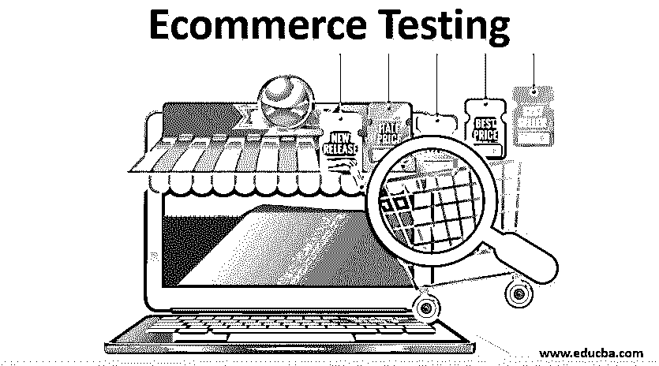

# 电子商务测试

> 原文：<https://www.educba.com/ecommerce-testing/>

## 电子商务测试简介

在电子商务测试中，电子商务是通过互联网以数字方式买卖商品/服务的商业活动。亚马逊、淘宝、沃尔玛、Flipkart、Ola 和优步是全球顶尖的电子商务公司，其中大多数都在印度有业务。-全球电子商务销售额占零售总额的比例约为 8%;美国是 13.5%，印度是 2.2%，而且各地都在以两位数增长。随着全球智能手机用户增至 27 亿，电子商务交易量必将呈指数级增长。电子商务供应商应该拥有一个充满活力的网站，具有卓越的性能/用户体验功能，以提高他们的在线销售。网站在部署给用户之前，应该在各个方面进行彻底的测试。

在这篇文章中，让我们看看测试电子商务网站的各种技术。

<small>Hadoop、数据科学、统计学&其他</small>

### 什么是电子商务测试？

这是一个检查网站的所有特性和功能的过程，以确定它是否按照最初的规格工作，并确保它在负载达到设计水平时以预期的速度运行。

测试的目的是增强:

*   通过修复代码中的缺陷来提高可靠性。
*   通过消除对编码人员/分析人员需求的歧义和误解来保证质量。
*   通过确保分配适当级别的资源来管理负载和微调/优化代码，提高性能水平。
*   通过删除不需要的导航/流程步骤并改善外观和感觉来提升用户体验。
*   强调编码标准和结构的安全性。
*   通过坚持既定的政策/原则，遵守所有的规章制度。
*   用户可在 24×7 窗口不间断地使用网站。

### 电子商务测试是如何工作的？

以下是展示其工作原理的步骤:

网站开发/实现的成功取决于在线部署之前测试的深度。

1.作为测试过程的第一步，我们需要确定要测试的场景

*   它必须来自系统需求文档(SRS 或 BRD)
*   需要详细说明要测试的各种功能，并且应该涵盖应用程序的端到端流程。
*   被定义为行动的高级资产。
*   都是简短的俏皮话。
*   应该关注测试什么而不是如何测试。

2.下一步是为确定的场景确定测试用例。每个场景可能会衍生出多个测试用例。

一个测试用例包括:

*   为验证应用程序的特性或功能而执行的操作列表。
*   一组[测试数据，用于测试](https://www.educba.com/test-data-generation-rules-advantages/)的各个动作。
*   要遵循的步骤，前提条件。
*   预期结果。
*   测试人员用来检查功能的独特条件。

需要更多的资源来运行测试步骤并记录结果。测试用例应该简单，明确，面向最终用户，覆盖所有的特性，并且容易识别。[测试场景和测试用例](https://www.educba.com/test-cases-vs-test-scenario/)应与系统需求文档一起准备，一旦应用模块的开发完成，测试团队应进入与开发团队互动的测试活动。

### 测试类型

以下是测试的类型:

电子商务应用程序可以作为网站或移动应用程序托管。台式机/笔记本电脑和手机通过浏览器使用 URL 访问网站。移动应用程序从移动设备上的应用程序商店下载。

**电子商务测试应涵盖以下场景:** 

*   通过台式机/笔记本电脑和手机访问网站
*   移动应用

#### 1.一般测试

与任何其他应用程序一样，电子商务应用程序也要经过一些常规测试，下表列出了这些测试:

| **测试类型** | **流程** |
| 功能的 | 根据需求规格验证应用程序的每个功能 |
| 可用性 | 测量终端用户在应用程序中交易时的舒适度 |
| 安全性 | 评估威胁、漏洞、风险并推荐补救措施 |
| 数据库ˌ资料库 | 检查数据完整性/一致性和数据库对象 |
| A/B | 比较两个版本的软件来衡量性能的提高。 |

#### 2.特定测试

电子商务应用程序有特定类型的测试，如下所列:

| **类型** | **测试过程** |
| 应用程序的工作流程(逐步测试) | 

1.  Register/log on to the website,
2.  Commodity search,
3.  Commodity range filtering,
4.  Commodity display sorting,
5.  Shopping cart function,
6.  Commodity review,
7.  acknowledgement of order
8.  Delivery instruction
9.  Payment processing,
10.  Invoice generation,
11.  cancel
12.  Shipment tracking

 |
| 浏览器兼容性 | 验证应用程序在所有浏览器及其版本中的功能 |
| 设备兼容性 | 网站在所有预期最终用户设备中的可访问性。它可以是台式机/笔记本电脑或移动设备，如 iPad、Tab、任何操作系统(ios、android、windows)中的智能手机等。 |
| 页面显示 | 检查页面格式、字体大小、页面设置、与浏览历史相关的产品显示、相关页面、页面外观、Cookies、分析和社交网站。 |
| 内容 | 质量、合法性、完整性和盗版方面的内容认证 |
| 有效性 | 几乎没有停机时间的全天候连续服务可用性 |
| 表演 | 检查主页加载、搜索速度、交易速度、负载处理、可伸缩性和稳定性。检查不同操作阶段的吞吐量和响应时间，并与标准进行比较。 |
| 搜索引擎优化 | 验证搜索引擎优化参数，如 HTML，关键字和短语，屏幕处理，内容质量，响应设计和反向链接等。 |
| 系统综合 | 检查接口的功能、接口的频繁激活及其性能。 |
| 全球化 | 支持多语言、多区域文化管理和会计 |

### 电子商务测试中的测试工具

一些广泛用于测试网站的工具有:

*   Selenium: 适用于任何浏览器/平台的 web 应用程序的开源测试套件。它使用简单的脚本实现了自动化功能&回归测试。它有一个记录/回放功能，可以在不了解脚本语言的情况下编写测试。
*   **JMeter:** 主要用于性能&负载测试，是 Java 中的开源工具。
*   **Spur:** 验证网页设计的工具，由网页开发公司使用。
*   **浏览器:**检查网站跨浏览器布局差异和脚本错误的工具。
*   **链接研究工具:**检查网站内容质量的 SEO 工具。
*   **点击热度:**提供了一个图形化的点击热度图，用于评估 HTML 页面中的热区和冷区。

### 结论

随着越来越多的用户接受网上购物，网站良好的响应时间/速度和稳定性对留住客户起着很大的作用。一个测试良好的电子商务网站将为在线业务的成功提供所需的活力。

### 推荐文章

这是一个电子商务测试指南。这里我们讨论类型、工具；什么是电子商务测试？它是如何工作的？.您也可以浏览我们的其他相关文章，了解更多信息——

1.  [电子商务购物网站](https://www.educba.com/ecommerce-shopping-websites/)
2.  [什么是软件测试中的 Bug？](https://www.educba.com/what-is-a-bug-in-software-testing/)
3.  [JavaScript 中的错误类型及处理](https://www.educba.com/errors-in-javascript/)
4.  [负载测试与压力测试的有用区别](https://www.educba.com/load-testing-vs-stress-testing/)

