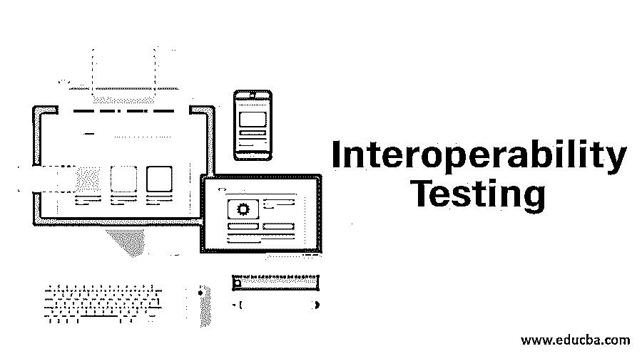

# 互操作性测试

> 原文：<https://www.educba.com/interoperability-testing/>

## 互用性测试简介

互操作性测试是一种检查一个组件是否可以与其他软件组件交互的测试。它根据客户的要求检查两个软件系统之间的功能。它验证两个系统之间的端到端功能是否符合要求。它确保了端到端的通信，并减少了传输数据时两个系统之间的兼容性问题。它提供了两个软件系统之间统一的数据类型和数据格式。这种测试是一个不可或缺的部分，因为许多不同种类的技术和架构被用于无缝操作。其他技术上合格的软件应用程序或来自其他相关应用程序的特定软件组件，它们实际上是链接在一起的，以形成客户作为要求指定的有效运行产品。

### 为什么我们需要互操作性测试？

*   互操作性测试的需求增加了，因为确保在系统中涉及的两个或更多软件之间提供端到端的服务是很重要的。这些系统可能来自不同的供应商，可能具有不同的体系结构，或者可能使用不同的技术。
*   系统之间的通信和数据交换应该顺畅，包含的软件也应该顺畅。对于将要发生的任何通信，不应该有任何兼容性问题。
*   由于在一个完整的系统中可能会涉及不同的架构、技术、产品和供应商，因此所有这些组件必须相互协作。所涉及的不同组件之间不应出现任何问题。
*   应该验证正在交换的数据没有被修改，并且处于原始状态。数据交换可以在没有任何预先通知的情况下进行。还应该注意的是，网络中的所有应用程序都自己执行它们预期的行为。

### 互操作性测试流程

测试过程包括互操作性测试中的以下步骤:

<small>网页开发、编程语言、软件测试&其他</small>

*   测试环境设置
*   [创建测试用例](https://www.educba.com/what-is-test-case/)
*   测试用例执行
*   测试结果分析
*   重新检测

#### 1.测试环境设置

这是测试的第一步。需要设置环境来测试互操作性。如果没有设置合适的环境，就不可能进行测试。需要为基础架构制定正式的工作说明书。

#### 2.创建测试用例

创建不同的测试用例来检查不同的场景和连接行为。为了覆盖不同的场景[，应该创建不同的测试用例](https://www.educba.com/test-cases-vs-test-scenario/)。这样做是为了更有效地执行测试。在此之前，所有的设置必须像设置自动化工具一样完成，以减少测试用例并重用它们。应进行所有数据库配置并测量指标。

#### 3.测试用例执行

一旦制定了测试用例，就需要在设置好的环境中执行它们。执行让我们知道软件的实际行为，让我们知道软件上线后的行为，以及它如何与其他组件通信。

#### 4.测试结果分析

一旦执行完成，所有的测试结果都应该被分析和验证。应该记录并解决发现的缺陷。测试团队应该找到失败的根本原因。应该确保这些问题得到解决。

#### 5.重新检测

应该确保指出的缺陷得到解决。一旦开发团队解决了缺陷，那么就应该确保再次执行测试，并且重复整个过程。这些问题现在应该得到解决。

这些活动完成后，应确保记录所有结果，并保留所有测试日志和测试结果的记录。

### 互操作性测试的类型

有五种互操作性测试

#### 数据类型互操作性

它主要关注于检查[数据类型](https://www.educba.com/pl-sql-data-types/)是否从一种类型转换到另一种类型。当数据在系统之间传输时，不应有任何数据不一致。

#### 语义互操作性

这种类型侧重于用于传输数据的算法。它检查所涉及的语义，并验证算法是否可靠。

#### 物理互操作性

这将检查两个或更多系统之间的连接是否正确。所使用的端口和电缆不应影响传输速度或速率。

#### 协议互操作性

检查用于数据传输的协议的数据安全性。应启用校验和，以便无任何错误地传输数据。

#### 数据格式互操作性

两个系统中发送和接收数据的格式应该相同。

### 互操作性测试的优点和缺点

以下是优缺点。

#### 优势

*   互操作性测试有助于建立两个系统之间的连接。这种联系有助于更好地了解系统如何与其他产品同步工作。它有助于促进两个不同系统之间更好的通信。
*   它提高了效率。当数据以一致的方式呈现时，决策就更容易了。
*   它确保传输统一的数据类型，并且数据类型与[不匹配。数据类型应该在整个系统中保持一致和兼容，这样就不会出现问题。](https://www.educba.com/hive-data-types/)
*   数据格式确保整个系统遵循统一的格式。所有的软件都是同步的，没有由于数据格式不兼容
*   它确保所有交互系统具有相同的语义或算法。

#### 不足之处

*   它需要精确的测量，这样所有系统才能在端到端的环境中正常工作
*   由于所有组件都要进行测试，因此本次测试的网络复杂性更高
*   该测试中的要求是不充分的。

### 结论

当系统的端到端测试开始时，这是非常重要的。它确保系统中的所有软件组件都是兼容的，并且可以作为一个单元一起工作。所有不同的数据类型、格式和语义都事先经过了验证。因此，该测试的目的很明确，它还提到了[测试计划](https://www.educba.com/test-plan-template/)和执行该测试时需要遵循的策略。

### 推荐文章

这是互操作性测试指南。在这里，我们讨论 5 种互操作性测试，以及过程和优缺点。您也可以阅读以下文章，了解更多信息——

1.  [自动化测试](https://www.educba.com/automation-testing/)
2.  [突变测试](https://www.educba.com/mutation-testing/)
3.  [静态测试技术](https://www.educba.com/static-testing-techniques/)
4.  [可扩展性测试](https://www.educba.com/scalability-testing/)

