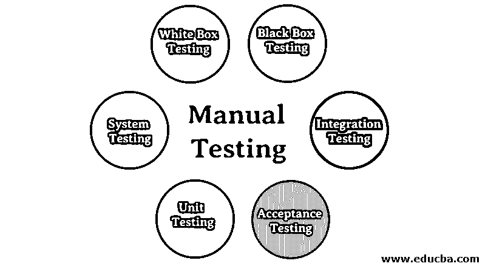

# 人工测试

> 原文：<https://www.educba.com/manual-testing/>

## 手动测试简介

手动测试可以定义为软件测试人员对软件的正确性进行物理验证，并根据业务分析师或客户提供的需求规范验证软件应用程序的功能的过程。这种类型的测试贯穿所有的软件测试阶段，并且应该覆盖软件产品的所有需要的测试应用类型。在手动测试过程的所有步骤中，创建和维护测试文档是至关重要的。

### 软件手动测试

软件可以通过两种方式进行测试，一种是人工测试，另一种是计算机自动测试。每种技术都有它的优点和缺点，但是都有维护软件质量的基本目标。在本文中，我们将专注于手工测试。

<small>网页开发、编程语言、软件测试&其他</small>

### 类型

下面是下面描述的六种类型。

#### 1.白盒测试

*   软件测试策略包括[黑盒测试和](https://www.educba.com/white-box-testing-vs-black-box-testing/)白盒测试。这里我们讨论白盒测试，称为“玻璃盒”测试、结构测试、透明盒测试和开放盒测试。它测试内部编码和软件基础设施，以验证预定义的输入和预期的输出。它基于应用程序的内部功能，围绕着测试内部框架。
*   这种测试所需的编程能力是测试实例的设计。白盒测试的主要目的是集中于通过软件的输入和输出流，并加强软件的安全性。由于内部系统视图，使用了“白盒”一词。清除框或白色框的名称表示查看软件外壳内部的能力。

#### 2.黑箱测试

*   黑盒测试是一种软件测试方法，它检查软件的功能，而不查看其内部结构或编码。客户指出的需求规格是黑盒测试的主要原因。这种技术用于选择一个特性，并提供一个输入值来检查该函数是否提供了预期的性能。
*   如果特性产生正确的输出，它将被测试，否则，它将失败。测试团队报告结果，然后测试下一个任务。毕竟，功能已经过测试，如果出现严重问题，开发团队将被退回进行更正。

#### 3.集成测试

*   集成测试是软件测试方法中单元测试之后的第二个阶段。在此测试中，单元或单个软件组件将在一组中进行评估。集成测试级别侧重于在部件或单元交互时暴露缺陷。
*   单元测试利用测试模块，这些模块在集成测试期间被组合和测试。该软件是用许多由不同程序员或编码员编写的软件组件设计的。集成测试的目标是验证所有模块之间的通信是否正确。

#### 4.验收测试

*   验收测试是基于用户需求和功能处理的正式测试。它决定了软件是否符合特定的客户需求。它是作为一种黑盒测试来完成的，在黑盒测试中，一定数量的客户参与系统验收测试。这是软件测试的第四个也是最后一个层次。
*   但是当系统处于最终用户使用的当前场景中时，仍然有一些小错误需要识别。软件现在已经经历了三个阶段(单元测试、集成测试和系统测试),在这三个阶段中，变更的需求是存在的，并且在项目的发展过程中不能有效地传递给开发团队。

#### 5.单元测试

*   单元测试包括对每个软件单元或元素的检查。这是第一个软件测试级别。单元测试的目标是验证单元元素的效率。设备是计算机方案的一个测试组件，在应用软件设计阶段已经过测试。该测试旨在检查隔离代码的准确性。单个功能或应用程序代码是一个单元元素。
*   [设计者用于单元测试](https://www.educba.com/unit-testing/)的测试方法白盒。单元测试是在测试级别结构中包含和其他测试集中之前执行的第一级测试。测试方法利用模块来减少单元测试框架对存根、驱动程序和模拟项的依赖，以帮助单元测试。

#### 6.系统试验

*   系统测试包括测试完全集成的软件系统。软件集成一般是由一个计算机系统产生的(每个软件只是一个计算机系统组件)。软件以单元的形式创建，然后与其他软件和硬件连接，形成一个完整的计算机系统。换句话说，一个系统由一组执行各种功能的软件组成，但单靠软件是无法完成这项工作的。
*   系统测试是一系列不同类型的试验，针对嵌入式软件计算机系统的完整功能需求进行测试。系统测试是在黑盒中测试的，因为它涉及到软件的外部测试。小缺陷的测试遵循用户的观点。

### 在手动测试中如何表现？

阅读项目文档/指南软件并理解它。如果可能，还要研究测试应用程序(AUT)。涵盖所有文档需求的测试用例草案。检查并参考团队领导、客户测试案例(如适用)一旦错误被纠正，再次运行失败的测试实例以确认它们已经通过。黑盒测试和白盒测试用于手动执行所有测试实例。

### 手动测试和自动化测试的区别

以下几点解释了手动和自动化测试:

*   自动化测试包括使用测试工具。手动测试需要人类的干预来进行测试。而它需要合格的劳动力、长时间和费用。
*   自动化测试节省了时间、成本和劳动力。当被记录时，自动化测试套件更容易操作。
    有些测试种类像 ad hoc、[猴子测试](https://www.educba.com/monkey-testing/)更适合手工执行，任何请求都可以手工测试。自动化测试只建议用于稳定的系统，主要用于[回归测试](https://www.educba.com/regression-testing/)。
*   用于[自动化测试](https://www.educba.com/automation-testing/)的自动化软件用于钻孔部分，以反复执行相同的测试实例。重复和枯燥的手工测试会变得。

### 优点和缺点

以下是利弊解释。

#### 优势

黑盒方法不需要理解编程。它用于测试动态变化的 GUI 设计。
·作为一个真正的用户，测试人员与软件互动，寻找可用性和用户界面问题。
它确保 100%无 bug 软件可用。
·新用户可以非常轻松地学习

#### 不足之处

需要大量人力资源。
查找输出将花费更多的时间。
·测试基于他们的专业技能和知识。没有证据表明所有的任务都被涵盖或未被涵盖。
案例测试不能重复使用。每个新软件都需要创建不同的测试实例。
由于两个团队合作，彼此的意图有时很难理解，他们可能会误导整个过程。

### 执行它的工具

现在我们将看到下面的一些工具:

*   硒
*   Appium
*   测试链接
*   邮递员
*   Jmeter

### 何时进行手动测试？

这需要很大的努力。简单地说“让我们滑”或“让我们自动化”可能很简单。然而，事实是，软件是必不可少的，因为自动化测试不能涵盖一切。毕竟，人们会使用你的软件，所以人们应该参与测试你的软件。手动测试比自动测试更有可能识别和修复实际的可用性问题。这使得测试人员很灵活，使您能够随时尝试各种东西。自动化测试并不是说无利可图。自动化测试在还没有完成的领域提供了它自己的优势和价值。但是在另一篇文章中，我们将保留它。

### 结论

虽然需要大量的工作，但需要保证高水平的客户体验和质量。人类测试人员总是能找到不能自动测试的东西。有效的手工测试的关键包括软件需求的知识，编写优秀的测试实例，以及记录全面的错误报告。因此，在本文中，我们已经看到了它是什么以及它的优缺点。

### 推荐文章

这是手动测试的指南。在这里，我们讨论了基本概念、类型、工具、手工和自动化测试之间的区别、优点和缺点。您也可以浏览我们的文章，了解更多信息——

1.  [稳定性测试](https://www.educba.com/stability-testing/)
2.  [安全测试](https://www.educba.com/security-testing/)
3.  [GUI 测试](https://www.educba.com/gui-testing/)
4.  [静态测试](https://www.educba.com/static-testing/)

