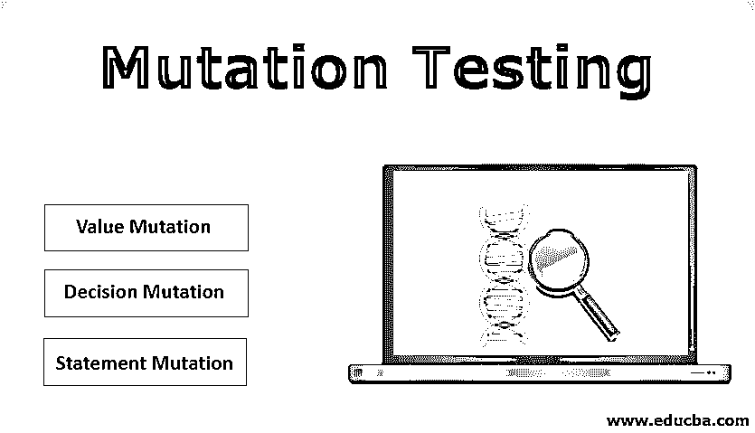

# 突变测试

> 原文：<https://www.educba.com/mutation-testing/>

## 突变测试简介

正如单词“mutate”通常意味着“改变”，突变测试也意味着“改变”。变异测试是一种软件测试，通过改变或变异一段代码来检查/验证测试用例是否足以发现错误/缺陷。它属于白盒测试，基本上是在执行应用程序特定模块的单元测试时完成的。在源代码/主代码中所做的更改很小，因此不会影响其总体目标。这也被称为故障检测技术，因为它的目的是通过在原始代码中创建一个故障来定位测试用例的弱点。

在进行任何测试之前，理解测试背后的目的是非常重要的。突变测试的主要目标是发现开发的测试用例的有效性，这些测试用例应该能够检测出代码中的微小变化。这样做是为了发现测试套件中的问题，以及在执行任何软件应用程序测试时使用的测试数据。原始代码的多个变体或版本被创建，并且它们中的每一个都根据原始测试用例进行测试。如果测试用例的结果与我们在原始代码中的结果相同，那么代码和测试用例都会被再次检查，因为要么代码没有被执行，要么测试套件没有足够的能力找到变异代码。

<small>网页开发、编程语言、软件测试&其他</small>

### 突变测试的类型

基本上有 3 种类型的突变测试被执行来创建原始代码的突变体:

#### 1.价值突变

顾名思义，在值突变中，常量的值、方法中传递的参数、循环中使用的值被改变以创建突变程序。要么将较大的值改为较小的值，要么反之亦然。基本上，已经在程序中定义的值被改变以执行值突变。

**原始代码:**

`int a = 75636737;
int b = 3454;
int mult = a * b;
print(mult);`

**突变代码:**

`int a = 75;
int b = 345466465;
int mult = a * b;
print(mult);`

#### 2.决策变异

在决策变异中，程序中使用的逻辑和[算术运算符](https://www.educba.com/arithmetic-operators-in-javascript/)被改变，从而改变程序中的整体决策及其各自的结果。例如，某个‘if’语句只在(a > b)时运行。在突变代码中，这个操作符被改为(a < b)，这样就改变了代码的整体决策。

**原始代码:**

`if (a>b || b>c)
{
print(“yes”);
}
else
{
print (“No”);
}`

**突变代码:**

`if (a<b || b<c)
{
print(“yes”);
}
else
{
print (“No”);
}`

#### 3.语句突变

在语句变异中，对代码的完整语句进行修改，以创建一个变异程序。语句的更改可以是删除整个语句、更改代码中语句的顺序、将语句复制并粘贴到代码中的其他位置、重复或复制原始代码中的几个语句。

**原始代码:**

`if (a > b)
{
print(“a is greater”);
}
else
{
print(“b is greater”);
}`

**突变代码:**

`if(a > b)
{
// removing the statement
}
else
{
print(“b is greater”);
}`

### 突变测试的优点和缺点

突变测试的优点和缺点如下:

#### 优势:

*   突变测试的最大优势之一是，它有助于发现隐藏的缺陷和最大的[代码覆盖率](https://www.educba.com/code-coverage/)，以便识别原始测试用例没有彻底测试的代码部分。
*   它有助于发现用于测试软件的测试用例的质量，并向测试人员提供关于测试过程和测试质量的真实反馈。
*   它有助于发现正常测试不容易发现的高质量 bug。
*   它有时会揭示隐藏的缺陷，如代码不明确、变量的值不正确等。，在代码的早期阶段进行软件测试，这是非常有益的。
*   有时，代码和测试用例都是正确的，但是问题是由测试数据引起的。突变测试有助于发现测试数据中的问题。

#### 缺点:

*   在突变测试中，代码的各种突变体被创建并对照原始测试套件进行测试，因此，在仅执行应用程序的单个特征/模块的单元测试时，会消耗大量时间。
*   如上所述，所有的突变体都是针对原始套件进行测试的，因此将会有大量的测试用例需要执行，因此没有自动化工具就无法执行，而自动化工具是昂贵的，并且会妨碍项目预算。
*   在原始代码中创建的复杂突变体会导致原始代码中的混乱和错误。

### 结论

上面的解释清楚地定义了什么是突变测试及其在应用程序测试领域的重要性。如果我们想要用最大代码覆盖率的测试场景对应用程序进行全面彻底的测试，那么它就扮演了一个至关重要的角色。

### 推荐文章

这是一个突变测试指南。在这里，我们讨论一个简短的介绍和突变测试的类型以及优点和缺点。你也可以通过我们其他的推荐文章来了解更多。

1.  [阴性测试](https://www.educba.com/negative-testing/)
2.  [移动应用测试](https://www.educba.com/testing-of-mobile-application/)
3.  [基于风险的测试](https://www.educba.com/risk-based-testing/)
4.  [蝗虫负载测试](https://www.educba.com/locust-load-testing/)

