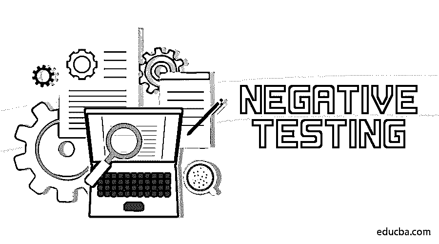

# 阴性测试

> 原文：<https://www.educba.com/negative-testing/>

## 什么是阴性测试？

负面测试是从最终用户的角度测试应用程序工作行为的负面功能流或故障通道的过程。这种测试类型在大多数基于 web 的应用程序或系统应用程序中是至关重要的，因为仅仅在应用程序的正面或成功路径中捕捉所有错误点是没有帮助的。这种测试是特定于负面测试用例场景的，它可以从输入/其他集成应用程序的多种组合和排列中获得。两种类型的否定测试是边界值分析和等价划分方法。

### 为什么我们需要阴性测试？

有几个原因，其中一些提到如下:

<small>网页开发、编程语言、软件测试&其他</small>

1.  虽然不可能向最终用户提供 100%无故障的软件，但是执行它并覆盖最大的负面场景可以确保应用程序能够处理意外情况。
2.  市场上有很多黑客在寻找机会攻击应用程序并滥用客户的私人数据，为了避免这种安全漏洞的情况，消极测试非常重要。
3.  通过执行应用程序来揭示应用程序中的漏洞，以防止意外行为。
4.  确保超限、异常和不良数据应用的稳定性。
5.  为了给客户提供一个易受攻击的和健壮的应用程序，阴性测试是必须的。

### 如何进行阴性测试？

因为这需要时间和成本。需要一个独立的测试团队来执行增强的测试。

*   需要为每个功能创建指定多个测试场景的负面测试用例。
*   包含所有可能无效数据的负面场景需要根据负面数据的优先级进行测试。

测试人员通常使用以下两种技术进行阴性测试:

#### 1.边界值分析

在边界值分析中，为边界限制之外的值设计否定测试用例，以便验证系统如何为它们工作。例如，如果表单中的文本字段接受 5-30 个字符的数据，那么边界限制将是 5 和 30，因此将测试这些值。

#### 2.等价划分

[在等价分区](https://www.educba.com/equivalence-partitioning/)中，输入值被分成等价数据的不同分区，为了验证整个分区，只测试每个分区的一些值。如果数据通过，则整个分区被认为通过，否则失败。对于上述示例，对于接受 5-30 之间数据的文本字段，分区将是 0-5、5-30、30-100，对于这种情况，将测试 0-5 和 30-100 的分区。

### 优点和缺点

以下是优点和缺点:

#### 优势

*   为了确保易受攻击的和高质量的软件，阴性测试是必须的。
*   为了防止软件应用程序遭受网络犯罪和不道德的黑客攻击，针对负面场景的[安全测试发挥了重要作用。](https://www.educba.com/security-testing/)
*   这让他们相信应用程序经过了所有负面场景的测试，因此更加可靠。
*   它确保软件应用程序优雅地处理所有错误或不良情况。

#### 不足之处

*   有时候，在某些应用中，这变成了浪费时间。密集 it 覆盖所有负面场景，并不总是需要多个负面测试数据。测试人员有时会过多地参与其中，以至于忽略了严格的正面测试(应用程序的基本功能)。
*   对于细节，项目中需要一个独立的测试团队，这可能会导致高项目预算问题。
*   应用程序的发布周期有时会延迟。
*   阴性测试需要经验丰富的人员。

### 用于阴性测试的工具

尽管市场上没有特定的工具。覆盖所有负面场景的测试用例可以手动执行，也可以通过自动化脚本执行。在执行测试时，最重要的事情是测试用例可以测试的测试数据排列的最大数量。用每个测试数据手工测试测试用例可能有点无聊和耗时，但是这个任务可以通过自动化测试来简化。自动化脚本可以通过[市场上可用的简单自动化工具](https://www.educba.com/automation-testing-tools/)创建，如 Selenium、TestComplete、Appium、Cucumber 等。自动化脚本有助于覆盖所有的测试数据，因为所有的测试数据都可以存储在一个文件中，对于每个测试用例，脚本可以一次又一次地执行。

### 结论

消极测试不包括在内，也从来不是积极测试的一部分，因为积极测试确保系统按照要求和文档(SRS)中提到的那样工作，而它表明软件的健壮性、脆弱性和高质量标准。它和积极测试一样重要，因为两者都有不同的目的来测试软件。软件经过的测试越多，市场上的风险就越小，从而使应用程序更加稳定可靠。

### 推荐文章

这是一份阴性测试指南。这里我们讨论一下消极测试的介绍，为什么我们需要这种测试的优点和缺点。您也可以阅读以下文章，了解更多信息——

1.  [单元测试](https://www.educba.com/unit-testing/)
2.  [静态测试](https://www.educba.com/static-testing/)
3.  [系统集成测试](https://www.educba.com/system-integration-testing/)
4.  [黑盒测试](https://www.educba.com/black-box-testing/)

