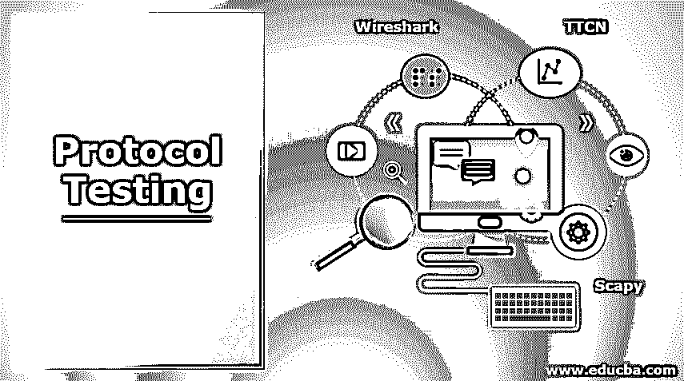

# 协议测试

> 原文：<https://www.educba.com/protocol-testing/>

## 协议测试简介

协议测试是对为特定网络设计的一组预设规则进行验证和确认的过程。该测试适用于任何类型的网络，包括带有交换机的网络、LAN 网络、路由器、无线网络，甚至 VoIP。在网络上执行的几种协议测试包括正确性验证、互操作性测试(含义、操作能力以及与其他类似或不同网络的兼容性)、延迟检查、带宽监控等。

### 什么是协议测试？

一般来说，协议是指执行任何事情所遵循的特定程序或规则体系。它包括测试交换、路由、无线和 VoIP 领域的协议。测试通过网络发送的数据包的结构。当通过网络在计算机之间通信时，路由协议(信号)和路由协议都需要遵循指令。

<small>网页开发、编程语言、软件测试&其他</small>

有 3 个最重要的东西需要测试:

1.  在传输过程中对数据进行正确解码(通过检查设备发送的数据包的结构)。
2.  完成了适当的会话分析。
3.  充分利用模拟器模拟不同单元的网络组件。

### 各种类型的协议测试

测试了以下方面:

1.  **延迟:**将数据包从源节点发送到目的节点所需的时间。
2.  **带宽:**一秒钟内可以发送的数据包数量。
3.  **正确性:**检查接收到的单个协议数据包的正确性。
4.  **互操作性:**计算机系统将数据包从源传输到目的地的能力。

为了测试上述方面，我们需要对协议进行适当的测试。从广义上来说，分为压力和可靠性测试，包括负载测试、[压力测试、](https://www.educba.com/what-is-stress-testing/)性能测试，以及[功能测试，](https://www.educba.com/what-is-functional-testing/)主要检查主要功能，包括正面测试、负面测试、一致性测试、互操作性测试等。

测试类型如下所述

1.  **压力和可靠性测试:**包括协议的非功能性测试和整体性能测试。
2.  **功能测试:**对协议的所有行为方面和整体功能进行测试。

### 优点和缺点

以下是优点和缺点:

#### 优势

下面提到的是一些优点

1.  以最高的效率、可靠性和安全性将数据从一台计算机传输到另一台计算机是至关重要的。因此，为了降低失败的风险，需要执行该操作。
2.  当负载增加或每秒传输的数据包数量增加时，整体性能会多次中断，这可能会产生许多问题。深入的协议性能测试有助于在故障发生前发现这些情况。
3.  当数据包从一个地方传输到另一个地方时，解码和编码数据包是很重要的，其测试也是如此。
4.  执行诸如输入无效密钥、用户验证和授权之类的负面测试非常重要。
5.  非常重要的一点是，要检查是否利用了全部带宽以及可以测试的速度。

#### 不足之处

下面提到的是一些缺点

除了优点之外，在项目中选择协议测试之前，测试经理应该清楚地了解一些缺点:

1.  协议测试需要特定的测试团队，因此可能会妨碍项目预算。
2.  有时测试人员会深入到协议测试测试用例的创建和测试执行中，这是非常耗时的，并且会导致项目发布周期的延迟。
3.  对于性能测试，需要适当的自动化工具，这些工具成本很高，并且可能会将项目预算提高到非常高的水平。
4.  协议测试需要非常熟练的测试人员，这需要高薪。

### 协议测试工具

市场上有很多可用的工具。其中一些列举如下:

1.  **TTCN:** TTCN 基本上是一种在协议测试中用于测试用例设计和实现的[编程语言。它可以用来定义测试场景、测试变量、测试步骤、计时器等等，所有这些都是完整的测试用例创建所需要的。TTCN 可用于各种领域，如移动通信、智能卡、互联网协议，但协议测试用于测试行为响应。](https://www.educba.com/what-is-a-programming-language/)
2.  **Wireshark:** Wireshark 也是用于协议测试的常用工具之一。它有一个重要的特性，即捕获数据包并将其转换为人类可读的形式。当数据包建立、会话开始以及每次发送的数据量时，它有助于获得网络流量的完整、深入的详细信息。Wireshark 对数据包的解密支持各种协议，如 SSL/TLS、IPsec 等。
3.  Scapy 是最强大的工具之一，主要用于数据包处理。它创建数据包，对数据包进行编码和解码，分析数据包，然后将其发送到网络中。Scapy 的主要工作是处理不同请求的数据包的传输和接收。它还可以处理跟踪路由、探测、攻击和网络发现。Scapy 中用于传输数据包的脚本是用 Python 语言编写的。

### 结论

上面的文章清楚地描述了协议测试及其在测试领域的重要性。由于这是一个非常新的测试，与其他测试不同，对于一个有怪癖的人来说，学习新东西会很有趣。为了深入了解协议测试，建议您必须亲自使用各种工具，以便更清楚地了解具体的工作。

### 推荐文章

这是一个协议测试指南。这里我们讨论协议测试的介绍以及类型和优缺点。您也可以看看以下文章，了解更多信息–

1.  [路由协议](https://www.educba.com/routing-protocol/)
2.  [物联网协议](https://www.educba.com/iot-protocols/)
3.  [负载测试与压力测试](https://www.educba.com/load-testing-vs-stress-testing/)
4.  [硒负荷测试](https://www.educba.com/selenium-load-testing/)

