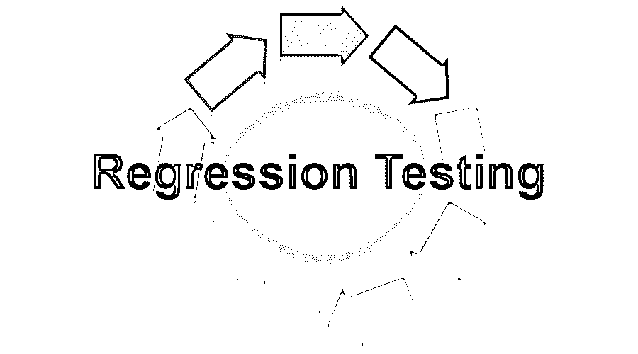

# 回归测试

> 原文：<https://www.educba.com/regression-testing/>

## 回归测试简介

在软件应用程序中，当现有系统发生新的变化或应用程序增加了新的功能时，测试受新需求影响的应用程序模块是必不可少的。这种类型的测试被称为回归测试。对于这个测试，没有设计新的测试用例。相反，从先前的测试执行中挑选一组测试用例，这适用于测试受影响的应用程序模块。大多数时候，这是使用自动化测试工具来完成的。

### 回归测试什么时候发生？

出现任何性能问题时都需要这样做，并且已经修复。缺陷修复或错误修复、需求变更、代码修改以及产品或软件的新增功能。必须对生产或任何其他环境中的软件或应用程序的最后部署和更改进行回归测试。

<small>网页开发、编程语言、软件测试&其他</small>

测试用例的选择主要基于:

*   客户端经常使用客户端。
*   产品的核心功能，如新建、编辑和查看。
*   更频繁地记录缺陷的测试用例。
*   所有类型的案例，如边界测试案例、集成测试案例和复杂测试案例。
*   对其进行了更改或修复了 bug 的功能。
*   所有类型的成功测试案例和失败测试案例。

### 特征

回归测试的特点如下:

*   这有助于节省大量的精力和时间。
*   它有助于同时运行多个测试，并且[保持先前测试用例的测试覆盖率](https://www.educba.com/test-coverage/)。
*   回归测试主要基于为测试现有功能或特性而定义的测试用例。
*   它还取决于释放的影响范围和组件的关键程度。
*   回归测试用例主要是自动化的，这为测试人员节省了时间和精力，因为有大量的测试用例，手动测试可能很耗时。

### 回归测试技术:

下面提到了各种技术:

#### 1.全部重新测试

这意味着所有先前编写的测试用例被再次执行，以确保一切正常，并且没有因为代码中的变化和新特性而引入的错误。这是最昂贵的方法之一，因为它需要大量的精力、时间和资源来执行所有的测试。

#### 2.回归测试选择

在这种类型的测试中，已经选择了需要被执行用于测试的测试用例。所有测试用例都不会为此方法运行；只有选定的测试用例用于运行。这些测试用例是在代码变更的基础上选择的。这些测试用例主要分为可重用测试用例以及过时测试用例。回归测试用例在随后的回归周期中使用，过时的测试用例不能在随后的周期中使用。

#### 3.测试用例的优先级

高优先级的测试用例可以比其他测试用例先被执行。中、低优先级测试用例在高优先级测试用例执行之后执行。优先级取决于产品的重要性、影响和功能。

#### 4.混合物

它是回归测试选择和测试用例优先级的结合。测试用例是根据优先级执行的，并且所选择的测试用例将针对发生的变更而执行。

### 回归测试的类型:

下面提到了不同类型的回归测试:

*   **单元回归:**主要在单元测试时执行。在这种情况下，通过回归案例测试代码，因为所有的依赖关系都被阻塞，以确保单元测试没有任何差异
*   **部分回归:**主要用于验证代码修改后运行良好，代码与已有代码或未修改的模块集成
*   **完全回归:**主要在代码和模块数量有大量变化时执行。测试用例是在整个软件上执行的，因为有很多代码变更。

### 回归测试的计划

回归测试的测试计划是为了接近软件或应用程序的测试。实现的新特性或功能、代码更改或错误修复，以及测试更改对现有代码的影响，回归测试通过自动化测试用例来完成。回归测试计划背后的主要思想是检查和了解如何进行测试以获得测试结果。这样做是为了确保产品的功能不受影响。

回归测试策略用于共享执行测试的方法，包括需要使用的测试技术、完成标准的使用、编写测试脚本，以及用于覆盖测试用例的自动化工具。测试用例是基于所使用的技术来执行的。它定义了需要测试的特性/组件。测试用例完全基于项目需求。

### 执行回归测试

可以手动和自动两种方式执行。如果是手工完成，那么就要耗费大量的时间和精力；测试可以手动完成，直到功能减少或应用程序变小。随着时间的推移，应用程序的功能会不断增加，并且会扩大回归范围。为了节省精力和时间，自动化工具主要用于测试回归和应用现有代码。

在执行回归测试以执行测试用例时，涉及到一些步骤:

*   为了进行回归测试，需要准备好测试套件。
*   测试用例需要自动化。
*   每当发现新的缺陷时，回归测试及其测试用例都需要更新。如果现有的测试用例没有覆盖已经完成的缺陷和变更，那么新的测试用例需要更新以覆盖那些功能。
*   即使有很小的变化或问题修正，也必须执行回归测试。现有的代码需要进行适当的测试。
*   在执行之后，必须创建包括通过或失败测试用例的报告。
*   随着应用程序开发或功能的增加，应用程序的测试时间也会增加。
*   对于软件发布的新版本和发布，测试人员需要测试和了解需要做的软件变更的需求。
*   分析变更对现有功能和模块的影响。
*   选择测试用例，并确定需要采用什么样的回归测试技术。
*   测试需要安排在特定的时间进行，并对其进行测试。

如果应用程序或软件的规模增加，回归测试将花费更多的时间和精力，并且对于新的版本，必须完全完成回归测试，这将增加测试成本，但是客户通常不准备支付测试费用。回归测试需要减少，但这是不可能的。即使是回归测试时间也不能减少，因为这是彻底测试应用程序的主要要求。自动化测试用例以及编写自动化测试脚本需要大量的工作，并且人们确实需要大量的知识来完成测试。

### 测试工具

测试工具用于自动化测试工作，并且可以在代码推送和构建之后自动运行。可用的测试用例以及手动运行它们将会花费大量的精力和时间。为了减少工作量和时间，正在使用自动化工具。测试用例大部分是记录的，只有回放类型。

下面提到了一些可用的测试自动化工具:

1.  硒
2.  QTP(快速测试专家)
3.  理性功能测试
4.  vTest

有许多其他工具正被用于编写脚本和测试应用程序或软件，并且测试用例经常是由于系统中的变化。测试工具也以一些特殊的方式帮助测试应用程序。如果有新的功能被嵌入，或者在定义的一段时间或几天内，或者在最近的 sprint 中有任何代码变更，那么测试用例需要按照添加的新功能来执行。执行回归测试用例的另一种方法必须对所有的应用模块再次执行，它被称为端到端回归测试，以覆盖产品的所有功能。

### 优点和缺点

下面是提到的优点和缺点:

#### 优势:

*   它确保现有的功能运行良好，并且不影响软件的任何部分。
*   回归测试确实有助于性能优化。
*   它有助于实现持续集成；开发人员一推送代码，构建就被触发，回归测试就自动运行。
*   它有助于提高产品质量。
*   这可以使用自动化工具来完成。
*   这也有助于确保同样的缺陷不会再次发生。
*   它不允许在回归测试开始时进行新的更改。
*   对于数据库可以这样做，需要隔离数据库进行测试。在进行回归测试时，数据库中应该没有变化。

#### 缺点:

*   如果项目中没有使用自动化工具进行回归测试，那么这将是一个耗时的过程。
*   手动操作需要大量的精力和时间，而且这是一个繁琐的过程。
*   它必须为代码中的小变化而做，因为它会在软件中产生问题。
*   每次都需要进行回归测试。
*   随着测试用例变得越来越大，有时由于时间和预算问题，所有的测试用例都不能被执行。
*   用较少的测试用例达到最大的测试覆盖率总是很难实现的。
*   在每次发布和构建 bug 修复之后，很难确定回归测试的频率。

### 结论

这是测试的重要部分之一，有助于交付高质量的产品。它确保如果代码中有任何变化，它不会影响任何现有的代码或功能。这主要是通过自动化工具手工完成的；这需要花费大量的时间和精力来完成。工具的选择主要基于项目的需求，并且工具还应该具有更新测试用例的能力。当新的变更与现有系统集成时，它有助于获取缺陷，主要是变更对未变更的不同旧模块的影响。这是测试中最重要的方面。回归测试可以用无脚本自动化测试工具来完成；在这种情况下，不需要编写很长的测试脚本。

回归测试主要是通过可复用的测试用例来完成的，可复用的测试用例被定义为方法论可复用性。它通常记录并回放测试用例。测试工具必须确保每一个动作都需要被正确记录。还有其他方法来做回归测试。每个组织或个人仅根据项目要求和客户预算使用测试。

### 推荐文章

这是回归测试的指南。这里我们讨论一些详细的概念、技术、工具、类型、优点和缺点。您也可以浏览我们推荐的其他文章，了解更多信息——

1.  [灰盒测试](https://www.educba.com/Gray-Box-Testing/)
2.  [Web 测试应用](https://www.educba.com/web-testing-application/)
3.  [决策表测试](https://www.educba.com/Decision-Table-Testing/)
4.  [什么是单元测试](https://www.educba.com/Unit-Testing/)

