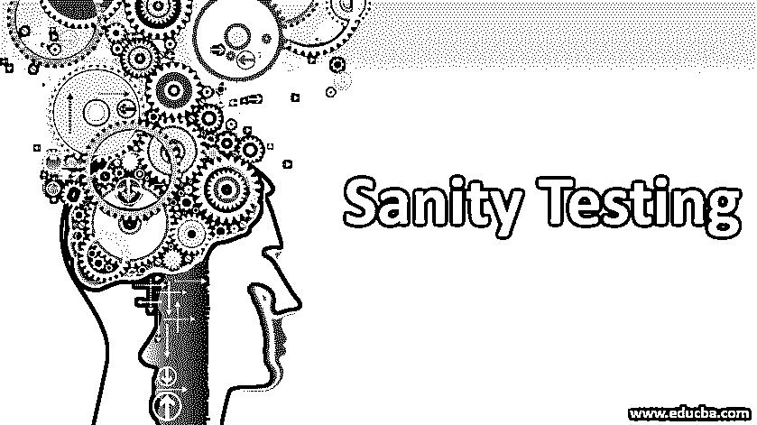

# 健全性测试

> 原文：<https://www.educba.com/sanity-testing/>

## 什么是健全测试？

评估结果真实与否的基本测试称为健全性测试。它接受回归测试，以确保代码更改按预期工作。测试之后，开发人员决定是否继续构建。如果测试不能节省时间和金钱，构建就会被拒绝。它只是检查应用程序的功能，并不测试整个应用程序。如果需要立即部署，就要进行健全性测试。它检查错误修复后，其他功能不受影响。

### 为什么我们需要健全性测试？

考虑一个测试 web 应用程序的支付模块的场景，但是在测试过程中，支付页面没有正确加载，或者 OTP 字段没有显示给用户。测试人员将一个错误归档并报告给开发人员。然后开发人员修复页面加载和支付页面 OTP 字段的 bug，并提交回测试人员进行测试。如果主要的错误没有得到解决，就没有理由对支付页面进行更严格的测试。在这种情况下，测试人员现在将围绕支付页面执行健全性测试，以检查错误修复，即基本问题是否得到解决。测试相关功能中是否没有因为修复了以前的问题而出现其他问题或错误也很重要。

<small>网页开发、编程语言、软件测试&其他</small>

为了提前减少未来的时间和精力，它在模块的深度回归测试之前执行。它在测试整个系统之前测试应用程序的基本“合理性”。

### 健全性测试是如何工作的？

正如我们所知，这是一个快速和快速的测试，所以有一个快速检查执行的应用程序周围的错误修复，新功能和任何其他变化的应用程序。它通常是无脚本的，所以在应用程序的健全性测试中不需要创建文档和测试用例。这样做的主要目的不是对应用程序进行详尽的测试，而是将重点放在特定组件的测试上。

当应用程序被移交给测试人员进行健全性测试时，没有围绕整个应用程序执行深度测试。测试人员首先测试程序的缺陷修复和新功能。它基本上是由测试团队完成的快速检查，以通过/失败应用程序，验证它是否准备好进行进一步的详细测试。这就是为什么它也被称为“测试人员验收测试”。如果构建不够好，无法通过进一步的测试，那么在快速检查之后让应用程序失败通常可以节省时间和金钱。在测试了错误修复和新功能之后，测试应用程序的相关模块或相关功能，以便验证没有因为代码更改或对先前问题的修复而引入新的错误。

例如，如果在一个应用程序中有两个模块，模块 1 和模块 2。模块 1 与模块 2 相关，因为数据从模块 1 传输到模块 2。以前，如果在模块 2 中发现了错误，在开发人员修复这些问题后，会发布新的版本进行测试。然后，测试人员将对新部署版本的应用程序执行基本的健全性测试，首先测试模块 2，以验证新版本中已修复的错误，如果模块 2 工作正常，则还测试模块 1，因为两者彼此相关，以便检查该修复是否影响了模块 1。

### 优点和缺点

下面列出了一些优点和缺点:

#### 优势

下面给出了一些优点:

*   它又窄又深。在测试整个应用程序之前，它有助于测试具有错误修复的特定组件。
*   由于对应用程序进行健全性测试不需要详细的文档，因此不会浪费额外的时间，测试人员主要关注于测试程序的错误修复和受影响的区域。
*   这非常有帮助，因为如果在健全性测试期间发现缺陷，并且项目在早期阶段被拒绝，那么在回归测试中的努力就不会被浪费。
*   有时，它对编译和部署问题的早期识别非常有帮助。如果应用程序的基本功能不能很好地工作，或者先前的错误仍然存在，但从开发人员的角度来看，将会有一些合并或编译问题。

#### 不足之处

下面列出了一些缺点:

*   它只有一个狭窄的范围。它不用于整个应用程序的详细测试。它仅用于测试应用程序模块的一部分的基本功能。
*   它用于测试应用程序的“合理性”，而不像冒烟测试那样检查应用程序的“稳定性”。
*   在小型应用程序的情况下，这并没有太大的帮助，因为它会消耗额外的时间来验证特定组件的功能，而不是整个应用程序可以在那个时候进行测试。
*   它通常是无脚本的，有时会消耗更多的时间，并间接增加项目的整体预算。

### 结论

上面的描述清楚地解释了健全性测试以及在测试任何[软件应用](https://www.educba.com/what-is-application-software-its-types/)时健全性测试的重要性。一些测试人员总是对冒烟和健全测试感到困惑，但是两者非常不同，并且用于他们的特定场景。冒烟测试是为了验证整个应用程序的关键功能是否工作正常。作为测试人员，了解两者的区别是非常重要的。

### 推荐文章

这是健全性测试的指南。在这里，我们讨论的基本概念，工作，需要以及优点和缺点详细。您也可以浏览我们推荐的其他文章，了解更多信息——

1.  [冒烟测试与健全性测试](https://www.educba.com/smoke-testing-vs-sanity-testing/)
2.  什么是自动化测试？
3.  [系统测试](https://www.educba.com/system-testing/)
4.  [白盒测试 vs 黑盒测试](https://www.educba.com/white-box-testing-vs-black-box-testing/)

