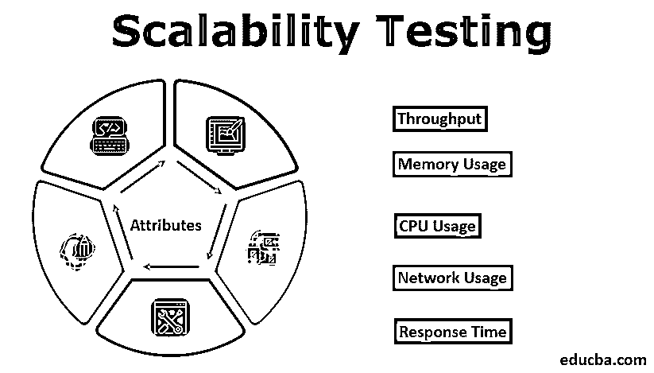
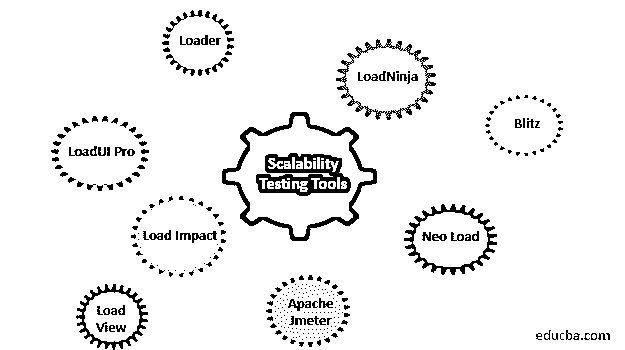

# 可扩展性测试

> 原文：<https://www.educba.com/scalability-testing/>

## 什么是可扩展性测试？

对应用程序的可伸缩性测试是在预测或计划未来扩大或缩小规模的情况下进行的。当软件通过这种类型的测试时，通常是为了观察增加或减少某些系统功能的选项，如数据量、系统性能、在给定时间内完成的进程数量、在给定时间间隔内使用系统的用户数量等。

在现实世界中，在生产环境中发布系统之前，测试系统的可伸缩性是非常重要的。考虑一个电子商务购物网站的场景，该网站在正常情况下工作正常，但在销售或任何特殊场合，网站上的负载/流量增加了 2-3 倍，网站开始响应非常慢或在某个点崩溃。它会造成巨大的金钱和市场声誉的损失。应用程序必须能够处理大量用户请求、数据量和其他工作负载的不同场景。可伸缩性测试向开发人员保证，应用程序已经准备好发布，可供客户使用。

<small>网页开发、编程语言、软件测试&其他</small>

许多人交替使用可伸缩性测试和负载测试这两个术语，但是这两者之间有很多不同。虽然两者都是非功能性测试，但负载测试是为了检查应用程序在最大负载时的崩溃点，而可伸缩性测试是为了测试应用程序在从最小到最大的各种负载下的各种属性的行为。它的主要目的是测试应用程序在各种负载下的性能，而不是测试应用程序的响应故障点。

### 如何执行可伸缩性测试？

如上所述，可伸缩性测试是为了检查应用程序在不同工作负载下的性能。为了执行可伸缩性测试，使用市场上可用的任何可伸缩性测试工具都要遵循以下步骤。

*   第一步是定义一个贯穿应用程序生命周期的可重复过程。
*   搜索任何合适的软件/工具来测试应用程序。
*   创建一个良好的测试环境，它几乎是执行整个测试的生产环境的复制品。
*   配置执行可扩展性测试所需的硬件。
*   以线程的形式创建多个虚拟用户，以在各种负载下执行测试。
*   考虑不同的测试条件，创建不同的测试场景。
*   在上面创建的测试环境中运行测试场景。
*   评估结果并观察为每个场景生成的不同图形和图表。
*   根据上述场景的结果采取纠正措施，以提高应用程序的性能。

### 可扩展性测试工具

用于可伸缩性测试的工具取决于用户想要测试的应用程序。尽管市场上有很多可伸缩性测试工具，而且都是开源的。下面提到了一些工具:

*   LoadUI Pro
*   loadminja
*   阿帕奇 Jmeter
*   加载视图
*   新加载
*   负载冲击
*   闪电战
*   装货设备

对于可伸缩性测试，市场上没有最好和最差工具的分类。每个工具都提供了自己的特殊功能来测试应用程序的可伸缩性，但是每个组织都有特定的标准，并且在选择任何工具来测试应用程序时，应用程序的环境因素也会产生影响。测试人员需要一个能够在各种场景下处理负载系数的测试工具。

### 可扩展性测试属性

下面给出了可扩展性测试的一些常见属性:

#### 1)吞吐量

吞吐量被定义为单位时间内处理的请求数量。然而，对于不同的应用程序，吞吐量的定义可能会有所不同，并以不同的方式进行测试。例如，对于 web 应用程序，通过验证单位时间内处理的用户请求数量来测试吞吐量，而对于数据库，吞吐量是通过一次处理的查询数量来衡量的。

#### 2)内存使用情况

还会测试内存使用情况，以便获得应用程序的最佳内存消耗结果。在内存使用方面，测试在应用程序中执行任何任务所使用的内存量。因为在执行任何任务时，都要使用 RAM 内存，这种内存应该针对任何应用程序的平稳运行进行优化。为了更少地使用内存，程序员应该遵循良好的编程实践，比如更少地使用冗余循环，减少对数据库的访问，只在客户端处理最大验证，等等。很多时候，应用程序会因为大量的请求而耗尽内存，所以开发人员应该总是保留额外的数据库来处理这种情况。

#### 3) CPU 使用率

测试 CPU 使用率是为了检查在应用程序中执行任何任务时所利用的 CPU。CPU 的使用以兆赫为单位。为了减少 CPU 的使用和提高吞吐量，用任何编程语言编写的任何 web 应用程序的代码都应该进行适当的优化。避免像死代码和冗余代码、线程、不必要的循环这样的编程实践应该被开发者避免，以减少 CPU 的使用。睡眠是最好的方法，应该用来最小化中间 CPU 的使用。

#### 4)网络使用

在网络使用中，测试在应用中执行特定任务所消耗的带宽量。网络使用率是通过网络每秒接收或发送的字节、段和数据包来衡量的。为了让理想的应用程序产生最佳效果，网络使用率应该最低。程序员使用各种拥塞技术来减少网络消耗和应用程序的高性能。

#### 5)响应时间

这是可伸缩性测试中最重要的属性之一。响应时间基本上是用户请求和应用服务器响应之间的时间。通过增加每个用户的请求数量或增加用户数量，在不同的负载下测试响应时间，以验证应用程序将在哪个时间点开始延迟响应。在集群环境中，负载平衡器用于检查各个节点上的负载，这样就不会出现一个节点因请求而过载，而另一个节点空闲等待请求从而导致响应时间延长的情况。对于一个可伸缩的应用程序，即使在流量增加的情况下，响应时间也应该是最短的。缩短响应时间。应用程序的性能越高。

#### 6)加载网站的网页需要时间

特定网页加载到应用程序所需的时间也很重要，并影响网站的整体性能。要快速加载任何网页，建议程序员使用良好的编程实践，并使用能够轻松快速加载的轻量级工具、图像、视频等。

### 可扩展性测试方法

可伸缩性测试有两种方法:

#### 1)水平缩放

水平扩展包括添加更多的物理机器和资源，从而降低每台机器/资源的负载。此过程涉及增加节点数量而不是增加容量，负载在旧的和新添加的资源之间分配。水平扩展被称为向外扩展，因为扩展是通过增加资源在向外的方向上完成的。

水平扩展是由像谷歌、雅虎、脸书、亚马逊这样的大公司完成的，它们在多节点、分布式环境中运行非常大的项目/应用程序。它需要高水平的计算，可以使用集群、负载平衡和分布式文件系统来实现。水平扩展涉及数据分区，即数据在不同节点之间划分。虽然单个节点的容量保持不变并且没有减少，但是负载在不同的节点之间分配，因此在不同的负载下整体性能得到提高。虽然从理论上讲，通过在现有池中添加资源来进行横向扩展更容易，但实际上，横向扩展应用程序非常困难。

#### 2)垂直缩放

垂直扩展包括增加现有机器在 CPU、RAM、磁盘和服务器方面的能力。它可以向同一台服务器添加更多的 CPU。例如，以前当工作由 1 个 CPU 处理时，由于负载增加，系统的性能开始下降，为此，尽管使用 1 个 CPU，但是在单个服务器中 CPU 的数量已经增加。如果内存需求从 4GB 增加到 16 GB 以保持系统的良好性能，或者磁盘大小从现有大小增加，则会进行垂直扩展。

垂直扩展通常由中小型公司针对小型应用进行，在这种情况下，只需增加已用资源的容量和大小，就可以在负载不断增加的情况下保持性能。在垂直扩展中，数据驻留在一个位置的单个节点上，负载通过多节点在不同的 CPU 和内存之间分配。垂直扩展相对困难，并且受限于机器或服务器的特定容量。MySQL 是垂直扩展的一个很好的例子，可以通过从小机器切换到更大的机器来实现。

### 可伸缩性测试的优点和缺点

以下是优点和缺点:

#### 优势

下面给出了可扩展性测试的一些优点:

*   可伸缩性测试最重要的优势之一是，它确定特定负载下的最终用户体验，以便可以提前采取纠正措施来纠正问题，并使应用程序更具可伸缩性。
*   它有助于确定测试中的 web 应用程序在响应时间、网络使用、CPU 使用等方面的限制。
*   为了降低由于应用程序的不良性能而导致的巨大金钱损失和公司声誉损失的风险，在生产环境中发布应用程序之前进行严格的可伸缩性测试是非常重要的。
*   它只在测试阶段揭示应用程序中各种性能问题的确切原因，如果在生产环境中检测到，这将节省大量时间和金钱。
*   可伸缩性测试也有助于有效的工具利用跟踪。

#### 不足之处

可伸缩性测试的一些缺点是:

*   测试环境并不总是与生产环境完全相同，因此会导致各种问题和不同的结果。
*   使用高级工具进行可伸缩性测试和指定的测试团队进行性能测试可能会导致项目超出预算。
*   测试可伸缩性测试的每一个属性所花费的时间有时非常多，并且会导致项目期限的延迟。
*   有时，实际上运行良好的测试在测试阶段会因为错误的测试场景和测试脚本而失败，从而浪费时间进行不必要的更改。
*   有时，功能错误会被遗留下来，无法在可伸缩性测试中识别出来。
*   有时，为了不中断业务流程，提供的测试窗口非常窄，因此[缺陷仍然](https://www.educba.com/what-is-defect/)未被发现。

### 结论

在软件行业，向客户交付高质量的结果非常重要，为了获得最佳结果和性能，在应用程序发布到生产环境之前，可伸缩性测试是应用程序完整开发的必要条件。可伸缩性测试的主要目标是发现应用程序在应用不同的工作负载时何时开始降级，以便采取预防措施并进行更改，从而降低金钱和市场声誉损失的风险。尽管用于可伸缩性测试方法和工具因组织和应用程序而异。

现在几乎所有的公司都将可伸缩性测试作为他们测试过程的一部分。可伸缩性测试需要一个独立的专业人员和测试人员团队，他们对系统有全面的了解，并且有很强的分析能力。市场上对可伸缩性测试人员的需求很大，公司准备向专业人员提供优厚的待遇。

### 推荐文章

这是一个可伸缩性测试的指南。这里我们讨论可扩展性测试的属性、工具和方法，以及可扩展性测试的优点和缺点。您也可以阅读以下文章，了解更多信息——

1.  [性能测试工具](https://www.educba.com/performance-testing-tools/)
2.  [SOA 测试](https://www.educba.com/soa-testing/)
3.  [DevOps 测试工具](https://www.educba.com/devops-testing-tools/)
4.  [黑盒测试](https://www.educba.com/black-box-testing/)

