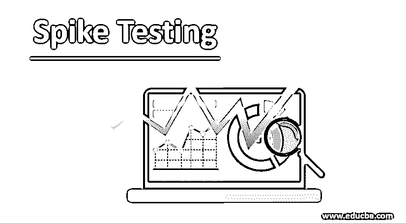
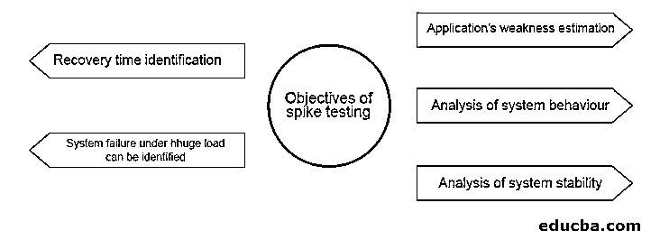
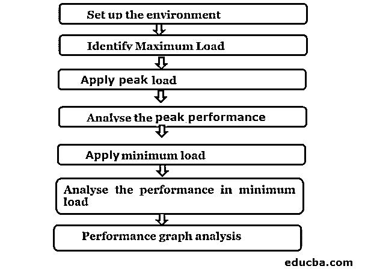

# 尖峰测试

> 原文：<https://www.educba.com/spike-testing/>

## 尖峰测试简介

测试是[软件开发生命周期](https://www.educba.com/what-is-sdlc/) (SDLC)的重要部分，它检查各种软件组件，如可伸缩性、速度和稳定性。一些测试技术是压力测试、负载测试、[容量测试、](https://www.educba.com/volume-testing/)耐久性测试、兼容性测试、峰值测试等等。这些测试方法确保开发的软件在预期的工作负载和其他一些场景下工作良好。因此，软件测试人员能够向产品所有者提供关于可伸缩性、准确性、速度和稳定性的必要信息。

### 什么是尖峰测试？

Spike 测试是性能测试，也是压力测试的[子集，确保开发的软件或应用是否在用户产生的快速增加和减少的负载下工作。这是为了确保在产品](https://www.educba.com/what-is-stress-testing/)交付后，软件的速度、稳定性和[可伸缩性不会出现任何问题。](https://www.educba.com/scalability-testing/)

<small>网页开发、编程语言、软件测试&其他</small>

该软件测试的主要目标是:

*   评估应用程序的弱点。
*   可以分析系统的行为。
*   分析了负载突变时系统的稳定性
*   可以观察到系统在大负载下的故障。
*   确定增加和减少负载的峰值(峰值是流量的快速减少和增加)之间的恢复时间。

在执行峰值测试时，应用程序的性能可能会变差、变慢或完全停止。那时，测试人员可能会找到它，并确定应用程序或软件的故障点。这有助于在为生产环境开发时纠正开发人员的错误。

### 如何做道钉测试？

执行峰值测试的步骤如下:

进行峰值测试的过程将在下一节中解释。

**1。设置环境**

确保不使用真实环境，而是使用单独的测试环境在应用程序中执行峰值测试。根据业务需求中的几个参数建立测试环境。

**2。确定最大负载**

确定您开发的软件或应用程序的最大负载能力。

**3。施加峰值负载**

使用任何工具或软件施加最大预期载荷。在一定时间内快速增加负荷。

**4。分析峰值性能**

分析应用程序在最大负载下的性能。

**5。施加最小负载**

逐渐降低负荷至最低水平。

**6。分析最小负载下的性能**

分析应用程序在最小负载下的性能。

**7。性能图分析**

性能图分析是通过考虑时间、虚拟用户、故障等指标来完成的。这将有助于测试人员识别应用程序失败的地方，并报告开发人员在此基础上解决问题。

现在，让我们来看看尖峰测试的一些优点和缺点。

### 优势

以下是一些优点。

1.  因为即使在极高负载和极低负载下也能分析性能，所以在实际环境中不会出现问题。在这些情况下，这是有帮助的。
2.  解决了负载意外变化的后果。
3.  防止系统在负载峰值下崩溃。
4.  通常，标准测试方法不会处理最坏的情况。但是通过峰值测试，所有这些问题都得到了解决。
5.  确定应用程序或软件的性能超出其预期负载的程度。
6.  开发人员能够避免应用程序崩溃，因为问题被识别出来了。

### 不足之处

以下是给出的缺点。

1.  昂贵，因为它需要特殊的测试条件。
2.  需要独立的测试环境。
3.  与其他测试方法相比，所需的时间更多。

### 使用的工具

所有的性能测试工具都可以用于峰值测试。但是有些工具是分开使用的。它们是:

*   #### Apache JMeter 【T1]

Apache JMeter 是一个开源工具，是 100% java 应用程序，旨在对性能和行为进行功能测试。缓存、完全多线程、高度可扩展的内核、可移植性、离线分析是 Apache JMeter 的主要特点。

*   #### Load Runner

LoadRunner 是 Micro Focus 的一款昂贵的软件测试工具，用于在负载下运行、测量系统行为、测试应用程序。可以模拟大量用户同时使用应用软件。它记录相同的内容，然后分析应用程序的关键组件性能。

到目前为止，我们已经讨论了什么是峰值测试，它的过程以及优点和缺点。现在，让我们看一些可以在峰值测试中使用的恢复场景。

*   尽量使用云平台如[微软 Azure、亚马逊 Web 服务](https://www.educba.com/microsoft-azure-vs-amazon-web-services/) (AWS)等。与用户负载同步地快速增加服务器的容量。
*   不要授予某些用户访问软件或应用程序的权限。这样，峰值负载以上的人无法进入应用程序。这可以保护系统免受过载威胁。
*   尝试向进入系统的用户提供警告消息。然后他或她将能够在此基础上进行表演。

下面介绍一些峰值测试场景。

*   当一个在线商店在特殊的日子推出有巨大折扣的特价商品时。
*   网络应用是流媒体直播的一个热门。
*   考试结果公布在网站上。
*   当一个特定的网站因其内容而疯传时。
*   当系统新发布时，多个用户访问该系统。
*   断电问题解决后，登录系统。
*   系统服务中断

### 结论

这是一种性能测试，其中对开发的应用程序或软件应用尖峰信号的增加和减少。它有助于确定最大负载和增加负载时可能出现的常见问题。关于这个测试的过程、优点和常见错误在上面的章节中有解释。

### 推荐文章

这是一个尖峰测试指南。在这里，我们讨论基本概念，一步一步的过程以及优点和缺点。您也可以看看以下文章，了解更多信息–

1.  [稳定性测试](https://www.educba.com/stability-testing/)
2.  什么是功能测试？
3.  [负载测试与压力测试](https://www.educba.com/load-testing-vs-stress-testing/)
4.  [硒负荷测试](https://www.educba.com/selenium-load-testing/)

