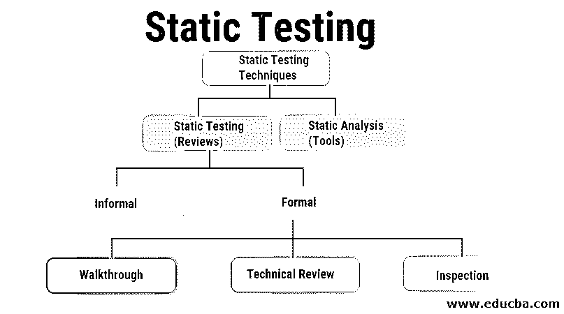

# 静态测试

> 原文：<https://www.educba.com/static-testing/>

## 什么是静态测试？

在使用的许多技术中，静态测试是另一种有助于检测软件缺陷的技术。静态测试是在不实际执行测试用例的情况下完成的。它包括检查代码，也检查所涉及的必要文件，但不需要执行程序。它与[动态测试](https://www.educba.com/dynamic-testing/)相反，后者涉及程序及其执行。

当涉及到软件开发和测试过程时，这是一种已经被证实的提高质量和生产率的方法。它帮助测试人员或开发人员在软件开发的早期阶段修复他们的缺陷。这可以手动完成，也可以借助工具完成。有不同的评审、走查、检查和分析来帮助在没有执行的情况下发现问题。

<small>网页开发、编程语言、软件测试&其他</small>

### 为什么要执行静态测试？

它有助于发现早期缺陷。这些缺陷如果在早期发现，可以被纠正，不会进入下一阶段。开发的时间表缩短了，因为遵循指导方针可以快速开发代码。

由于问题会在早期阶段被发现，测试成本会因节省大量时间而降低。所有这些反过来提高了开发质量。开发人员的生产力也提高了，因为他们已经有了一套要遵循的指导方针、审查、检查等(将在本文的后面讨论)。它还减少了在测试后期遇到的缺陷数量。

### 静态测试的范围是什么？

*   它可以用来测试单元测试用例。这是可以发现问题的最初阶段。另一个有用的领域是业务需求文档。它有助于审查需求并得出系统的合理需求。它也可以用于用例在图片中的情况。
*   通过引起注意，它可以创造奇迹的其他领域是功能需求、原型、原型规范文档、测试数据、可追溯性矩阵文档、培训指南和文档等。除此之外，它还有助于自动化和[性能测试](https://www.educba.com/performance-testing-life-cycle/)，可以提前发现问题区域。

### 静态测试是如何进行的？

要执行它，有几个方法需要遵循。为了检查和设计应用程序，应该进行全面的检查。主要以评论为主。可以维护一个清单，其中提到了每个文档，以确保完全覆盖所有审查。

该测试中执行了一些活动，如下所列:

*   **用例需求验证:**在这个验证中，所有的最终用户行为都被识别和验证。它还检查与用例相关的所有不同的输入和输出操作。关于用例的细节越多，创建的测试用例就越准确。
*   **功能需求验证:**帮助记录所有功能变化、数据库变化、列表界面、网络需求、[硬件和软件](https://www.educba.com/hardware-vs-software/)变化。这是确保所有必要的变更都被记录和实施的一个步骤。
*   **架构回顾:**一个项目的完整架构需要分布在不同位置的服务器、网络图、协议定义、数据库可访问性、负载平衡等。这有助于全面了解正在使用的设备和架构设计。
*   原型或屏幕模型验证:它包括需求和基于需求的用例的验证。
*   **字段字典验证:**用户界面中使用的所有字段都需要执行验证测试。不同的字段需要检查它们的最小和最大长度，列出不同的值、错误消息等。列出这些字段并确保它们得到验证是非常重要的。

在您的流程中使用它时，应该记住产品是通过手动或使用某些工具进行检查的。静态测试技术有两种类型。主要是审查和工具测试。

### 静态测试技术

测试中涉及的技术如下:

*   非正式评论
*   演练
*   技术评论
*   检查
*   静态分析

让我们简要介绍一下所有这些技术。

#### 1)非正式评审

*   这些是在文件的早期阶段开始的第一次审查。顾名思义，它可以在两个人之间非正式地进行，之后可以增加更多的人。此处不涉及任何程序，因此没有为审查编制任何文件。它提高了准备文件的质量。虽然做正式测试的方法有很多，但是常用的都是非正式的。这个过程分为 6 个步骤。其中包括:

1.  规划
2.  开球
3.  准备
4.  评审会
5.  修订
6.  追踪

*   正式的审核计划包括一名主持人，他检查表格并负责计划会议的日程安排细节。召开动员会的目的是让所有参与者有一个清晰一致的理解，并给出一个时间表来记录和承诺所需的变更。
*   给每个人一个简短的介绍。在这之后，参与者单独审阅每个文档，并与审阅者共享他们的工件。然后，在评审会议上进行正式评审，将所有问题标记为已讨论，并做出最终决定。任何特定问题也会被记录下来。根据这些会议评审，所有发现的缺陷都要返工。采取后续措施来检查预期的变化。
*   作者承担这些缺陷的责任，因为不是每个缺陷都需要处理。然后，主持人检查是否采取了所有预期的行动。所有缺陷都记录了过程改进建议。主持人的工作是检查所有指标，并评估讨论和行动项目的退出标准。

#### 2)演练

*   在演练中，其他人也参与进来，并获得团队的集体反馈，以便达成共识，实现文档的目的。一个团队不需要做详细的研究。作者已经为这次审查做好了准备。所有被呈现的内容都应该被评估。在讨论建议的解决方案之前，应对其进行验证。
*   被检查的文档通过文档的作者，其他人被要求检查并提供他们对文档的意见。给出了许多反馈，我们会考虑这些反馈。一步一步的解释有助于参与者清楚地了解情况。他们可以在开会前研究并检查代码。它有助于创建更高级别的文档。
*   有一个广泛的部分被覆盖，它确保了没有遗漏需求的任何方面。围绕文档达成共识，并提出解决方案或备选方案。

#### 3)技术评审

*   这是一次正式会议，讨论文档的技术内容。需要有专家的指导。它专注于获取项目中技术细节的价值。它有助于保持一致性，并确保所有技术细节都是正确的。通过进行技术审查，有望就所有文件的技术方面达成共识。
*   一旦文件完成，专家就会被要求做一个非正式的审查。这些专家可以是架构师、首席设计师、关键用户等。程序员同事或同行也可以是这个评审的一部分。所有的技术概念都可以由每个人在这次审查中进行评估。它还确保了正确的概念被用在正确的地方。

#### 4)检查

*   这是最正式的一种评审。在这里，一名资深或训练有素的团队人员指导检查过程。在会议开始之前，所有的审阅者都准备好了，文件也准备好了。检查可确保对整个产品进行检查，并发现缺陷。发现的所有缺陷必须记录在日志中。检查的重点是提高被检查文件的质量。
*   它能有效地发现缺陷，并创建高质量的文档。这也是一种记录以前的缺陷并避免再次出现类似缺陷的方法。所有提出的缺陷都被记录和讨论。只有当缺陷被修复后，才会对这些文档进行进一步的讨论。它专注于在早期阶段发现缺陷，从而在很大程度上提高软件的质量。

### 静态测试工具

静态分析工具主要由开发人员使用。它们可以被看作是编译器的扩展。一些编译器也有静态分析功能。它检查静态需求，也分析网站的静态分析。通过使用这些工具，可以用一种容易理解的方式开发代码。

可以通过使用这些工具来设置编码标准。这一步的重点是通过使用自动化工具来测试技术、设计和代码。重点是软件代码。它由开发人员在集成测试之前和期间使用。

涉及的不同工具如下:

*   编码标准:为了让开发者遵循统一的方式，需要确保所有设定的编码标准都被遵循。可以使用工具来检查这些标准。如果没有工具用于此，那么遵守[编码](https://www.educba.com/what-is-coding/)标准的保证就更少。
*   **代码度量:**代码的结构属性可以利用代码度量来度量。当软件继续构建时，它会使代码变得复杂。代码度量有助于有效的设计，并且在重新设计代码时也可以有替代方案。
*   **代码结构:**代码的结构，如控制流、数据结构以及它们的流程都是在这个阶段决定的。它按照程序中执行指令的顺序工作。这包括循环和迭代，程序中使用的不同条件。根本没有被使用的代码，也称为死代码，可以在这个阶段被识别并消除。程序的流程决定了要访问的数据项，然后可以相应地更改代码。包括复杂数据结构在内的所有数据结构都可以被识别。

### 优点和缺点

下面是静态测试的一些优点和缺点:

#### 优势

*   测试通常由具有良好技术知识和编码知识的专家进行。
*   为了敏捷和迅速地发现错误，可以使用这种技术。
*   自动化工具可以用于这种测试，这使得扫描和审查的过程很快。
*   当涉及到静态测试时，可以在早期发现错误，从而降低修复这些问题的成本。
*   随着自动化工具的使用，所有风险都可以很容易地降低。

#### 不足之处

*   当代码实时执行时，这些问题和弱点会产生问题
*   这些工具只扫描代码
*   手动完成时非常耗时。
*   自动化工具有时会提供假阳性和假阴性案例。此外，他们只扫描可能导致功能缺陷的代码。

### 结论

这是在早期发现代码缺陷的最简单有效的方法。代码由专家审查，问题在进入测试之前被发现。它也有助于设定每个人都可以遵循的代码标准。

这种测试通常由开发人员完成，因此技术问题可以在早期得到控制。它降低了由于愚蠢的文档问题而导致的产品缺陷的风险。所有这些都是预先验证的，因此导致的问题较少。

### 推荐文章

这是静态测试的指南。在这里，我们讨论了基本概念，如何执行，范围，技术，工具，以及静态测试的优缺点。您也可以浏览我们推荐的其他文章，了解更多信息——

1.  [功能测试与非功能测试](https://www.educba.com/functional-testing-vs-non-functional-testing/)
2.  [软件测试职业](https://www.educba.com/careers-in-software-testing/)
3.  [软件测试面试问题](https://www.educba.com/software-testing-interview-questions/)
4.  [硒负荷测试](https://www.educba.com/selenium-load-testing/)

