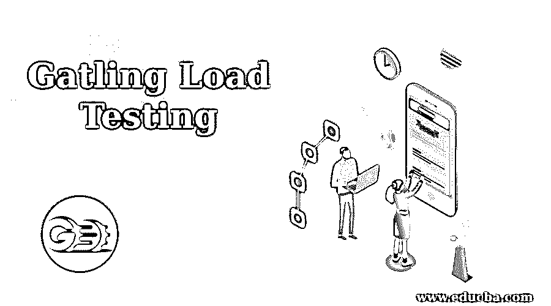

# 转管负载测试

> 原文：<https://www.educba.com/gatling-load-testing/>

## 转管负载测试介绍

在应用中执行性能测试的开源框架是基于 Scala、Netty 和 Akka 的 Gatling 负载测试。它于 2012 年 1 月首次实施。它每年都更新，现在它在工程委员会中广泛流行。Gatling 主要用于在 Scala 编程中编写测试代码，Scala 编程是一个强大的框架，但不幸的是拥有的受众很少。简要介绍了转管负载测试工具的工作、应用、重要性和优点。光栅工具的受欢迎程度甚至多年来也没有减弱，并且在其连接的观众中保持强劲。

### 解释加特林载荷测试

使用允许用户在 HTTP 服务器上运行并以异步方式工作的工具是可靠的。它坚持认为，虚拟用户的消息使他们在资源上变得简单，允许数千个虚拟服务器同时执行，而没有任何影响。加特林的特点是脚本，记录，编辑和分析。场景是在测试加载时执行的一段脚本，它利用一个内置的记录器来开发许多场景。该记录使用浏览器来捕获进行可靠负载测试的测试场景。

<small>网页开发、编程语言、软件测试&其他</small>

例如，用户可以捕捉和记录浏览网页的用户的工作，包括点击之间的思考时间。edit 选项用于管理在测试加载时应该使用的场景。在分析时，它通常会生成许多有意义的报告，并在测试过程结束时用彩色的图形表示结果，这对分析过程更有帮助。一些工具用于负载测试，这些工具可以有效地处理 URL 攻击，但是不能管理多个请求之间的逻辑。

加特林是一个先进的测试工具，管理拥有其数据的虚拟用户，并遵循独特的浏览路径。测试工具假设每个虚拟用户都是一个线程。然后，它通过消息与用户通信，这些消息以一种合适的方式组合在一起，用于同时管理成千上万的用户。

### 加特林负载测试是如何工作的？

加特林载荷测试的工作涉及到以下概念，下面将简要说明。

**场景–**它用于表示测试人员的行为，描述脚本化并提供给加特林的场景。该场景是作为对从分析工具中获得的已执行应用程序的度量的输出而获得的。场景的开发是从负载测试中获得有意义的输出的重要元素。创建该场景是为了表示虚拟用户的任何行为，它维护用户访问其网页或应用程序所需的所有必要选项。

例如，为标准电子商务应用程序创建的场景应该是。

*   要访问主页
*   要选择浏览器类别
*   在类别中进行任何特定的搜索
*   查找并打开任何产品描述
*   要购买选定的产品
*   登录和注销用户帐户
*   支付和检查应用程序

**模拟—**这是负载测试的简要定义。它解释了几个用户在应用程序上执行的可能性。它还展示了在新注入的虚拟用户上执行的场景的特定部分。

**会话–**每个虚拟用户都由一个会话备份。这些会话是工作流上运行的真实消息。它是一个静态的占位符，测试工程师可以在这里捕获、输入和保存数据。

**Feeders–**当应用程序完成测试时，它允许对测试人员进行身份验证，并检查应用程序或 web 浏览器的基本活动，如登录、注销和用户许可的操作。因此，feeders 可以轻松地为测试工程师执行 API，只为相关的虚拟用户提供来自外部资源的数据。

检查可以分析由转管产生的响应。因此，每当用户向服务器发送任何请求时，它都会用服务器产生的响应进行回复，然后进行加特林处理。该检查还用于存储数据并在以后重复使用。

该断言用于描述对加特林统计数据的接受策略，该策略使得加特林在整个测试中失败并带有错误代码。

测试过程结束时会自动生成 HTML 格式的报告。这些报告是可移植的，可以在网络浏览器中看到。

### 转管负载测试的重要性

Gatling 是用 Scala 编写的，这使得用户可以在任何操作系统上执行它。使用不同的云服务器和用于创建和执行用户测试的本地机器不容易出现任何问题，因此它可以在任何地方运行。Gatling 的性能测试以代码的形式提供，这对许多开发者来说是一个巨大的好处。它包含可以编辑和重用的历史数据仓库。

一旦测试完成，加特林提取详细的报告，这有助于决策。该报告是交互式的，其中包含未来修改的一瞥。强大的性能测试工具是 Gatling，它拥有 Akka toolkit 的最佳架构，提供了对 actor 模型的并发计算。与 Jmeter 相比，它具有更好的能力和功能性断言。

### 优势

它管理最佳连接，对开发人员非常有用，有助于简化他们的测试过程。加特林负载测试即时提供持续集成和持续部署。它支持实时监控，并通过自动生成的报告吸引分析师。它可以与 Taurus 集成，也适用于所有的操作系统。

Gatling 负载测试因其人类可读的文本格式而广受欢迎。通过使用实时监控工具，它提供了简单的集成过程。加特林的架构是用持续集成的管道构建的。

### 推荐文章

这是一个加特林负载测试指南。在这里，我们讨论如何加特林负载测试工作以及重要性和优势。您也可以看看以下文章，了解更多信息–

1.  [网络服务测试](https://www.educba.com/web-services-testing/)
2.  [渗透测试服务](https://www.educba.com/penetration-testing-services/)
3.  [视觉测试](https://www.educba.com/visual-testing/)
4.  [灰箱测试](https://www.educba.com/grey-box-testing/)

