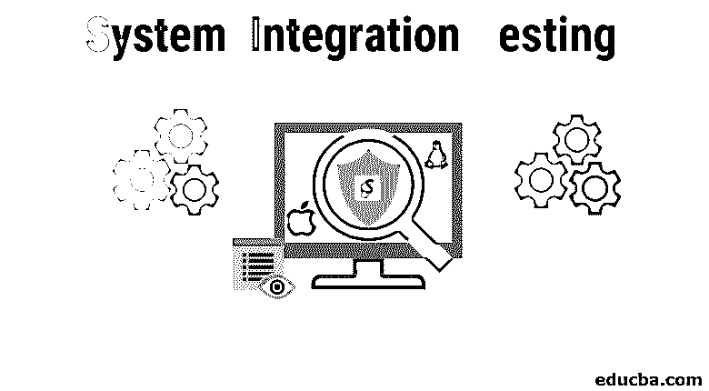
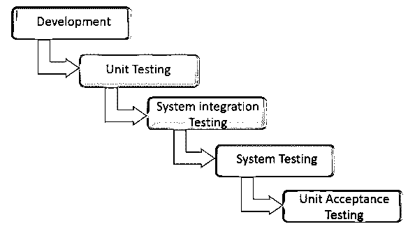
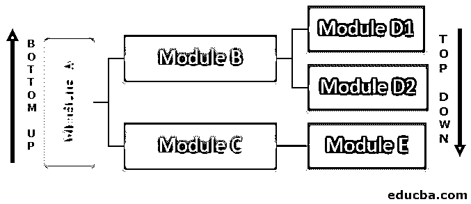
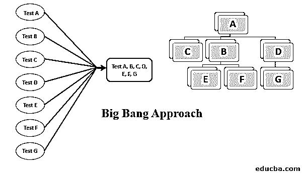
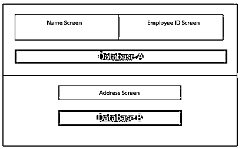

# 系统集成测试

> 原文：<https://www.educba.com/system-integration-testing/>

## 系统集成测试(SIT)介绍

系统集成测试(SIT)是对应用软件和整个系统进行综合测试的过程，整个系统通常由多个较小的软件和硬件单元组成。执行这类测试的主要目标是确保软件和硬件系统的功能特征彼此同步。通常，在 SIT 中，首先单独测试单个模块，然后在将其组合成一个单一的固体系统后再次测试。

<small>网页开发、编程语言、软件测试&其他</small>

系统集成测试(SIT)在子系统单独[经过单元测试](https://www.educba.com/Unit-Testing/)并通过测试后进行。集成后，SIT 将系统作为一个整体进行测试。SIT 的结果然后被传递给用户验收测试(UAT)。

### 系统集成测试的好处

以下是下面给出的好处。

*   SIT 有助于在早期发现缺陷。在 SIT 中发现的缺陷被送回开发团队进行修复。这有助于节省时间和后期维修的费用，后者可能会更贵。
*   SIT 有助于获得关于系统中模块可接受性的早期意见。
*   SIT 有助于暴露集成组件交互时可能发生的故障。
*   一个系统中有几个模块，对所有模块分别进行单元测试需要时间。即使每个单元被单独测试，当集成为一个整体时也有可能失败，因为当子系统相互作用时会出现许多问题。

因此，在将系统发送给用户之前，SIT 基本上需要发现并修复问题。

### 进行 SIT 的方法

让我们来看看执行 SIT 的不同方法，让我们逐一理解。

#### 1.自上而下的方法

这是一种增量方法，测试从应用程序的最顶层模块开始。在存根的帮助下，模拟较低层模块的功能。顶层模块与底层模块的存根集成在一起，一个接一个地测试它们的功能。一旦每个测试完成，相应的存根就被真正的模块替换。这种测试方式一直持续到整个系统测试完毕。

**优势**

*   不需要驱动程序，系统的功能用于指定测试用例。

**缺点**

*   存在对较低层模块的功能可用性的依赖性。
*   测试可能会有延迟，因为实际的模块被替换为存根。
*   写存根很难。

#### 2.自下而上的方法

这是一种渐进式方法，首先将最低级别的模块聚集在一起形成集群。然后驱动程序得到测试用例的输入和输出。然后对集群进行测试。测试完集群后，移除驱动程序，这样集群就可以与上层结合了。这种测试方式一直持续到整个系统测试完毕。

**优势**

*   这种方法不需要存根。
*   随着过程的进行，测试变得更加容易，因为驱动程序的使用减少了。

**缺点**

*   最后测试最重要的模块，即 UI。

#### 3.大爆炸方法

在这种方法中，系统的模块只有在所有模块都完成之后才被集成。集成后，对整个系统进行测试，以检查其工作情况。

**优势**

*   只需要一轮 SIT。

**缺点**

*   很难找到错误的根本原因。

### 系统集成测试过程

执行 SIT 的最常见方法是通过数据驱动方法，因为它需要最少使用[软件测试工具](https://www.educba.com/what-is-software-testing/)。

在这种方法中，主要是在系统模块之间进行数据交换，即数据导入和导出，然后观察各个层中每个数据字段的性能。

一旦集成了软件，数据流就有三种主要状态:

#### 1.在集成层内流动时的数据状态

集成层充当数据导入和导出之间的接口。在这一层执行 SIT 需要某些模式技术的基础知识。

执行 SIT 以验证数据交换的步骤:

*   根据需求文档验证该层中的数据属性。
*   验证 [web 服务请求](https://www.educba.com/web-services-interview-questions/)。
*   运行一些单元测试来验证数据映射和请求。
*   查看日志。

#### 2.在数据库层内流动时的数据状态

在这一层执行 SIT 需要 SQL 的基本知识。

执行 SIT 以验证数据交换的步骤:

*   验证是否所有数据都已到达前一级别并已从前一级别提交。
*   根据需求文档验证表和列的属性。
*   验证应用于数据库的数据有效性规则和约束。
*   检查存储过程中任何要处理的数据。
*   查看日志。

#### 3.在应用层内流动时的数据状态

执行 SIT 以验证数据交换的步骤:

*   检查 UI 中字段的可见性。
*   执行测试用例，包括正面的和负面的，以确认数据。

### SIT 示例

为了让 SIT 更清楚一点，让我们举一个公司的例子，这个公司使用软件来存储员工的详细信息。

该软件在 UI 中包括两个屏幕，即姓名屏幕和员工 ID 屏幕，并且它有一个称为数据库 a 的数据库。在姓名屏幕和员工 ID 屏幕中输入的详细信息被输入到数据库 a 中。

几年后，公司要求员工提供额外的数据。因此，需要进行增强，他们开发了一个带有另一个数据库(数据库 B)的地址屏幕。现在，这个具有地址屏幕和数据库 B 的系统必须与现有系统集成，然后在整个系统上进行的测试称为 SIT，以确定功能是否正常。

总之，SIT 是我们测试的一个重要部分，因为它让我们对我们的应用程序运行得有多好有了第一印象。这可以通过不同的方法和过程来实现，我们可以使用任何适合我们应用的方法和过程。

### 推荐文章

这是系统集成测试的指南。这里我们讨论了系统集成测试的概念、方法、优点和缺点。您也可以浏览我们推荐的其他文章，了解更多信息——

1.  [什么是软件测试？](https://www.educba.com/what-is-software-testing/)
2.  [测试面试问题](https://www.educba.com/testing-interview-questions/)
3.  软件测试中的缺陷生命周期
4.  [系统设计面试问题](https://www.educba.com/system-design/)

