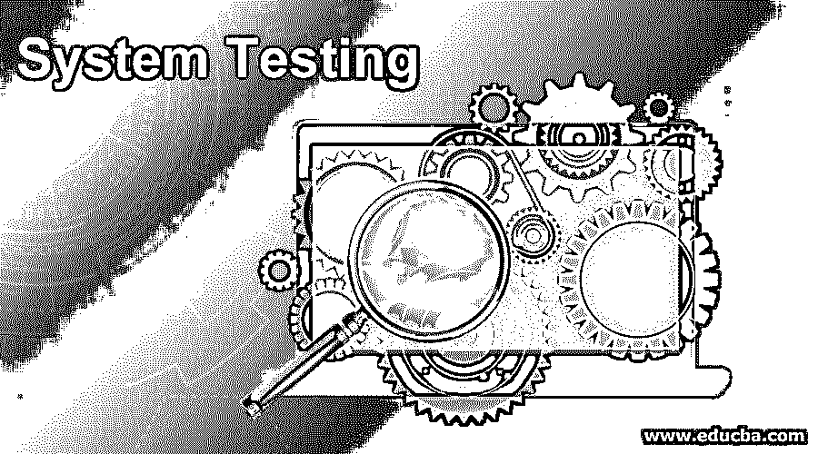
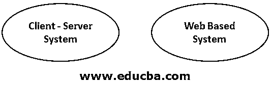
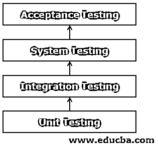
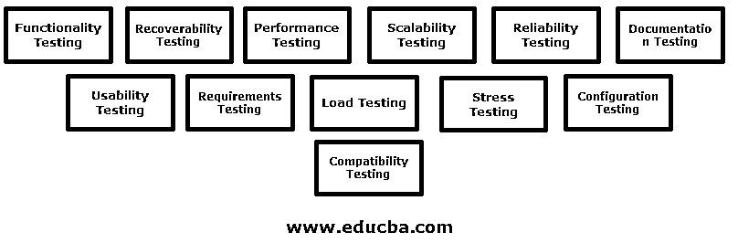
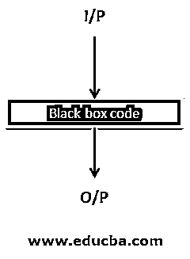
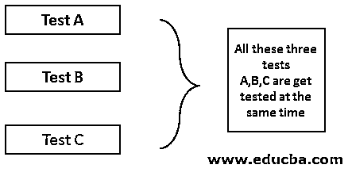

# 系统试验

> 原文：<https://www.educba.com/system-testing/>

## 系统测试介绍

系统测试是对整个系统进行全面功能测试的过程，目的是确保系统符合客户以功能规范或系统规范文档的形式提供的所有要求。在大多数情况下，它是在集成测试之后进行的，因为这个测试应该覆盖端到端系统的实际例程。

这种类型的测试需要专门的测试计划和来自系统规格文档的其他测试文档，这些文档应涵盖软件和硬件要求。通过这个测试，我们发现了错误。它确保所有系统按预期工作。我们检查系统性能和功能，以获得高质量的产品。系统测试不过是将系统作为一个整体来测试。该测试从客户的角度检查完整的端到端场景。

<small>网页开发、编程语言、软件测试&其他</small>

功能和非功能测试也由系统测试完成。所有的事情都是为了维护开发中的信任，即系统是无缺陷和无 bug 的。系统测试还旨在测试硬件/软件需求规格。系统测试更多的是一种有限类型的测试；它试图检测“内部集合”中的两个缺陷。

**有两种类型的测试:**

那些是专门的系统和应用程序

在直接进入系统测试之前，我想让你知道测试的流程。所以你会有一个清晰的概念。请看下图。

### 系统测试的类型

以下是不同类型的测试:

#### 1.功能测试

*   这种测试确保产品的功能在系统的能力范围内，按照需求规范工作。
*   功能测试是手工完成的，或者用自动化工具完成的。

#### 2.可恢复性测试

*   该测试确定在发生灾难或系统完整性丧失后是否可以继续运行。
*   最好的例子是假设我们正在下载一个文件。突然连接中断了。恢复连接后，我们的下载从我们离开的地方开始。它不是从重新开始开始。
*   这用于操作的连续性至关重要的情况

#### 3.性能试验

*   该测试确保系统在各种条件下的性能，即性能特征。
*   这种测试也称为关于性能的符合性测试。
*   该测试确保满足系统要求
*   它会检查何时多个用户同时使用同一个应用程序，然后如何回应

性能测试可以分为三个主要类别，如速度、可伸缩性和稳定性。

#### 4.可扩展性测试

该测试确保系统在不同方面的伸缩能力，如用户伸缩、地理伸缩和资源伸缩。

#### 5.可靠性测试

*   可靠性测试确保系统没有错误。
*   该测试确保系统可以长时间运行而不会出现故障。

#### 6.文档测试

该测试确保系统的用户指南和其他帮助主题文档是正确和可用的。

#### 7.安全测试

*   测试确认程序可以访问授权人员，并且授权人员可以访问其安全级别可用的功能。
*   该测试确保系统不允许对数据和资源的未授权访问。
*   安全测试的目的是确定系统对未经授权的内部或外部访问或蓄意破坏的防护能力。

**我们通常可以在以下区域检查安全性:**

*   证明
*   批准
*   数据有效性
*   运输安全
*   数据保护
*   会话管理

#### 8.可用性测试

确保系统易于使用、学习和操作

#### 9.需求测试

每个系统都是经过测试的需求。

*   对使用该系统的人的直接观察。
*   可用性调查已经在这个测试下完成。
*   该测试下的用户测试。[也被称为 Beta 测试](https://www.educba.com/beta-testing/)。
*   该测试测试系统关于真实用户将如何在环境中工作。
*   可用性测试主要用于应用程序的设计。
*   在可用性测试中，实际用户试图在受控条件下获得产品的典型目标和任务。

**本系统用于确定:**

*   理解应用程序的用法是多么简单。
*   执行一个应用程序进程有多容易。

#### 10.负载测试

该测试确定当多个用户跨多个位置同时访问应用程序时，应用程序的行为。

*   进行该测试是为了确定在预定的负载水平下系统性能是否可接受。
*   负载测试使用预定义的负载级别评估系统性能。
*   它检查应用程序的正常和预定义条件。

#### 11.压力测试

该测试通常检查系统在数据量超过预期时是否会继续运行。

*   [压力测试可能包含](https://www.educba.com/what-is-stress-testing/)输入事务、内部表、通信通道、磁盘空间等。
*   压力测试检查系统是否应该像在生产环境中一样运行。
*   它在极端条件下检查系统。
*   压力测试也称为耐力测试。

#### 12.配置测试

*   配置测试是检查应用程序与硬件的多种组合。
*   该测试检查兼容性问题。
*   确定最低和最佳硬件和软件配置。
*   该测试确定添加或修改内存、磁盘空间、CPU、网卡等资源的影响。

#### 13.兼容性测试

*   [兼容性测试用于](https://www.educba.com/compatibility-testing/)检查您的应用程序是否能够在不同的硬件、操作系统、应用程序、网络环境或移动设备等上运行。
*   类似多平台测试。
*   能力测试在基于 web 的应用程序中更有用，我们可以检查应用程序必须可以从每个浏览器访问。

### 关键重点领域

*   在系统测试期间，系统在生产环境中进行测试。在交付产品之前，应该在生产环境中测试系统。
*   开发和生产环境可能因公司而异。
*   它应该主要得到与配置相关的错误。

### 系统测试概念

系统测试属于[黑盒测试](https://www.educba.com/Black-Box-testing/)的范围。此外，还有安全性、可靠性、性能、安装、功能测试等测试。

我们也有白盒测试。这也被称为透明盒测试。白盒测试是指测试人员知道测试应用程序内部结构的测试。但是在这篇文章中，我们关注的是黑盒测试。

### 什么是黑盒测试？

*   这种测试也被称为行为测试。
*   黑盒测试主要关注输入和输出，因为内部代码对测试人员是隐藏的

系统测试还有如下一些专门的测试:

#### 1.回归测试

这个测试依赖于时间。该系数并不总是足以进行该测试。该测试通过两种方式完成:

*   **手动测试** : [手动测试](https://www.educba.com/manual-testing/) g 可以针对小型系统进行。成本是问题的项目。自动化测试并不方便。开发人员或质量保证团队手工测试软件代码的每一条路径。然后比较就发生了。这种测试非常耗时，并且需要大量的资源来完成。这种测试效率不高，因此自动化测试就成了问题

*   **自动化测试:**这个测试非常好。许多公司试图获得自动化测试工具。如果我们对一个应用程序进行了大量的版本变更，这将非常有帮助。其中一类工具称为采集回放工具。

#### 2.错误处理测试

*   确定系统正确处理错误交易的能力。
*   所有合理的错误都应该由应用系统来检测。
*   在误差校正期间对误差的控制是必须的。
*   程序通常保证错误得到正确的纠正。
*   该测试应在 SDLC 的整个过程中进行[。](https://www.educba.com/what-is-sdlc/)
*   错误包括所有意想不到的情况。
*   它检查软件正确执行所有事务的能力。
*   例如:只需在应用程序中输入一些错误的值，就可以检查系统是否有足够的能力发现这些问题。这个过程可能是迭代的。

#### 3.系统间测试

*   当一个应用程序被放置在一个分布式区域中时，这个测试就完成了。所有放置的集成都会发生。这项测试主要是为了检查从托管的主系统到其他系统的数据流。
*   简而言之，我们可以说“测试两个或多个应用系统之间的接口”

这决定了:系统的文档是完整和准确的。参数和数据在两个应用程序之间正确传递。

*   从一个系统到另一个系统的大量测试集可以正常执行，反之亦然。交叉检查已经发生，如果有错误发生，它会在那时得到纠正。
*   这种测试确保了应用程序之间的数据流。
*   如果自动化没有完成，这种测试是乏味的。
*   迭代次数越多，成本越高。

#### 4.健全性测试

*   健全性测试意味着检查系统的行为。这种测试也称为狭义回归测试。
*   健全性测试对于初始环境验证和未来的交互式增量都是有用的。
*   健全性测试是一个重点。
*   这种测试也被认为是衰退测试的一个子集。
*   健全性测试的例子是，我们可以假设我们需要系统正常运行时间。起床的时间系统必须是怎样的？
*   健全性测试最初被设计用来测试核心模块。
*   健全性测试可以检查与应用服务器和外围设备的连接性。

#### 5.烟雾测试

*   一般来说，冒烟测试也被称为“构建验证测试”。
*   这个术语来自硬件测试。在硬件测试中，如果设备第一次开机时没有着火或冒烟，则通过测试。
*   冒烟测试检查软件的可测试性称为冒烟测试。
*   冒烟测试决定了测试对于应用程序是否足够。稳定吗？
*   烟雾测试有助于确定在哪里停止。
*   烟雾测试可以手动进行，也可以用自动化工具进行。
*   烟雾测试场景强调广度多于深度。
*   冒烟测试也称为验证测试/链接测试/基本功能测试。
*   这是一种“浅而广”的应用方法。
*   烟雾测试有助于及早发现问题。
*   冒烟测试也有助于发现集成测试。
*   在冒烟测试中，所有组件都应该被触摸，每个主要特征都应该被简单地测试。
*   如果一个测试失败了，这个构建将被返回给没有经过测试的开发人员。
*   冒烟测试通常用于系统测试、验收测试和集成测试。

#### 6.平行测试

*   并行测试意味着同时测试多个应用程序或子系统。
*   我们可以说两种不同制度的比较。

*   并行测试的目的是参照正常工作的现有系统，确定新版本的应用程序或新系统是否正常运行。
*   当接受一个新系统时，可以使用并行测试。
*   进行并行测试时，在两个系统上使用相同的数据。
*   在并行测试中，新系统与现有系统一起使用一段规定的时间。
*   通过交叉检查 o/p 并与现有系统的 o/p 进行比较。进行并行测试是为了确保新系统像以前的系统一样正常工作。

### 结论

每个[软件开发过程](https://www.educba.com/what-is-software-development/)都有一个测试部分。如果软件拥有所有的测试并满足所有的条件，那么它就可以交付给客户了。测试是至关重要的一部分，必须非常认真地完成。

### 推荐文章

这是系统测试的指南。在这里，我们已经讨论了系统测试的介绍，各种类型，以及它的重点领域。您也可以阅读以下文章，了解更多信息——

1.  [软件测试职业](https://www.educba.com/careers-in-software-testing/)
2.  [渗透测试面试问题](https://www.educba.com/penetration-testing-interview-questions/)
3.  [缺陷生命周期](https://www.educba.com/defect-life-cycle/)
4.  [软件测试方法论](https://www.educba.com/software-testing-methodologies/)

