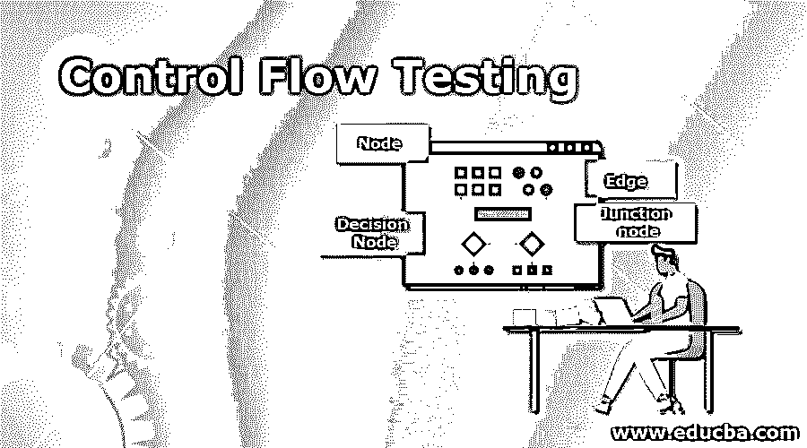
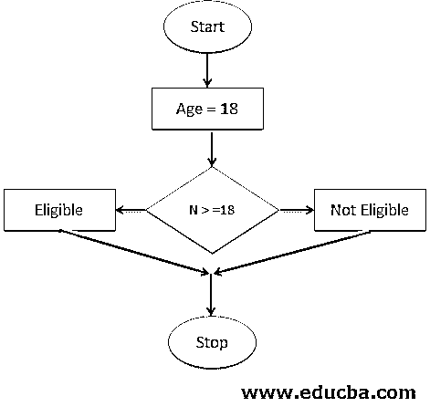

# 控制流测试

> 原文：<https://www.educba.com/control-flow-testing/>

## 控制流测试简介

控制流测试是一种使用控制流技术的软件测试技术，它被表示为白盒测试。控制流测试是一种结构化的测试策略，它描述了给定语句或指令的执行顺序。它用于开发程序的测试用例，测试人员选择程序的大部分进行测试，并设置测试路径。整个测试用例以节点、边等控制流图的形式表示，主要用于单元测试。

### 控制流测试的使用

控制流测试是白盒测试方法之一，它检查一系列程序代码并执行测试用例，另一种方法是执行数据流。

<small>网页开发、编程语言、软件测试&其他</small>

我现在将讨论控制流测试的各种用途:

*   控制流测试用于单元测试目的，其方法是识别执行路径，并根据这些路径编写单元用例，并使用程序代码完成执行。
*   控制流图是通过测试目的创建的，它表示程序的整体流程，通过分析可以完成的路径以及从路径中出现的各种测试用例。
*   测试中的控制流图覆盖了图中的每一个节点和边，有助于满足测试目的中的结构化数据，并保证适当的测试代码覆盖率。

### 解释控制流测试的符号

控制流测试中使用了四个节点。它们是:

**1。节点:**在控制流图中，节点在创建过程路径中起着重要的作用。节点有助于表示过程或语句的顺序以及它应该出现的顺序。通过测试团队的帮助可以知道指令的顺序。

在控制流图中，节点代表一组程序语句。总共有五种不同类型的节点，在一个图中，有一个入口节点和一个出口节点。

这是一个控制流程图。

在这个图中，我们可以看到图中有一个起始/入口节点。下一个过程是分配第 n 个值，之后，决策节点将负责决定下一个过程 n 的值是大于还是小于 18。如果 n 的值大于或等于 18，则该过程将作为合格的来执行，如果 n 的值小于 18，则该过程将作为不合格的来执行。最后，它将传递到最后一个停止整个流程的结点。

**2。边:**在控制流图中，一条边被表示为方向箭头，其中的节点连接到哪些节点。

边负责连接第一个节点直到末端节点。在上图中，可以看到链接节点的箭头指向哪里以及指向哪个方向。

**3。决策节点:**在控制流图中，决策节点是最重要的节点形式之一，它描述了流程将根据条件值遵循哪个节点。

它是一个条件语句，创建两个或多个控制语句，如 if 或 switch 语句。在上面的示例中，决策节点根据 n 的值处理下一个流程。如果 n 的值大于或等于 18，则符合条件的流程将执行，否则，如果该值小于 18，则不符合条件的流程将执行。

**4。连接节点:在控制流图中，连接节点是至少三个节点相交的点。**

### 控制流测试的优点和缺点

优点和缺点如下:

#### 优势

以下是优点；

*   这是一个使用控制流图的单元测试，控制流图指向表示要执行的过程序列的节点和边。
*   在单元测试中，可能会出现重大缺陷。但是在测试的帮助下，所有主要的和次要的缺陷都被测试人员在测试阶段进行了彻底的分析和测试，并且超过一半的缺陷都是通过测试确定的。
*   控制流测试还负责确定整个程序中至少三分之一的缺陷，这有助于更好地分析和执行测试用例。
*   测试既可以手动完成，也可以全自动方式完成，因为表示要执行的指令序列的控制流程图可以通过使用手动方式(即手动模式)来完成，也可以通过使用软件应用程序(即全自动方式)来实现。
*   使用覆盖所有节点和边的路径来表示测试，满足总体测试标准，从而优化程序的测试覆盖。

#### 不足之处

缺点是:

*   如果图很大，并且整个程序和模型由同一个人控制，那么在整个控制流图中很难找到缺失的路径。
*   它不能捕捉变量实例化过程中的所有错误。
*   在规格说明过程中发现的错误在测试过程中不可能总是被发现。
*   在测试期间，接口中的任何错误或不匹配(如果发生的话)都很难被发现。
*   它也无法关注变量在哪里获得值以及值在哪里被准确使用的链接。

### 结论

控制流测试一直是任何单元测试目的的最佳方法，借助于控制流图，它可以提供所有有价值的信息，根据给定的条件求解和执行指令，并使使用循环语句变得容易。

### 推荐文章

这是控制流测试的指南。这里我们讨论控制流测试的使用以及它的优点和缺点。您也可以阅读以下文章，了解更多信息——

1.  [蝗虫负载测试](https://www.educba.com/locust-load-testing/)
2.  [基于风险的测试](https://www.educba.com/risk-based-testing/)
3.  [吉拉测试工具](https://www.educba.com/jira-testing-tool/)
4.  [结构测试](https://www.educba.com/structural-testing/)

