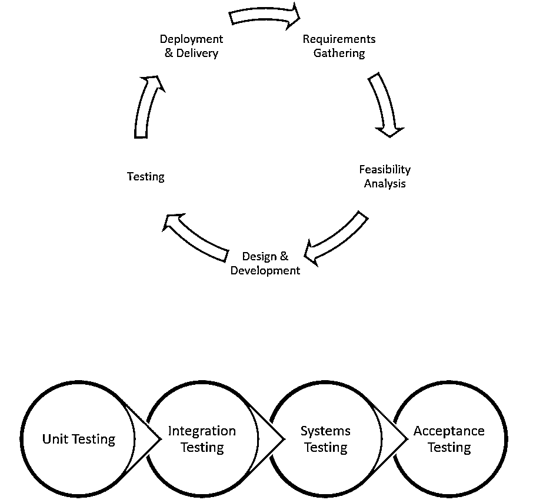

# 单元测试

> 原文：<https://www.educba.com/unit-testing/>

## 什么是单元测试？

单元测试用于测试源代码的特定模块，进而验证代码的正确性、代码覆盖率、编码标准的实现和维护、代码块所覆盖功能的验证。传统上，在将代码与代码的其他现有功能模块合并之前，这种测试由开发人员自己在开发环境中组织和执行。绕过单元测试过程可能会导致缺陷数量的增加，因为代码本身就可能是错误的。

### 单元测试的类型

下面给出了单元测试的类型:

<small>网页开发、编程语言、软件测试&其他</small>

#### 1.人工测试

[代码的手动测试](https://www.educba.com/manual-testing/)需要开发人员手动调试每一行代码，并测试其准确性。如果功能复杂，可能还需要一步一步的指令集。

#### 2.自动化测试

在自动化测试中，开发人员编写代码来测试代码。这通常是通过没有在生产中部署的单元测试框架来实现的。其他时候，开发人员可能选择在没有框架的情况下编写测试代码，并在部署之前手工注释掉。

对于大多数情况来说，手工测试显然很耗时。但是对于某些情况，当编写自动化测试用例来覆盖每一个场景是不可能的时候，手工通常是首选的方法。

### 为什么单元测试很重要？

为了理解单元测试的重要性，我们需要从更广阔的角度来看。它是[软件开发生命周期](https://www.educba.com/what-is-sdlc/)的一部分。

让我们简单地看看其他部分，以便更好地理解单元测试的作用。

上图是一个普通软件开发生命周期和测试过程的简单说明。不用说，根据项目的结构，整个过程会随着某些组件的添加和删除而变化。

然而，测试过程肯定包括如下所述的四种类型:

*   **单元测试:**整个测试过程的初级水平。这是由组件的开发人员或他的任何同事执行的。在后一种情况下，它通常被称为软件世界中的对等测试。
*   **集成测试:**测试单元组件及其直接父模块。目标是检查单元组件是否与其他组件集成良好，并且没有导致任何其他组件出现故障。
*   **系统测试:**当单元部件放置到位时，测试整个系统。
*   **验收测试:**通常由企业/客户完成，它检查结果是否符合最终用户期望的功能。

因此，人们可以很好地看到，所有的测试过程都依赖于初级水平的测试。如果初级水平的测试没有完成，所有其他的测试都可能是徒劳的。

现在，假设您有一个包含两部分的代码:

*   计算复利。
*   本金加上利息，计算到期收益。

让我们假设您没有测试这些组件中的任何一个，而是直接进行系统测试。系统测试中出现了一个 bug，即成熟度值不正确。现在代码的哪一部分有错误？

*   可以在利息的计算上。
*   它可以应用复合逻辑。
*   它可以是本金的附加利息。

看看它现在是如何增加努力的。如果两个代码组件都经过单元测试，所有这些都可以避免。

### 为什么单元测试很重要？

*   它只在开发阶段早期修复错误。这节省了大量的时间、精力和成本。想象一下，如果没有进行单元测试，代码会因为非常简单的问题而在质量保证团队之间来回传递。
*   好的单元测试也有助于详细的文档。当开发人员编写单元测试用例时，他无意中编写了代码的预期功能。这只是解释代码工作的文档。
*   它使得修改和维护代码变得容易。一旦你对代码做了任何修改，再次运行测试，viola 就能毫不费力地发现所有的缺陷。
*   它还加强了模块化。单元测试是在单个组件上运行的，这意味着代码需要尽可能的细化。这确保了代码被恰当地划分成模块。

### 事情的另一方面

它也有一些缺点。虽然优点大于缺点，并且总是建议对代码进行单元测试，但是了解同一枚硬币的两面也是有意义的。

*   单元测试，无论多么彻底，有时也不能捕捉到最琐碎代码中的所有错误。不可能评估所有的执行路径。因此，单元测试通常是简单明了的、快乐的、消极的场景。
*   它要求开发人员跳出框框思考，尝试破解他的代码。这通常是困难的，因为开发人员的感觉偏向于代码。

### 单元测试工具

行业中有几种工具可以帮助自动化单元测试用例。正如其目的，它们使得开发人员编写和执行单元测试用例更加容易。开发人员有一个单元测试框架的世界。

下面列出了一些最流行和最广泛使用的工具:

*   JUnit: JUnit 是一个免费的 Java 测试工具。它被自动包含在许多项目模板中，这些模板可用于 Java 开发的各种 ide。[让 JUnit 变得特别的是](https://www.educba.com/junit-annotations/)它首先测试数据，然后在插入数据后测试代码。它还提供了用于识别测试方法的断言。
*   **努尼特:**努尼特是为了。Net 就像 JUnit 对于 Java 一样。它具有 JUnit 的所有显著特性，但是对于。Net 编程语言。它还支持并行运行测试。
*   **PHPUnit:** 与 JUnit 和 NUnit 类似，PHPUnit 是一款面向 PHP 开发者的工具。它还支持一个好的测试工具的所有基本特性。
*   另一个比同类框架更通用的框架是 XUnit。它支持多种语言，如 C++，C#，ASP.Net 等。它还拥有与市场上其他工具相似的功能。
*   **Jtest:** Parasoft Jtest 是一个第三方插件，它利用了 JUnit 等开源框架，并添加了一键解决方案，使生活变得更加轻松。使用 Jtest，您只需点击几下鼠标，就可以为您的代码自动生成测试代码。通过自动化这些任务，开发人员可以自由地处理测试用例的业务逻辑。
*   **QUnit:** 一个非常流行的 JavaScript 单元测试框架。它可以在客户端和服务器端测试 JavaScript 代码。
*   Jasmine: 另一个非常广泛使用的用于 [JavaScript 框架](https://www.educba.com/best-javascript-frameworks/)的测试工具。它拥有 Angular、React 等的主要社区支持。
*   **JMockIt:** JMockIt 是一个开源工具，它也支持用记录和验证语法模拟 API 调用。

### 单元测试案例示例

任何单元测试用例的一个非常基本的需求就是要测试的代码。假设我们有一个验证电话号码是否正确(就格式而言)的函数。根据地理位置的不同，这一标准也可能有所不同。所以，我们不会强调标准。相反，我们将关注单元测试用例。

**代码:**

`public class PhoneValidator
{
public bool IsPhoneValid(string phone)
{
/* write some code to verify if the phone is valid or not. return true, if the phone is valid. return false, if invalid. */
}
}`

现在我们需要测试这段代码。

我们可以通过插入各种值并验证输出来手动测试它。乍一看，这似乎很容易，但如果对代码进行任何更改，这将是一个重复的任务。

或者，我们可以编写一个单元测试用例，只要业务逻辑保持不变，它就可以作为我的验证器。即使我们改变代码，单元测试用例也不会改变。所以，让我们为上面的代码写一个单元测试用例。

**代码:**

`public void TestPhoneValidator()
{
string validPhone = "(123) 456-7890";
string invalidPhone = "123 45"
PhoneValidator validator = new PhoneValidator();
Assert.IsTrue(validator.IsPhoneValid(valid phone));
Assert.IsFalse(validator.IsPhoneValid(invalidPhone));
}`

那么上面的单元测试代码是如何工作的呢？注意这两个断言语句。它们确保只有当两条线从各自的 IsPhoneValid 函数调用接收到 true 和 false 时，测试才通过。

你会问写这个测试用例有什么好处？好吧，如果您在任何真实的场景中都有数千个电话号码需要验证，那么您就不需要在调试器每次命中代码时都进行手动验证。简单地调用测试代码数千次，它会告诉你哪些测试通过了，哪些测试失败了。现在你只需要检查失败的。

### 单元测试提示

*   始终使用支持您的语言的工具或框架。工具使得开发单元测试用例变得容易。否则你可能会付出额外的努力。
*   尽管建议对所有情况都这样做，但有时跳过简单且不直接影响系统行为的代码会很方便。例如，getter 和 setter 代码可以不太受关注。
*   不要跳过直接影响系统或对业务逻辑实现至关重要的代码。
*   使用类似于生产数据的测试数据。
*   隔离您的代码。如果您的代码依赖于数据库中的数据，请不要编写调用数据库并获取值的测试用例。相反，创建一个接口并模拟 API 和数据库调用。

在修复单元测试产生的 bug 之前，编写暴露缺陷的测试用例。

这样做有三个原因:

*   您将能够发现由您的修复引起的回归缺陷。
*   您的测试用例现在更加全面了。
*   通常一个开发人员太懒了，以至于一旦写好就不更新他的测试用例。

除了编写验证业务逻辑的测试用例，还要编写测试代码性能的用例。特别是当代码涉及循环时，性能是最受影响的方面。

### 要记住的事情

以下是需要记住的事项:

1.单元测试用例应该独立于:

*   **要测试的代码:**代码的任何变化都不应该要求单元测试用例的变化，除非业务逻辑本身发生了变化。例如，如果逻辑现在要求一个有效的电话号码应该总是以'+，'开头，那么单元测试用例就需要改变，否则就不需要。
*   **其他代码:**不应该与任何其他代码或数据库值或任何类似的东西有任何交互或依赖。测试时，应隔离一个单元。

2.为你的测试用例遵循清晰一致的命名惯例。这使得跟踪场景变得更加容易。您还可以使用版本控制工具来跟踪您的测试用例。

3.永远不要把你的代码传递到下一个阶段，直到它已经完成，bug 被修复，并且被重新测试。

4.最重要的是，让它成为一种习惯。这是一种需要反复灌输的编码实践。没有经过单元测试的代码越多，代码就越容易出错。

**单元测试生涯:**

虽然单元测试不是一个完整的领域，但它是你箭筒中的一支额外的箭。这是一个好的编码实践，什么时候好的编码员不是首选呢？

### 结论

毫无疑问，单元测试有时很简单，有时很复杂。这时，工具和框架就来拯救你了。即使完成了单元测试，代码也不是完全防错的。这是下一阶段测试程序开始的时候。在所有这些不确定性中，唯一确定的是单元测试是必要的。

### 推荐文章

这是单元测试的指南。这里我们讨论单元测试的重要性、技巧、工具、职业和类型，并给出例子。您也可以浏览我们推荐的其他文章，了解更多信息——

1.  [测试面试问题](https://www.educba.com/testing-interview-questions/)
2.  软件测试中的缺陷生命周期
3.  [软件测试职业](https://www.educba.com/careers-in-software-testing/)
4.  [单元测试工具](https://www.educba.com/unit-testing-tools/)

