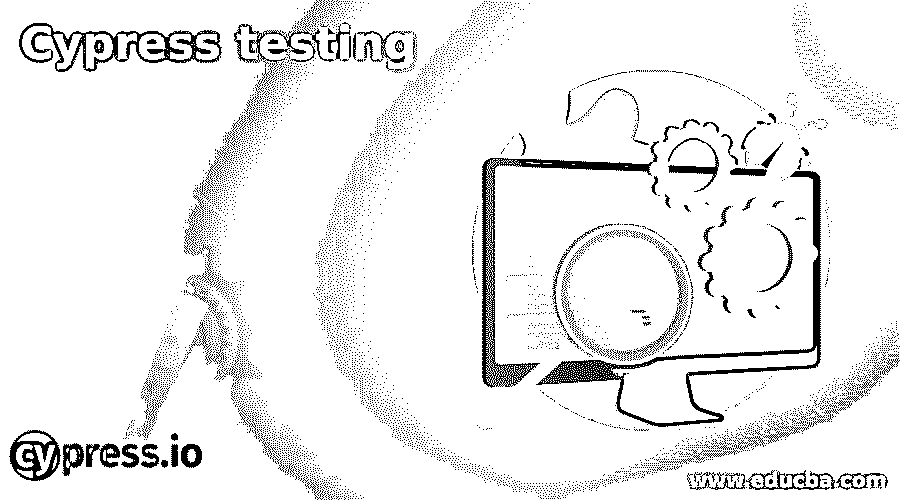

# 柏树测试

> 原文：<https://www.educba.com/cypress-testing/>

## Cypress 测试简介

Cypress 是一个免费的、开源的下一代测试自动化工具，用于执行现代 web 应用程序的前端测试。在端到端测试的帮助下，Cypress 使得单元和集成测试的编写和调试变得容易。它是用 JavaScript 编写的，基于 Mocha 和 Chai(著名的断言 Javascript 库)。在 Cypress 测试工具的帮助下，高度交互的应用程序的测试变得很容易，测试人员可以很容易地执行诸如读/写测试字段中的数据、提交表单、检查所需的元素是否出现在屏幕上等操作。与 Selenium 等其他测试工具不同，Cypress 的引擎在浏览器内部运行。

### 为什么我们需要柏树测试？

Cypress 是一个一体化的工具，可以执行任何前端自动化测试。此外，它还可以完成一些其他测试工具无法完成的非凡任务，如下所示:

<small>网页开发、编程语言、软件测试&其他</small>

1.  它自动获取测试用例失败的截图和视频，这使得测试人员可以很容易地检查测试失败的确切位置。
2.  Cypress 具有根据特定要求控制网络流量的能力。
3.  测试人员不需要在程序中添加额外的等待或睡眠条件，因为它会在进一步处理之前自动等待断言。
4.  与其他测试工具不同，Cypress 不使用 Selenium。它建立在不同的建筑背景上。它可以在与应用程序相同的循环中运行测试(意味着测试代码在应用程序所在的浏览器中执行)。
5.  Cypress 只支持一种测试语言，Javascript，也就是说没有语言或者驱动绑定。
6.  借助于 Cypress 中的 Fixtures，我们可以将测试脚本从测试数据中分离出来。此外，相同的框架提供了模拟第三方请求和独立测试前端的功能。
7.  借助 Chrome DevTools 等 Cypress 工具，很容易调试代码，找出是哪个部分导致了错误。通过堆栈跟踪可读错误，Cypress 中的调试变得更快。
8.  由于其高度的建筑设计，它提供了快速、可靠和优秀的测试结果。

### 赛普拉斯测试是如何进行的？

下面给出了一些要点，表明 Cypress 测试实际上是可行的:

1.  著名的 Javascript 断言库之一 Mocha 和 Chai 是 Cypress 的基础，所以在 Cypress 中像其他 Javascript 框架一样构建应用程序(它支持 TDD)时正常编写测试用例。
2.  在 Cypress Test Runner 的帮助下，测试用例/脚本在 Cypress 中运行。它允许您在命令执行时查看每个命令。
3.  在测试套件与 CI 提供者集成之后，Cypress Dashboard Service 可以记录测试用例。此外，dashboard 服务提供了记录测试结果的权限，从而让测试人员完全了解测试脚本运行时到底发生了什么。
4.  Cypress Dashboard 允许测试人员管理项目、查看测试结果、管理运行、管理用户、管理组织以及与各种工具的集成等。
5.  此外，Cypress Dashboard 有 Test Status 菜单，它显示了通过或失败的测试用例数量的精确计数。它向测试人员提供适当的错误日志消息，显示测试脚本失败的原因。将鼠标悬停在 Cypress 命令日志中的命令上，可以很容易地看到每个测试事件的细节。

### 优点和缺点

这里我们讨论一下优点和缺点

#### 优势

1.  Cypress 具有自动操作 DOM 的能力，这意味着 Cypress 测试可以访问每个 htingtimer、服务工作者、DOM web 元素等。
2.  要在 Cypress 上执行测试，用户不需要做任何额外的下载，安装额外的依赖项。只在系统中安装 Cypress 将会做所有的事情，因为测试用例只在浏览器中运行。
3.  它建立在 JavaScript 之上，JavaScript 是最流行和广泛使用的 web 开发语言之一。几乎所有的程序员都熟悉 JavaScript，所以对他们来说使用它很容易。
4.  测试人员可以在 Cypress 交互式 UI 上清楚地看到每个测试活动的每一个细节，比如存根、断言、测试结果等等。这使得编码器易于调试。
5.  将 Cypress 与其他 CI/ CD 工具(如 Jenkins、BitBucket、Bamboo 等)集成是非常容易的。
6.  Cypress 运行速度非常快，事实上比其他测试工具快得多。它为 TDD(测试驱动开发)提供了对 web 应用程序进行端到端测试的能力。因此，应用程序可以更快地开发和测试，因为变化会实时反映出来，从而加快整体开发速度。
7.  Cypress 支持并行化和负载均衡，这是测试人员的福气。

#### 不足之处

1.  当进行跨浏览器测试时，Cypress 不是首选，因为它只适用于有限的浏览器，如 Chrome、Firefox 和 Electron 浏览器。
2.  Cypress 只支持 JavaScript，因此熟悉或擅长其他语言的程序员会发现很难使用它。
3.  Cypress 不支持‘多个浏览器标签的处理’，不像 Selenium，它很容易处理。
4.  与 Selenium 等其他测试工具不同，Cypress 不允许程序员进行远程执行。
5.  使用 Cypress，不可能在一个测试用例中访问两个不同来源的域。

### 柏树测试的用途

1.  Cypress Testing 用于执行单元测试，并为应用程序的前端执行集成测试和端到端流测试。
2.  Cypress 测试可以用来运行大量需要在浏览器内部执行的测试用例。
3.  开发人员可以使用它进行各种活动，因为它提供了出色的功能，能够更快地调试代码，并易于维护。
4.  Cypress 测试也可以用在任何支持测试驱动开发的框架中，因为它允许开发人员在开发的同时创建测试用例。

### 结论

上面的描述清楚地解释了什么是 Cypress 测试，以及为什么它被全世界的测试人员广泛用于测试现代 web 应用程序。它是一个快速、可靠的工具，可以在浏览器中运行测试。此外，通过提供一些特别的特性，它克服了测试人员在执行端到端测试时所面临的各种问题。因此，使用 Cypress 可以使测试变得更加愉快和轻松。

### 推荐文章

这是一个柏树测试指南。这里我们讨论 Cypress 测试是如何进行的，以及它的优点和缺点。您也可以阅读以下文章，了解更多信息——

1.  [安全测试类型](https://www.educba.com/security-testing-types/)
2.  [移动渗透测试](https://www.educba.com/mobile-penetration-testing/)
3.  [非功能测试类型](https://www.educba.com/non-functional-testing-types/)
4.  [Python 测试框架](https://www.educba.com/python-testing-framework/)

