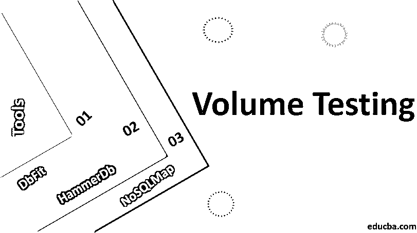

# 容量测试

> 原文：<https://www.educba.com/volume-testing/>

## 什么是容量测试？

容量测试是在软件应用程序系统上执行的，在该系统中，预计数据量会波动。该测试包括使用各种数据和内容来测试系统的功能流程。对性能、响应时间、功能特性的观察被记录并呈现给业务人员。以确保企业得到他们所期望的，并且供应商交付高质量的产品。

也称为淹没测试，是一种通过提供大量数据来测试软件应用的软件测试。通过在数据库中提供大量数据来检查软件应用程序的性能。在该数据库中，通过提供批量数据将大小扩展到阈值限制，然后测试系统在各种场景下的响应时间和行为。它主要检查数据库中各种数据量下软件应用程序的效率。这可能是数据库更新、新的数据输入或从数据库中大量检索数据。

<small>网页开发、编程语言、软件测试&其他</small>

### 我们为什么需要它？

在理解它的必要性之前，让我们考虑一个场景。假设有一个通常由 100 个用户访问的电子商务 web 应用程序。在销售或其他节日期间，在 web 应用程序上，大约 500 个用户试图访问应用程序，而应用程序崩溃或数据无法成功加载，给客户带来了问题。要处理这样的实时情况，非常重要。

以下几点突出了容量测试的重要性:

1.  在测试的早期阶段找出数据库中数据量增加时可能出现的问题。
2.  确定数据库的阈值，系统在哪个阶段开始降低其性能。
3.  以确定当数据库的容量增加到一定限度时是否有任何数据丢失。
4.  在处理客户端之前，帮助找出各种系统性能问题。

### 如何进行容量测试？

市场上有用于批量测试的数据库性能工具。对于成功者来说，有几点需要牢记在心。

下面提到的容量测试:

1.  检查软件应用程序中各种负载的日志。
2.  检查应用低、中和高负载时软件应用程序的响应时间。
3.  如果一次大容量插入，检查数据是否保留在数据库中。
4.  检查批量操作时数据库中是否没有数据丢失或数据被覆盖。
5.  如果应用了大量数据，检查应用程序中受影响的区域。
6.  检查在应用程序中处理批量数据时是否会产生任何内存问题。
7.  在应用大量数据时，会检查应用程序是否崩溃，或者是否有任何其他阻止程序问题导致用户无法访问应用程序。

### 优点和缺点

以下是解释的优点和缺点。

#### 优势

下面提到的是一些优点:

1.  它让团队对应用程序在现实世界中发布的能力充满信心。
2.  它有助于发现应用程序中在开发过程中未被发现的各种瓶颈。
3.  涵盖各种场景的回归容量测试降低了市场声誉和金钱损失的风险(这将花费在应用程序的维护成本上)。
4.  它清楚地描述了应用程序顺利运行所需的硬件，如内存、CPU 存储等。
5.  向团队提供应用程序处理负载能力的几乎精确的概念。

#### 不足之处

下面给出了一些缺点

1.  需要一个专业的[数据库性能测试](https://www.educba.com/performance-testing-life-cycle/)团队来执行批量测试，这将导致项目的额外成本。
2.  在执行涵盖所有测试场景的特定容量测试、创建脚本和执行这些脚本时浪费了大量时间，这可能会影响应用程序的发布时间。
3.  一些项目，如桌面应用程序，只由少数用户处理，不需要单独的测试阶段。
4.  不可能创建真实世界中使用的精确内存碎片。
5.  真实环境的精确复制是困难和棘手的。

### 容量测试工具

尽管容量测试既可以手动完成，也可以通过使用工具执行的自动化脚本来完成。市场上有许多开源和付费的容量测试工具。应根据项目要求使用工具。市场上提供的一些容量测试工具如下:

#### HammerDb

HammerDb 是市场上可用的开源工具之一，支持各种数据库，如 Oracle、SQL Server、MySQL、PostgreSQL 等。它为两者都提供了可扩展性。Windows 和 Linux 操作系统。HammerDb 最好的特性之一是它提供了数据库的标准性能指标，并允许用户通过 GUI 和命令行进行交互。

#### NoSQLMap

NoSQLMap 是市场上可用的开源工具，它是用 Python 语言编写的。它基本上是用来利用 NoSQL 数据库的漏洞。目前，它只为 MongoDB 数据库提供漏洞，在任何软件应用程序的批量测试中非常有效。

#### DbFit

它是一个开源工具，用于自动化数据库测试，并支持高效的数据库测试。在 DbFit 中，测试用例以简单的文本格式编写。DbFot 只处理 SQL 查询和存储过程。

### 结论

上面关于这篇文章的解释清楚地表明了它在任何软件应用程序中的重要性。手动或通过使用自动化工具来检查应用程序在高数据负载下的行为是非常重要的。尽管在执行它时会遇到一些挑战，如内存碎片，但生产环境的精确副本在某种程度上可以应付。这并不新鲜，几乎每个测试服务都提供容量测试，因为它与其他功能性和非功能性测试同等重要。

### 推荐文章

这是容量测试指南。在这里，我们讨论需求、如何执行、不同的工具以及各自的优缺点。您也可以阅读以下文章，了解更多信息——

1.  [性能测试工具](https://www.educba.com/performance-testing-tools/)
2.  [SOA 测试](https://www.educba.com/soa-testing/)
3.  [DevOps 测试工具](https://www.educba.com/devops-testing-tools/)
4.  [黑盒测试](https://www.educba.com/black-box-testing/)

