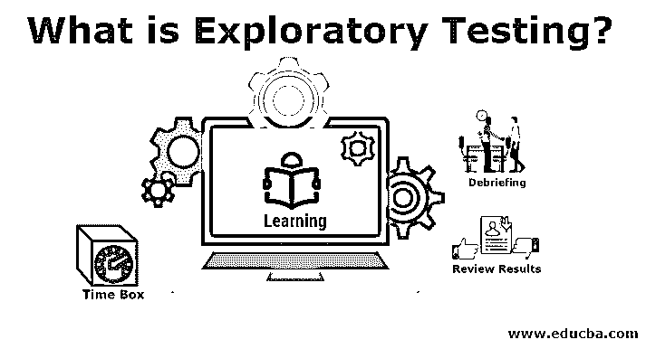

# 什么是探索性测试？

> 原文：<https://www.educba.com/what-is-exploratory-testing/>

## 探索性测试简介

探索性测试可以被描述为一种测试技术，在这种技术中，软件测试专家吸收了各种额外的领域，当测试执行仍在进行中时，额外的一轮测试是必要的。顾名思义，补充功能是在功能测试执行过程中发现的。新识别的潜在可测试片段可以用于任何类型的测试，如阳性、阴性、安全性、性能等。，取决于测试专业人员的智力。

### 脚本测试

*   它是从需求出发的。
*   测试用例的确定是预先预测的。
*   测试的确认在需求范围内给出。
*   决策能力强，重视预测。
*   探索性测试包括确认测试。
*   它也是关于控制测试的。
*   这就像你在草稿中做演讲一样。
*   它是一个可控的脚本。

### 探索性测试

*   它也是从需求的角度出发的，但也是在测试过程中探索的。
*   它还可以确定测试过程中测试用例的数量。
*   系统、项目或应用程序的高级调查。
*   它还强调适应性和学习标准。
*   这都是关于测试用例以及测试设计的改进。
*   做决定是很自然的。
*   测试者的思维是可以被控制的，或者说是被控制的。

因此，我们已经基本理解了脚本测试和探索性测试之间的主要区别。

<small>网页开发、编程语言、软件测试&其他</small>

**探索性测试的具体特征:**

*   这是一种严格、粗糙和结构化的测试。
*   它不同于随机测试，但是这种类型的测试包括寻找 bug 的特定目的。
*   这种类型的测试结构是时间盒或者特许的。
*   我们可以轻松地管理和教授探索性测试。
*   这种类型的测试不是一种方法或框架，但它是一种方法。

### 探索性测试工作

现在是我们讨论探索性测试在当今世界是如何工作的时候了。因此它包括 5 个阶段，每个阶段负责一个单独的测试现象，称为基于会话的测试管理(SBTM 循环)。

#### 1.Bug 分类被创建(分类)

*   在这个阶段，我们必须对测试中发现的故障类型进行划分和分类。
*   之后，我们分析了这类故障发生的根本原因或父原因。
*   然后找出每个故障的风险比及其解决方案。

#### 2.时间盒

*   给一对测试者规定一个时间表，不超过 90 分钟。
*   在规定的一个半小时会议期间不应有任何障碍。
*   它可以增加或减少 45 分钟。
*   这个阶段让测试人员分析故障，并带着友好的解决方案返回。

#### 3.测试章程

*   测试章程推荐的测试用例。
*   需要测试的最重要的东西
*   测试的方法。
*   测试用例修复后的应用程序输出。
*   在探索性测试中，主要的出发点是关于处理测试思想。
*   使用 test charter 测试器来确定应用程序用户如何使用系统。

#### 4.查看结果

*   对 bug 的评价被带走了。
*   验证测试用例可以带来更好的学习。
*   测试覆盖区域被优先考虑。

#### 5.任务报告

*   编译输出结果。
*   特许成绩比较。
*   是否需要检查额外的测试。

**为了更深入地解释这一点，为了更好地进行测试，需要提供下面提到的提示:**

*   测试的确切目标从一开始就应该非常具体。
*   需要对应用程序产品质量进行定期测试，因此测试人员需要回答为什么、何时以及什么与测试故障有关。
*   找 bug 应该是很精细的。
*   测试人员的结对可以产生好的测试结果。
*   我们测试得越多，我们就越有机会分析错误或问题。

**在探索性测试过程中，测试人员需要维护以下文档，如下:**

*   [测试覆盖率](https://www.educba.com/test-coverage/)
*   风险
*   测试执行日志
*   问题/疑问

### 优点和缺点

让我们找出探索性测试的突出优点和缺点:

#### 优势:

*   当需求文档不完全可用或者部分可用时，这是很有用的。
*   在调查过程中，它可以找到比脚本测试更多的错误。
*   覆盖所有在[手动测试](https://www.educba.com/manual-testing/)或其他类型测试中被忽略的臭虫。
*   通过使用越来越多的测试用例，也增加了测试人员解决问题的想象力。
*   探索性测试涵盖了所有的需求、场景和测试用例。
*   它有助于鼓励测试人员的直觉和创造力。

#### 缺点:

*   这种类型的测试需要关于测试的先决[知识。](https://www.educba.com/system-integration-testing/)
*   这种类型的测试有一个测试人员知识的边界域。
*   特定错误测试中的失败不应该重复。
*   维护测试案例和错误修复的正确文档。

### 确切的需求是什么时候？

*   当工业或技术公司的测试人员有知识和经验丰富的测试人员。
*   早期迭代的需求。
*   这是一种非常重要的应用。
*   当探索性测试更强调测试者的知识和经验时，探索性测试可以被广泛使用，因此与脚本测试相比，它给出了更好的结果，因为它侧重于适应性和学习的角度。

### 推荐文章

这是什么是探索性测试的指南？在这里，我们讨论了脚本测试和探索性测试的区别，探索性测试的特点、工作原理、优点和缺点。您也可以浏览我们推荐的其他文章，了解更多信息——

1.  [什么是加密？](https://www.educba.com/what-is-encryption/)
2.  [回归测试](https://www.educba.com/regression-testing/)
3.  [黑盒测试](https://www.educba.com/black-box-testing/)
4.  [ISTQB 面试问题](https://www.educba.com/istqb-interview-questions/)

