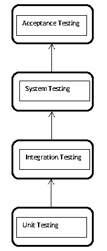
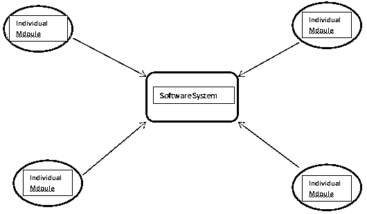
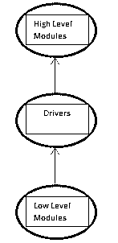
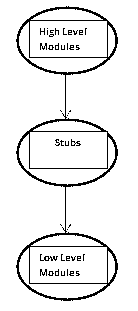

# 集成测试

> 原文：<https://www.educba.com/integration-testing/>

## 什么是集成测试？

集成测试或“集成和测试”是测试特定模块的过程，其中有一个以上的应用程序作为一个整体的贡献，或者只有来自其他应用程序的模块。该测试用于确保应用程序能够通过相互吸收和通信顺利运行。这种类型的测试可以是黑盒测试，也可以是白盒测试，这取决于所涉及的其他应用程序的贡献程度。

要理解什么是集成测试，首先，我们需要理解什么是软件测试！软件测试是检查测试的输出/结果是否等同于预期的输出/结果的活动，这意味着软件正在正确运行。某个软件/系统运行后获得的结果必须与该软件/系统输出的预期结果相匹配；如果做不到这一点，就需要重新编写软件，或者需要对编写的代码进行某些修改。

<small>网页开发、编程语言、软件测试&其他</small>

软件系统的软件测试是在不同的层次上完成的。

测试等级描述如下:

按时间顺序，集成测试是在第一步“单元测试”完成后进行的。正如集成这个名字一样，集成测试的文本定义是“将单个软件模块组合在一起测试，就像一个组一样”。这意味着，在软件中，有许多组件。这些组件组合在一起，就形成了一个软件系统。这个软件系统被一起测试，并且测试它的测试级别被称为集成测试。因此，当这些模块组合在一起时，从中获得的结果必须与预期的结果相同；这就是集成测试发挥作用的地方。集成测试的主要目的是检查单个模块组合在一起时是否能正常工作。

也称为 I & T(集成和测试)可以帮助测试个人以及整个模块的测试。它包含在黑盒和白盒测试中。大多数组织只使用[单元测试](https://www.educba.com/unit-testing/)和功能测试方法来测试他们的软件。

### 类型和方法

下面提到了四种类型和方法:

*   大爆炸方法
*   自下而上的方法
*   自上而下的方法
*   混合/三明治

#### 1.大爆炸方法

软件系统的开发模块/组件被耦合在一起。当耦合时，这些单独的模块被一起测试。单元测试之后，这些模块一起测试，就形成了一个软件系统。但是我们中的一些人可能会有这样的疑问，软件[系统测试](https://www.educba.com/system-testing/)作为一个整体和集成测试有什么不同？我们在这里理解的主要事情是，在集成测试中，在进行单元测试之后，对组合在一起的各个模块进行测试，而在软件系统测试中，在考虑所有参数的情况下对整个系统进行测试。

下图准确描述了集成测试大爆炸方法的含义:

大爆炸方法有一些相关的优点和缺点:

**优点:**

*   如果系统很小，这种方法非常方便。由于这种方法花费的时间更多，大系统会导致更多的时间消耗。
*   考虑到小型系统，故障检测非常容易。

**缺点:**

*   由于所有模块都是耦合的，如果系统中出现故障，很难发现。
*   有些模块非常重要，需要测试。这些模块在用于系统之前必须经过测试。但是在集成测试过程中，这些模块可能不会得到有效的测试，因为所有的模块都耦合在一起。
*   整个软件系统所花费的时间比其他集成测试方法要多得多。
*   模块的耦合可能花费一些时间，这可能导致花费软件系统的总处理时间。
*   这种方法花费的时间更多，因为许多模块耦合在一起，测试每个模块将花费更多的时间。

#### 2.自下而上的方法

在这种方法中，低级模块首先被一起和单独测试。所有的底层模块都是集成的，包括功能和程序，所有的东西都是耦合和测试的。这有助于测试更高级别的模块，因为它为它们形成了一个基础。对从底层到顶层的所有模块重复这一过程。简单地说，测试从内部和最底层的模块开始，逐渐向上。现在，如图所示，这样做时需要驾驶员的帮助。那么什么是驱动程序，它有什么帮助呢？如流程所示，顶层模块不能集成到系统中，除非底层模块测试完成并耦合。因此，这里的驱动程序帮助耦合底层和顶层模块，并作为一个媒介，或者用技术术语来说，作为一个调用函数。

**优点:**

*   当使用自下而上的集成测试方法时，可以进行单个模块的开发，因为耦合和集成测试是在底层模块首先被测试之后进行的。
*   如果存在/出现某些错误，可以在同一时间和同一级别修复。错误识别和纠正比其他方法容易得多。
*   与其他方法相比，错误识别和错误纠正所需的时间要少得多。
*   错误可以在同一实例、底层或顶层解决。

**缺点:**

*   整个过程花费的时间更多；直到顶层和底层的所有模块都被包含和测试，测试过程才结束。
*   驱动程序是调用高级模块所必需的。
*   如果软件系统包含越来越多小而复杂的模块，完成软件测试过程可能需要更多时间。

#### 3.自上而下的方法

这种方法与自底向上的方法正好相反。首先测试顶层模块，然后同时测试其他较低层模块。最顶层的模块首先被单独测试，就像为最顶层的模块运行专门的单元测试一样，最后，其他模块也被考虑进来并被测试。自顶向下的方法需要一个调用函数，就像自底向上的方法一样，称为存根。存根是短代码逻辑语句，用于接受来自顶层模块的输入，并最终调用底层模块进行集成和测试。

**优点:**

*   这种方法很容易检测出故障或错误。
*   在测试其他模块之前，对关键模块进行彻底测试。
*   与其他方法相比，软件[系统集成测试](https://www.educba.com/system-integration-testing/)可以在更短的时间内完成。

**缺点:**

*   底层模块可能没有被测试到预期的级别，或者可能没有被测试到需求。
*   存根是必需的，并且是测试过程进一步发展所必需的。

#### 4.混合/夹层方法

也称为混合集成测试。这种方法结合了自底向上方法和自顶向下方法。因此被称为混合或夹层或混合集成测试方法。这种方法被用来掩盖两种方法各自的后果。对最顶层的模块进行单元测试，同时底层模块与顶层模块进行集成测试。

**优势:**

*   主要用于大型项目，需要大量时间来完成。

**劣势:**

*   这种测试的成本相当高，因为两种方法都用于完成测试。

### 集成测试的优势

*   同时对不同模块进行集成测试很容易。
*   它可用于测试过程的早期和后期阶段。
*   与其他软件测试技术相比，代码长度覆盖率更高，因为自底向上和自顶向下的方法都可以使用。
*   根据需求的变化，开发会有所不同，因此不同层次的模块测试就变得很重要，为此集成测试可以很容易地使用。

### 为什么使用集成测试？

*   从事 IT 行业的人可能知道不断发生的变化。根据需求，开发某个软件系统的需求每天都在变化，因此每天都有新的代码补丁被开发出来。现在当这些补丁连接在一起形成一个软件时。因此，为了检查这一点，集成测试及其方法是必须的。
*   当一个复杂或庞大的软件被编码或构建时，它被分类到不同的模块中。许多人同时在这些模块上工作，但是当这些模块被集成时，测试就完成了。在大多数情况下，模块的集成需要在进一步处理之前进行集成测试。
*   大多数软件应用程序需要一些支持库才能工作。当这些库与开发的代码一起使用时，集成测试就完成了。
*   当软件被开发时，集成成为必须，因为错误可以在规定的水平上被纠正。现在，正如我们所知道的方法，其中一种方法可能会被用于它。

### 集成测试案例

假设我们正在构建一个员工管理软件。

这个软件有三个主要方面:

*   员工登录
*   员工报告
*   员工薪资指定页面和薪资级别

现在考虑上面的案例，第一，软件开发，流程应该是员工注册(输入值，ex:员工 id，姓名，电话号码等。).正确输入后，它应该重定向到员工报告页面的网页。现在，如果此处员工没有被定向到“报告”页面，而是直接定向到“薪资信息”页面，那么这就是一个错误。因此，为了纠正这一点，流程，活动的顺序，集成测试已经完成。

集成测试的另一个例子是:

我们每天查看电子邮件。所有的电子邮件服务提供商为我们提供相同的功能。

**代码:**

`Login-> Inbox->Send / Delete Mail-> Logout`

现在，这里当我们登录到他们的服务器时，首先，检查值的正确性，也就是单元测试。现在，在凭证匹配之后，登录页面应该会将我们转到收件箱页面。这是预期的结果。如果它不把我们转到收件箱页面，而是把我们转到某个垃圾文件夹，那么它就变成了一个集成测试案例。发送和删除电子邮件也是如此。

**其他原因可能是:**

*   在任何在线/离线应用程序上成功注册后，用户面前会出现一条显示消息。
*   银行应用程序应该将用户引导到所需的帐户摘要页面。
*   成功登录社交媒体应用程序后，应该会出现默认页面，例如:脸书的主页/个人资料。

### 结论

随着 IT 领域日复一日的进步，以及如此多的开发人员坐在不同的地方开发相同的软件，集成测试已经成为一种必须。通过它的方法，集成测试可以用于小型和大型软件应用程序。集成测试处于软件测试的中间层次，具有许多优点，对于商业级客户来说变得越来越重要，定期检查有助于保持软件的完整性。

### 推荐文章

这是集成测试的指南。这里我们讨论集成测试的概念、类型和方法，以及它们的优缺点。您也可以浏览我们推荐的其他文章，了解更多信息——

1.  [软件测试职业](https://www.educba.com/careers-in-software-testing/)
2.  软件开发人员的职业
3.  [什么是黑盒测试](https://www.educba.com/Black-Box-Testing/)
4.  [软件工程师职业](https://www.educba.com/careers-as-a-software-engineer/)

