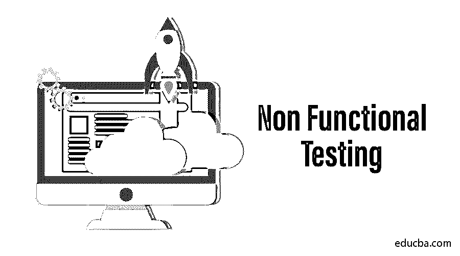

# 非功能测试

> 原文：<https://www.educba.com/non-functional-testing/>

## 什么是非功能测试？

非功能测试是一种软件测试，用于测试非功能参数，如性能、可靠性、负载测试和软件责任。非功能性研究的主要目的是根据非功能性参数检查软件系统的读取速度。在功能测试之前，不测试非功能测试参数。非功能测试在客户满意度中起着至关重要的作用，它也是重要的测试，就像功能测试一样。

### 非功能测试的特征

以下是非功能测试的一些特征。

<small>网页开发、编程语言、软件测试&其他</small>

*   非功能测试应该是可测量的，所以没有主观的描述，比如好、更好、更好等等。，都是可用的。
*   在需求阶段开始时，确切的数字可能不为人知。
*   确保在软件工程中，质量特性得到正确的识别。
*   必须对规格进行优先排序。

### 非功能性测试的类型

我知道我们将要看到的非功能性测试的类型如下

#### 1.可用性测试

*   与操作需求的可用性相反，可用性测试是一种测试嵌入式系统的方法。
*   24 * 7 软件实施可在任何必要的时候无故障地完成其预期功能。
*   软件不再是简单的程序。它们在结构上是复杂的，在实现上也是复杂的。这种本质上的复杂性使得广泛的测试对于保证其按照客户要求运行非常重要。

#### 2.兼容性测试

*   该测试对于软件产品评估其与预期操作设置(包括各种平台、操作系统、软件和硬件)的兼容性至关重要，以便正确实现其计划的功能。
*   兼容性测试是一种非功能性测试方法，通常用于验证和检查产品或网站与其他不同工件(如其他 web 浏览器、硬件平台、客户、操作系统等)的兼容性。[软件测试生命周期的主要组成部分【STLC】](https://www.educba.com/software-testing-life-cycle/)测试。
*   [在质量保证的早期阶段执行的兼容性测试](https://www.educba.com/compatibility-testing/)允许团队确保满足客户要求的兼容性标准，并与最终产品相结合。

#### 3.配置测试

*   配置测试是在具有各种硬件或软件设置(即操作系统、浏览器、支持的驱动程序等)的计算机中进行软件测试的独特变体。，用于软件产品的[性能测试](https://www.educba.com/performance-testing-tools/)。这种类型的设置测试在实验室中进行。
*   实验室里有各种硬件设置的所有计算机。实验室中的每台机器都有要发布的软件的可测试版本，并且执行测试套装。由于用昂贵的重型机器建立测试实验室可能很困难，许多企业将执行硬件配置测试的工作外包给专门执行这种测试的组织。

#### 4.负载测试

*   在软件开发过程完成后，该团队关注于通过不同的软件测试技术来测试软件。
*   负载测试是在软件生命周期测试(STLC)期间执行的一种方法，用于保证软件产品的稳定性和可靠性。
*   负载测试是最简单的性能测试形式，在特定的预测负载条件下执行，以了解软件或应用程序的行为。这些货物是基于预期使用软件的最终客户的真实需求。
*   负载测试的原则是不断增加软件的负载，直到它达到阈值，然后评估它的效率和与这些负载增加相关的行为。

#### 5.本地化和国际化测试

*   本地化测试旨在验证针对特定地区/文化/人群的本地属性的质量，以便本地化版本能够正确运行，并有望满足特定地区的需求和期望。
*   本地化测试的重点是监控生产环境的调整和修改，以满足在特定国家使用产品的特定用户的需求。

#### 6.性能试验

*   一种关键的测试方法，包含不同的测试方法，用于测试对实际环境的响应性，以及对软件产品的稳定性、可伸缩性、可靠性和其他质量度量的要求。
*   在软件测试领域，打着性能测试旗号的评估是确保产品上市后有效运行的主要因素之一。性能测试是效率工程的一个子集，通常被称为“性能测试”这是一种测试，确保软件应用程序在预期的工作负载下正确、完美地运行。
*   它决定了速度、效率、可靠性、可伸缩性以及其他重要的系统特性和组件。此外，还会比较两个或更多应用，并评估它们的系统速度、信息传输速率、带宽等。

#### 7.可维护性测试

*   这是一种非功能性测试，旨在评估软件或系统在没有问题的情况下进行修改的能力，以满足客户不断变化的需求。
*   维护测试用于评估软件应用程序升级或更改以满足日益增长的用户需求和要求的能力。
*   源代码的结构、复杂性和其他特性将与软件开发过程文档部分一起讨论。
*   它主要包括以下操作。[动态测试包括](https://www.educba.com/dynamic-testing/)测试方法，专注于缺陷的识别，以避免意外的软件或系统故障。

#### 8.安全测试

*   安全测试应用于检查和验证软件的安全特性，包括识别和检测安全故障或其他相关漏洞，以便存储在方案中或与方案共享的信息和数据得到保护、真实和保密。
*   这些应用程序已经成为强制性的，因为其他人可能是不同漏洞的受害者。证券化不是强制性的。在软件开发阶段，真正的测试是必要的。同样的原因集中在运行程序或应用程序以捕获软件错误。其原因是程序或应用程序正在运行以捕捉软件错误。这一点非常重要，因为这种攻击非常关键，黑客可以利用它来获取服务器数据库数据。

#### 9.容量测试

*   为了测量和评估应用程序的响应、行为和有效性，容量测试使软件产品受到大量数据的影响。“容量测试”涉及软件应用程序的测试，这些应用程序会受到信息量增加的影响。
*   这个词最早是由“Glenford Meyers”在 1979 年的《软件测试艺术》中发现的，他将容量测试描述为“让程序接受大量的信息”。
*   容量测试的[目标是证明其目标中的数据量无法准确处理。](https://www.educba.com/volume-testing/)
*   容量测试是一组非功能性试验(容量、负载、压力)的一部分，通过提高信息量来分析系统效率。该卷通常可能是数据库的大小或经过卷测试的文件接口的大小。

#### 10.可扩展性测试

*   [可伸缩性测试是性能测试的一种形式](https://www.educba.com/scalability-testing/),它保证软件产品或应用程序的灵活性随着最终用户不断增长的需求而增加。
*   执行可伸缩性测试的主要目的是评估软件的适应性能力，以随着这些需求而增长，并适应它们以有效地运行而没有任何问题。可伸缩性是软件应用程序的非功能特性之一。
*   因此，可伸缩性测试可以被认为是一种保证系统可伸缩性的非功能性测试方法。

要点:在可伸缩性试验的开发过程中，测试方案中后续阶段的负载增量应该是首选的，并在非常基础的高级水平上提出建议。

### 非功能测试的要求

非功能性需求在决定系统如何符合限制和前提条件方面极其重要。非功能性需求影响软件开发和培训的整个过程以及价格和资源规划。

1.  竞争和容量选择产品是否可以同时管理各种计算，以及竞争对手客户的平均和最大数量。
2.  质量是促成非功能性需求的主要因素。所有人都在要求这个要求，并决定最终产品的受欢迎程度。
3.  软件应用程序的利用和管理功能，为用户提供最佳体验。
4.  免受外部和内部安全威胁，保护机密或非机密信息和数据。
5.  可扩展性，以不断满足客户和环境不断增长的需求和要求。

### 非功能测试过程

非功能性测试方法包括六个重要的阶段，在这六个阶段中，测试团队计划并合作评估系统的功能性需求和就绪性。现在我们将看到非功能测试的各个阶段:

1.  规划
2.  准备
3.  设置
4.  记录
5.  分析和改进
6.  测试执行

**1。计划:**整个团队在这里计划并优先考虑信息和测试规范。该团队还确定测试方法和方法论，并选择所需的仪器。

**2。准备**:一旦他们的特定职责被分配，团队根据功能需求一起准备测试用例和测试信息。为了控制系统故障&的恢复速度等等，实验也是在不同的情况下进行的。

**3。设置:**经过规划和准备，为测试方法**建立了正确的环境。**该团队确保测试环境设置易于配置和重复，这使得整个团队可以轻松访问中央存储库中的所有可配置文件**。**

**4。记录:**团队监控并记录测试输出和响应时间，然后与预期进行比较。这些文件非常重要，因为它们可以作为将来参考的整个过程的总结**。**

**5。分析&改进:**测试人员监控系统与非功能需求的兼容性，发现系统的隐藏外壳并验证其可配置设置，同时定期进行所需的改进**。**

**6。测试执行:**在这些测试过程中，测试性能在创建交付预期结果的软件中扮演着重要的角色。因此，这里有一个关于测试重要性的争论。

### 结论

测试实现在软件开发过程中是一个非常关键的因素，从作为所有测试的组成部分到[识别方案中的多个缺陷](https://www.educba.com/what-is-defect/)、bug 和问题。在这种方法的帮助下，测试人员团队可以生产出满足客户需求的产品，并提供某种服务。因此，在这篇文章中，我们已经看到了什么是非功能测试，非功能测试的特征以及它的类型和需求。这里我们也看到了非功能性测试的各个阶段。我希望你会发现这篇文章充满希望。

### 推荐文章

这是非功能测试指南。这里我们讨论非功能测试的类型、需求、过程、es 和特征。

1.  [软件测试生命周期](https://www.educba.com/software-testing-life-cycle/)
2.  [稳定性测试](https://www.educba.com/stability-testing/)
3.  [软件测试的类型](https://www.educba.com/types-of-software-testing/)
4.  [GUI 测试](https://www.educba.com/gui-testing/)

