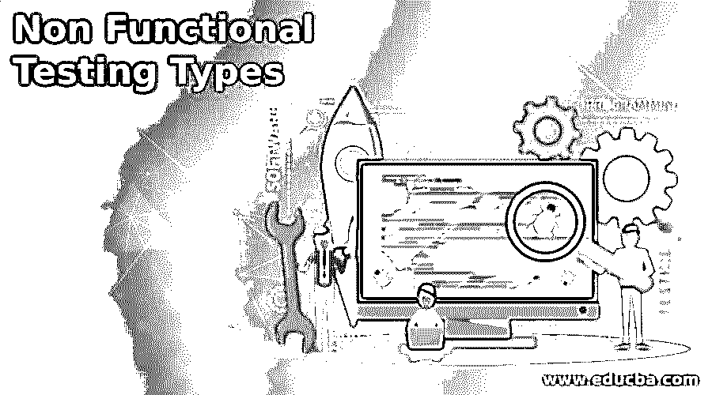

# 非功能测试类型

> 原文：<https://www.educba.com/non-functional-testing-types/>

## 非功能测试类型介绍

非功能测试是软件测试的一种类型，用于测试软件的非功能方面，如加载、可靠性、性能、安全性、恢复、容量、压力等。基于这些方面，非功能性测试被分为各种类型，例如符合性测试、基线测试、文档测试、可靠性测试、负载测试、性能测试、恢复测试、安全性测试、可扩展性测试、压力测试、可用性测试和容量测试。

### 非功能性测试的类型

*   **基线测试:**基线测试是一种非功能性测试，用于验证设计测试用例所依据的文档和规范。这意味着它为新的创造创造了基础。由于它在早期测试需求，许多问题在早期被发现和解决。基线测试也称为基准测试。它有助于衡量重要的特征和需求，并分析应用程序的性能。
*   **符合性测试:**符合性测试是一种非功能性测试技术，用于验证开发的系统是否符合组织定义的标准。它也被称为一致性测试。它评估项目的文档以检查其完整性和合理性。这些标准被 IT 行业和大型组织如 IEEE、W3C 等使用。
*   **文档测试:**文档测试用于测试通常在软件测试过程之前或期间开发的文档化工件。文档测试有助于估计所需的测试工作，跟踪需求，测试的覆盖范围等。它包括与软件开发带测试相关的常用文档化工件的描述，如测试计划、测试用例、跟踪矩阵。
*   **可靠性测试:**可靠性测试是一种非功能性测试，用于验证软件在特定的环境下，能否在指定的时间内无故障运行。它用于测试软件在给定条件下的性能。它的主要目标是找出在特定时间内发生的故障数量。重测信度、决策一致性和平行形式信度是信度检验的三种主要方法。
*   **负载测试:**负载测试是一种非功能性测试，用于测试软件在特定预期负载下的性能。它决定了软件应用程序在被多个用户同时访问时的行为。它的主要目标是在部署之前提高性能并确保软件的稳定性和平稳运行。它有助于在用户压力很大的情况下识别系统中的瓶颈。
*   **性能测试:** Performance by 用于测试软件在预期工作负载下的速度、稳定性、可伸缩性、可靠性、响应时间。它的主要目标是识别和消除性能瓶颈。它有助于识别您的测试环境，识别性能验收标准。LoadNinja、Jmeter、HP LoadRunner 是常用的性能测试工具。
*   **恢复测试:**恢复测试是一种非功能性测试，用于验证软件从软硬件崩溃、网络故障、磁盘故障等故障中恢复的能力。它的主要目标是确定在数据或软件/硬件发生故障后，软件操作是否能够正常运行。
*   **安全测试:**安全测试用于确定软件的安全性。它的主要目标是确保软件系统免受任何可能导致损失的威胁。它测量系统的潜在漏洞，帮助检测软件中安全风险的可能性，帮助开发者通过代码修复安全问题。它涉及渗透测试、安全扫描、漏洞扫描、风险评估、安全审计等多种操作。
*   **可伸缩性测试:**可伸缩性测试是一种非功能性测试类型，用于根据其增加或减少用户请求数量的能力或其他此类性能属性来测量性能。它测量响应时间、吞吐量、CPU 使用率、内存使用率、网络使用率等属性。该测试的主要目标是确定开发的软件能够适应内部应用程序、硬件和软件的变化。
*   **压力测试:**压力测试验证软件的稳定性和可靠性。它的主要目标是测量软件在高负载条件下的健壮性和错误处理能力，并确保软件在崩溃压力测试(也称为耐久性测试)下不会崩溃。压力测试分为分布式压力测试、应用程序压力测试、系统压力测试、事务性压力测试和探索性压力测试
*   可用性测试:可用性测试测试系统的用户友好程度，它衡量软件的易用性和用户友好程度。它主要关注用户使用应用程序的易用性、灵活性和处理控件的能力。它帮助开发者满足最终用户的需求，提高软件的效率。
*   **容量测试:**容量测试通过增加数据库中的数据量来分析系统的性能。它有助于识别系统在大容量和小容量情况下的容量。通过在早期阶段识别负载问题，可以节省成本。

### 结论

在本文中，我们已经讨论了各种类型的非功能测试。它旨在根据非功能性参数测试系统 bas 的准备情况，这些参数从未在功能性测试中提及。我们希望你喜欢这篇文章。

<small>网页开发、编程语言、软件测试&其他</small>

### 推荐文章

这是非功能测试类型的指南。这里我们也讨论了非功能测试的介绍和类型，以及详细的解释。您也可以看看以下文章，了解更多信息–

1.  [渗透检测的类型](https://www.educba.com/types-of-penetration-testing/)
2.  [白盒测试的类型](https://www.educba.com/types-of-white-box-testing/)
3.  [系统测试的类型](https://www.educba.com/course/types-of-system-testing/)
4.  [系统测试的类型](https://www.educba.com/course/types-of-system-testing/)

